# Manuscript review video, session 2 (second pass)

Marcus Madsen's second recorded read-through of [`manuscript/manuscript.pdf`](../../manuscript/manuscript.pdf),
uploaded 2026-09-29 as [youtu.be/LgUbi-ZpGi0](https://youtu.be/LgUbi-ZpGi0) ("Tensegrity
Manuscript Review 2 - Madsen", unlisted, 9 min 45 s, 2210 x 1200 at 30 fps). It re-reads the
abstract, then continues from **Section 2.3 on page 3 to line 300 on page 4**: the Bayesian
optimization background, Fig. 2, the constant-mass and printability paragraph of Section 3.1,
and Table 2. He pauses at line 300 and plans to continue in a later session. Part 1 is in
[`../2026-09-02-madsen-video-review-part1/`](../2026-09-02-madsen-video-review-part1/README.md).

The draft under review is the 17-page build at commit `e613b86` (the current `manuscript.pdf`
on this branch; the two commits after it did not touch the manuscript). Line numbers below are
the PDF's margin numbers; source pointers are into
[`manuscript/manuscript-body.tex`](../../manuscript/manuscript-body.tex) at the same commit.

**There are no comments on the video.** The YouTube API reports `comment_count: 0`, so there is
nothing to inlay. YouTube had not generated auto-captions yet when the video was downloaded
(shortly after upload), so the transcript is a Whisper pass with a second pass over
the unclear passages (see [How this was produced](#how-this-was-produced)).

**Nothing in the manuscript has been changed.** As requested, each item says what I would
change, for the team to approve first. The inquiries he asked for have been run, and their
results are in [Inquiry reports](#inquiry-reports) below.

## Summary

- **19 items**: 8 edits to the text or figures (1, 3, 4, 9, 14, 17, 18, and the Fig. 2(b)
  photo in 6), 1 review request for Dr. Baird (5), 8 inquiries or clarifications
  answered here (7, 8, 10, 11, 12, 13, 15, 16), and 2 context notes (2, 19).
- **The inquiries, answered.**
  - Transmissibility against printed mass: printed mass explains about 1% of the variance
    across all 44 articles (r = +0.12). Inside batch 4 the relation looks strong (r = +0.85),
    but that tracks two design families rather than mass.
    ([A](#a-transmissibility-against-printed-mass))
  - "Inverting the printed-mass model" means solving the calibrated mass model backwards for
    the uniform scale factor that hits 20.23 g. ([B](#b-what-inverting-the-printed-mass-model-means))
  - The 1.7% and 2.3% are spreads (coefficient of variation), not offsets. The batches came in
    0.2 to 0.6 g **under** target. ([C](#c-what-the-batch-mass-cvs-are-and-the-sign))
  - The printability screens were only ever flags. The 250 cm³ cap is a placeholder carried
    over from the simulation work, not a printer limit. The 3.0 mm floor came from an Edison
    analysis of a PETG print. Three statements in that passage are not supported by the print
    log. ([D](#d-printability-screens-plain-language-report-origin-and-number-check))
  - Justin cannot trigger Claude. He has read access, and his attempt on 2026-09-28 failed
    for that reason. ([E](#e-can-justin-ping-claude))
- **Two things found along the way that change what the edits should be.**
  - The pipeline's rebound fraction is already a velocity ratio, so the velocity loss index is
    1 minus it (0.937 to 0.986). The 0.76 to 0.89 range quoted on 2026-09-22 used a square
    root that does not belong there. ([F](#f-what-the-velocity-loss-index-is-in-this-pipeline))
  - The current Fig. 2(b) $d_t$ arrow points at a strut, not a tendon.
    ([G](#g-fig-2b-candidate-photos-for-you-to-check))

## How to read this

Each item has the corrected transcript of what was said, a screenshot of what was on screen at
that moment, a pointer into the LaTeX source, and what I would change. Screenshots live in
[`images/`](images/), and every time links back into the video.

This time he marked text with Edge's yellow highlighter rather than an Acrobat selection, so the
yellow bands in each crop are literally what he is talking about; highlights persist, so a crop can
also show earlier ones. In the collapsed "full screen" images, **red boxes** mark the highlights,
an **orange circle** marks the mouse pointer, and a **blue box** marks the region shown in the main
crop. Each item also carries frames from two seconds before and two seconds after.

"Kind" in the index is my classification, not his, using the same labels as part 1
(change required, change requested, verify, clarification, inquiry, review request, context).

## Item index

| # | Time | What it is | Kind |
|---|---|---|---|
| [1](#1-0000-to-0028--call-the-rebound-quantity-the-velocity-loss-index-everywhere) | `00:00 to 00:28` | Call the rebound quantity the velocity loss index everywhere | Standing instruction |
| [2](#2-0029-to-0048--quick-re-read-of-the-start-then-resume-where-part-1-stopped) | `00:29 to 00:48` | Quick re-read of the start, then resume where part 1 stopped | Context |
| [3](#3-0049-to-0120--the-abstracts-closing-replication-claim-is-premature-until-3dran-is-tested) | `00:49 to 01:20` | The abstract's closing replication claim is premature until 3dran is tested | Change likely |
| [4](#4-0122-to-0157--abstract-name-the-second-objective-the-velocity-loss-index) | `01:22 to 01:57` | Abstract: name the second objective the velocity loss index | Change requested (wording supplied) |
| [5](#5-0159-to-0224--ask-dr-baird-to-review-how-the-bayesian-optimization-is-worded) | `01:59 to 02:24` | Ask Dr. Baird to review how the Bayesian optimization is worded | Review request (@sgbaird) |
| [6](#6-0226-to-0317--replace-the-fig-2b-photo-with-one-on-a-light-backdrop) | `02:26 to 03:17` | Replace the Fig. 2(b) photo with one on a light backdrop | Change requested, plus a task for Claude |
| [7](#7-0319-to-0409--plot-transmissibility-against-printed-mass-for-every-structure) | `03:19 to 04:09` | Plot transmissibility against printed mass for every structure | Inquiry (done) |
| [8](#8-0413-to-0457--inverting-the-calibrated-printed-mass-model-needs-a-plain-explanation) | `04:13 to 04:57` | "Inverting the calibrated printed-mass model" needs a plain explanation | Clarification (answered) |
| [9](#9-0457-to-0513--cvs-was-read-as-control-volumes) | `04:57 to 05:13` | "CVs" was read as control volumes | Change required |
| [10](#10-0514-to-0540--what-17-and-23-mean-and-whether-the-batches-were-over-or-under) | `05:14 to 05:40` | What 1.7% and 2.3% mean, and whether the batches were over or under | Clarification (answered) |
| [11](#11-0541-to-0618--the-printability-screens-sentence-is-too-dense-where-did-the-screens-come-from) | `05:41 to 06:18` | The printability-screens sentence is too dense; where did the screens come from? | Clarification + origin inquiry (answered) |
| [12](#12-0620-to-0633--double-check-the-numbers-in-the-volume-constraint) | `06:20 to 06:33` | Double-check the numbers in the volume constraint | Verify (done) |
| [13](#13-0634-to-0717--tpu-self-bridging-floor-on-the-as-projected-cable-diameter-is-unclear) | `06:34 to 07:17` | "TPU self-bridging floor on the as-projected cable diameter" is unclear | Clarification (answered) |
| [14](#14-0717-to-0808--stringing-defects-say-what-ours-actually-are) | `07:17 to 08:08` | Stringing defects: say what ours actually are | Change requested |
| [15](#15-0808-to-0822--plain-language-report-on-the-highlighted-passage-with-related-posts) | `08:08 to 08:22` | Plain-language report on the highlighted passage, with related posts | Inquiry (done) |
| [16](#16-0823-to-0840--check-whether-justin-can-ping-claude) | `08:23 to 08:40` | Check whether Justin can ping Claude | Inquiry (answered) |
| [17](#17-0841-to-0909--point-vertical-orientation-at-a-figure-that-shows-it) | `08:41 to 09:09` | Point "vertical orientation" at a figure that shows it | Change requested |
| [18](#18-0911-to-0927--table-2-put-units-after-range) | `09:11 to 09:27` | Table 2: put Units after Range | Change requested |
| [19](#19-0929-to-0942--session-paused-at-line-300) | `09:29 to 09:42` | Session paused at line 300 | Context |

## Cross-cutting themes

**1. The rebound objective needs a name and a definition, not just a new label.** He asks for
"velocity loss index" everywhere (items [1](#1-0000-to-0028--call-the-rebound-quantity-the-velocity-loss-index-everywhere)
and [4](#4-0122-to-0157--abstract-name-the-second-objective-the-velocity-loss-index)). The pipeline
supports that name directly (the rebound fraction is a velocity ratio), but the campaign optimized a
mass-weighted version of it, and the index runs the opposite way to transmissibility (higher is
better), so the abstract wording he offered needs its verb changed.

**2. The printability paragraph (lines 291 to 299) does not survive a check against the record.**
Items [11 to 15](#11-0541-to-0618--the-printability-screens-sentence-is-too-dense-where-did-the-screens-come-from)
all land on one sentence. The flags-only statement is right; the "build envelope" name, the
"both exhibited stringing" claim, the "only minor stringing" claim and the "defect predictor"
conclusion are not supported by the print log.

**3. Say what a number means where it is used.** "CV" (items [9](#9-0457-to-0513--cvs-was-read-as-control-volumes)
and [10](#10-0514-to-0540--what-17-and-23-mean-and-whether-the-batches-were-over-or-under)),
"inverting the model" (item [8](#8-0413-to-0457--inverting-the-calibrated-printed-mass-model-needs-a-plain-explanation)),
"as-projected" and "floor" (item [13](#13-0634-to-0717--tpu-self-bridging-floor-on-the-as-projected-cable-diameter-is-unclear)),
and "vertical orientation" (item [17](#17-0841-to-0909--point-vertical-orientation-at-a-figure-that-shows-it))
each assume the reader already knows the campaign.

**4. Claims ahead of the data.** The abstract's closing replication sentence (item
[3](#3-0049-to-0120--the-abstracts-closing-replication-claim-is-premature-until-3dran-is-tested))
generalizes from one reprint while the third print (3dran) and the replicate study are printed
but not yet measured. This is the part-1 standing rule (part 1, item 30) applied again.

## Open questions for the team

- **@sgbaird**: the velocity loss index decision in item 1: do future batches optimize the
  index itself, or keep the mass-weighted score the campaign has used so far?
- **@sgbaird**: review of Section 2.3 and the BO method wording (item 5).
- **@sgbaird**: add @JustinBal-Vulp as a collaborator with the Write role (item 16).
- **@me-madsen and @ctrhjk**: check the Fig. 2(b) candidates, or reshoot (item 6).
- **Anyone**: were Background Sections 2.1 and 2.2 of the current draft reviewed? They were
  scrolled past in this session (item 2).
- **Anyone**: pick one set of seed articles for the seed mass range. The body says 18.50 to
  22.04 g (the eight drop-tested articles) and the SI and Discussion say 18.50 to 22.29 g
  (adds the untested duplicate dea4ls). Both are arithmetically right.

## Detailed items

### 1. 00:00 to 00:28 | Call the rebound quantity the velocity loss index everywhere

**Standing instruction.** Rename "rebound energy" to "velocity loss index" throughout the manuscript and SI, following the name Dr. Baird suggested on PR #76 (2026-09-22).

> All right, this is the second batch of video edits for the manuscript. Before getting into that, as a note to Claude: let's replace any mention in here (I think Sterling mentioned it before) of rebound energy. Let's replace that with velocity loss index. That is probably the best term we'll have to use for that going forward.

**On screen** ([jump to 00:00 in the video](https://youtu.be/LgUbi-ZpGi0?t=0)): Page 1 (title and abstract), before any highlighting. The rename is a note for the whole draft, not for one line.

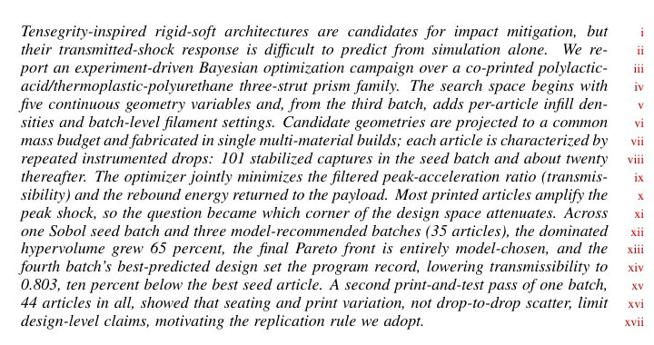

**Where in the source:** `manuscript-body.tex` has 37 lines that mention rebound (166, 312, 416, 959 to 974, 1041 to 1136, 1271 to 1289, 1355 to 1640, 1678 to 1748, 1784 to 1861) and 16 lines carrying the symbol $E_{\mathrm{reb}}$; `supplementary.tex` lines 378, 383, 389, 454. Table 1 (the "This work" row lists "t180; provisional E_reb") and the rebound axes of the Pareto, front-evolution and LOGO-CV figures carry it too.

**What I would change:** This is not a find-and-replace, and it needs one decision first (see [Inquiry F](#f-what-the-velocity-loss-index-is-in-this-pipeline)). The pipeline's rebound fraction is already a velocity ratio, $e_{\mathrm{reb}} = g t_{\mathrm{second}}/(2 \Delta v)$ (the top vertex's hop speed over the base-plate velocity change), so the natural definition is **VLI = 1 minus $e_{\mathrm{reb}}$**: dimensionless, higher is better, 0.937 to 0.986 across the 44 articles. What the campaign actually optimized in batches 1 to 4 was the mass-weighted score $E_{\mathrm{reb}} = e_{\mathrm{reb}} m g h$ in millijoules. I would (1) define VLI once in the objectives paragraph (`manuscript-body.tex:938` to `980`) with its formula, (2) use "velocity loss index" in all prose, (3) keep the record honest by saying the optimizer minimized the mass-weighted counterpart, $(1 - \mathrm{VLI}) m g h$, and (4) regenerate the figure axes from the campaign plotting pipeline. The two rankings nearly coincide where printed mass was held constant (Spearman 0.995 between $E_{\mathrm{reb}}$ and $e_{\mathrm{reb}}$ over batches 3 and 4) but less so in batches 1 and 2 (0.855), so the wording matters for those batches. **Needs @sgbaird:** whether future batches optimize VLI itself rather than the mass-weighted score.

Burst frames and full screen

Mouse pointer detected at (1224, 389) in the 2210 x 1200 frame.

**00:10 (2 s before)**

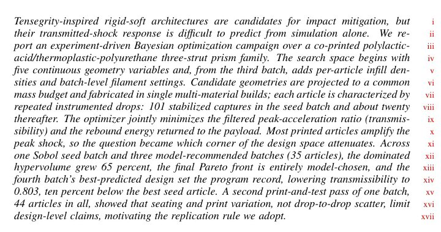

**00:14 (2 s after)**

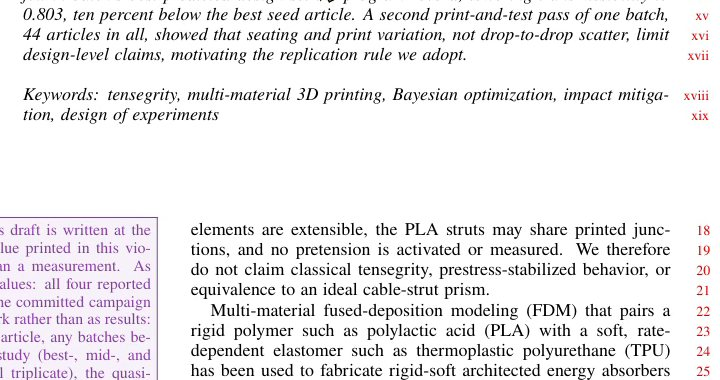

**Full screen at 00:12.** Red boxes: his yellow highlights. Orange circle: the mouse pointer. Blue box: the region cropped above.

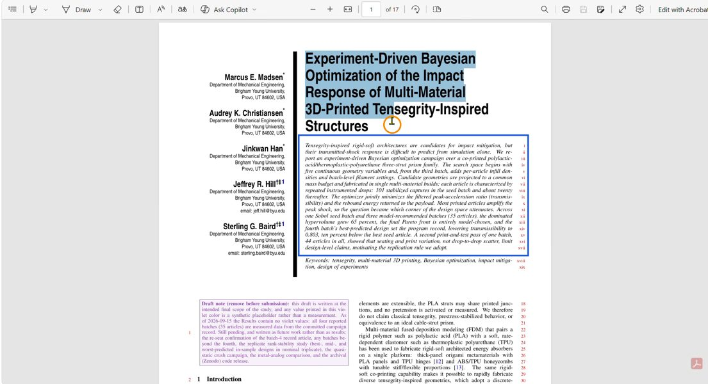

---

### 2. 00:29 to 00:48 | Quick re-read of the start, then resume where part 1 stopped

**Context.** No edit. Coverage note only.

> I believe that I last left off somewhere partway through this. We're going to give it a quick glance over the very beginning and then pick up where I was before.

**On screen** ([jump to 00:29 in the video](https://youtu.be/LgUbi-ZpGi0?t=29)): Scrolling through page 1 (abstract) of the current draft.

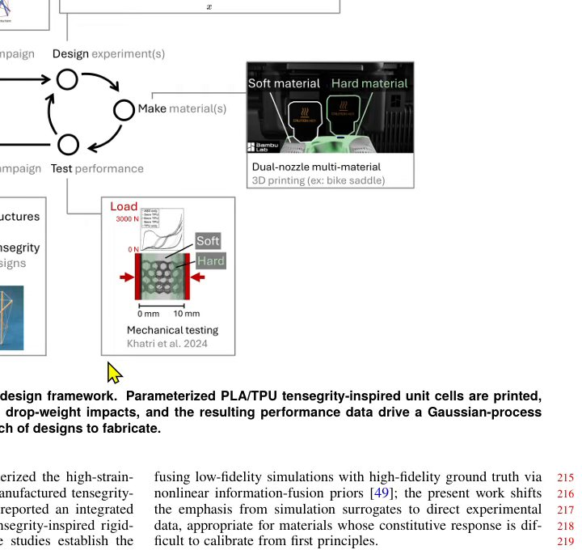

**Where in the source:** Not applicable.

**What I would change:** Part 1 reviewed the older `827301d` draft (title block to Contributions). This session re-reads the abstract of the current `e613b86` draft, then jumps to Section 2.3 on page 3 at 02:00. **Background Sections 2.1 and 2.2 (roughly PDF lines 100 to 197) were scrolled past without comment**, so they may still be unreviewed in the current draft.

Burst frames and full screen

Mouse pointer detected at (1067, 583) in the 2210 x 1200 frame.

**00:38 (2 s before)**

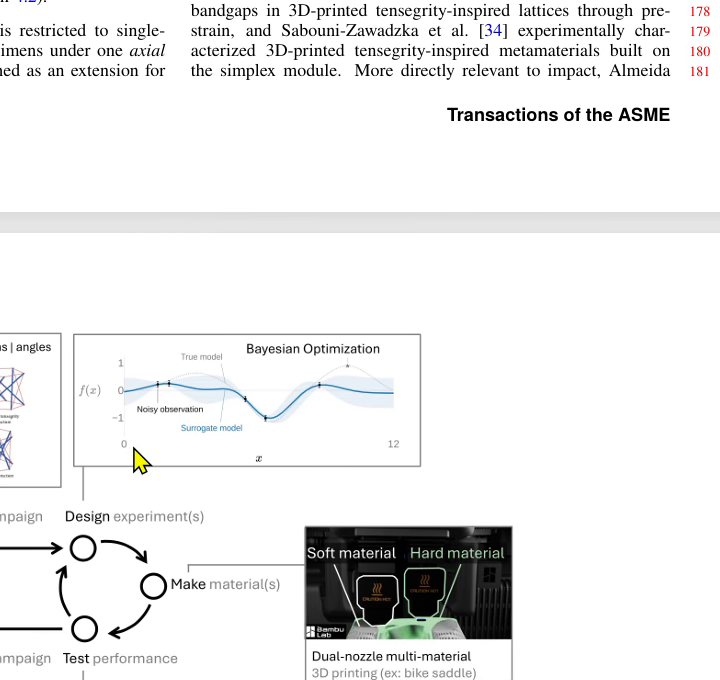

**00:42 (2 s after)**

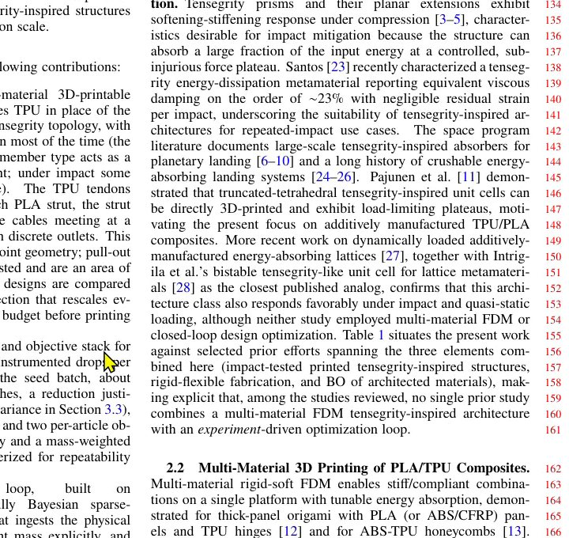

**Full screen at 00:40.** Red boxes: his yellow highlights. Orange circle: the mouse pointer. Blue box: the region cropped above.

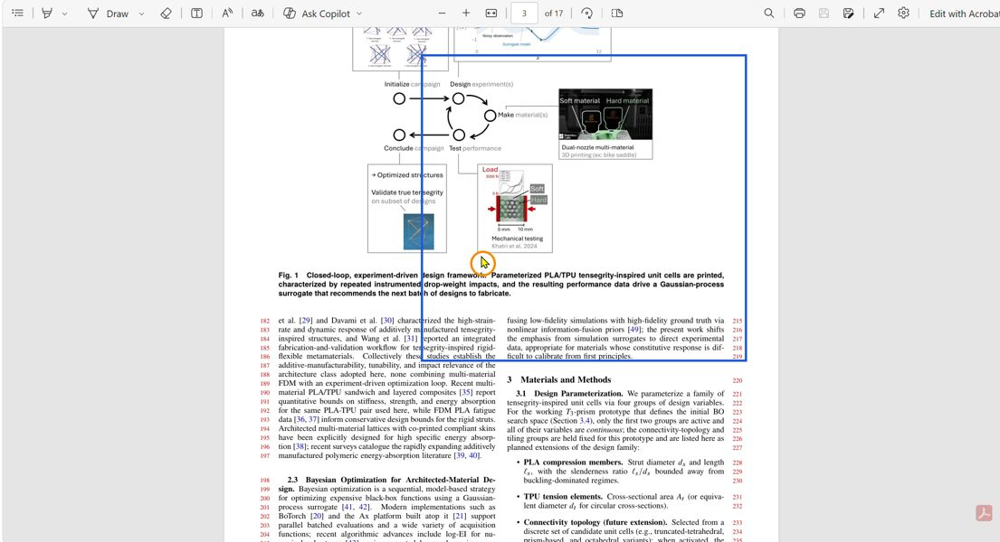

---

### 3. 00:49 to 01:20 | The abstract's closing replication claim is premature until 3dran is tested

**Change likely.** Soften the last abstract sentence until the third print (3dran) and the replicate study are measured, or mark it as pending.

> I'll note really quick, this remains to be seen, as we still have yet to finish our validation testing. I believe this is talking about 2dran, which I guess I'll find out about later. But we're still waiting to validate it with a more perfect replication of printing a 3dran. That'll probably be a more perfect print that we can run.

**On screen** ([jump to 00:49 in the video](https://youtu.be/LgUbi-ZpGi0?t=49)): He highlights the abstract's last sentence: "A second print-and-test pass of one batch, 44 articles in all, showed that seating and print variation, not drop-to-drop scatter, limit design-level claims, motivating the replication rule we adopt." (abstract lines xv to xvii)

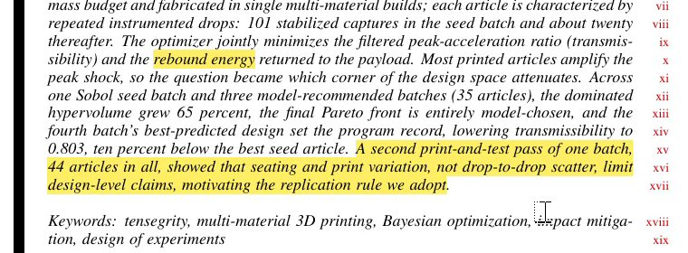

**Where in the source:** `manuscript-body.tex:173` to `176` (abstract). The same claim is repeated in the Conclusions (`:1962`) and carries the Replication paragraph of Section 4.2 and the Discussion.

**What I would change:** He is right that it is about 2dran: the "second print-and-test pass" is the 2dran reprint of the nine batch-3 designs. The record shows the third print is ready but untested: the **3dran print project** (3dranN = the design of drranN and 2dranN) was committed on 2026-09-28 at `cf667d8` on the campaign branch, together with the replicate-study plates (corny7, corny8 and corny2, nine articles each). I would keep the measured fact and drop the generalization: "A second print of one batch (nine designs) moved individual results by more than the drop-to-drop scatter, so single-print extremes are treated as provisional until replicated." Then add a visibly marked placeholder for the 3dran and replicate-study outcome, per the part-1 standing rule (item 30), rather than claiming a settled conclusion.

Burst frames and full screen

Mouse pointer detected at (1480, 639) in the 2210 x 1200 frame.

**00:56 (2 s before)**

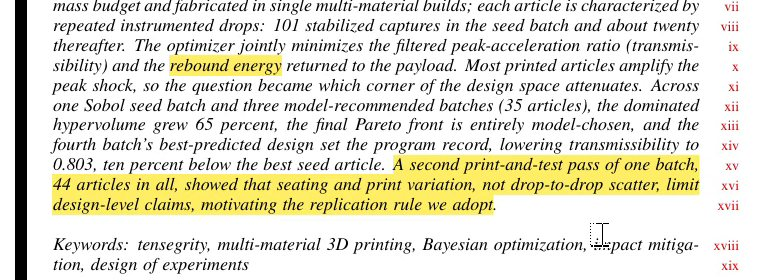

**01:00 (2 s after)**

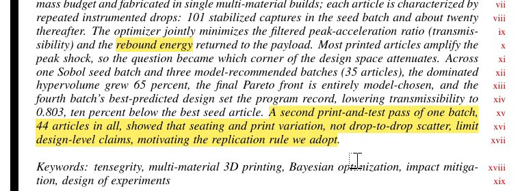

**Full screen at 00:58.** Red boxes: his yellow highlights. Orange circle: the mouse pointer. Blue box: the region cropped above.

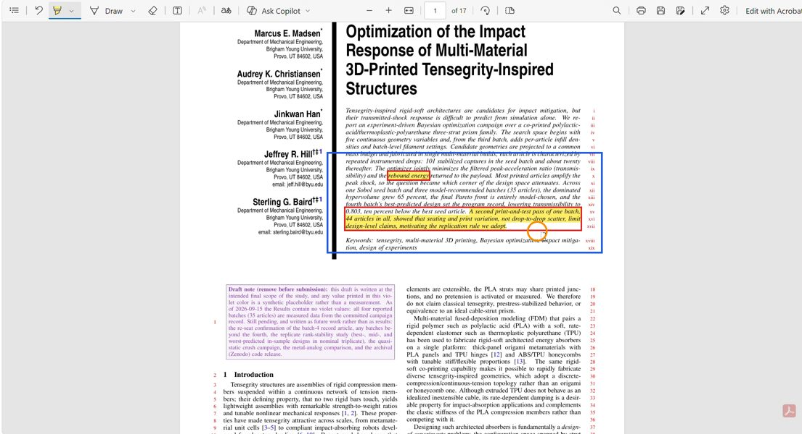

---

### 4. 01:22 to 01:57 | Abstract: name the second objective the velocity loss index

**Change requested (wording supplied).** Replace "the rebound energy returned to the payload" with the velocity loss index, optionally "of the top vertex". Keep the full explanation for the Methods.

> Noting here is one of the cases of rebound energy. There's probably a lot in here. Just replace that with the velocity loss index. We'll need to explain it at some point. It probably doesn't need to be [explained here]; it can probably just be mentioned here as a velocity loss index. So it could say "the filtered peak-acceleration ratio (transmissibility) and a velocity loss index." We could mention that it's of the top vertex; we could explore different ways to say it, but something along those lines right there.

**On screen** ([jump to 01:22 in the video](https://youtu.be/LgUbi-ZpGi0?t=82)): He highlights "jointly minimizes the filtered peak-acceleration ratio (transmissibility) and the rebound energy returned to the payload." (abstract lines ix and x)

**Where in the source:** `manuscript-body.tex:164` to `166`.

**What I would change:** One correction to the offered wording: the velocity loss index is higher-is-better, so "jointly minimizes ... transmissibility and a velocity loss index" would state the wrong direction. I would write: "The optimizer seeks low transmissibility (the filtered peak-acceleration ratio) and a high velocity loss index at the top vertex." If the decision in item 1 is to keep describing batches 1 to 4 by the mass-weighted score they actually optimized, the abstract can still use the short name and leave the weighting to the Methods.

Burst frames and full screen

Mouse pointer detected at (1328, 339) in the 2210 x 1200 frame.

**01:48 (2 s before)**

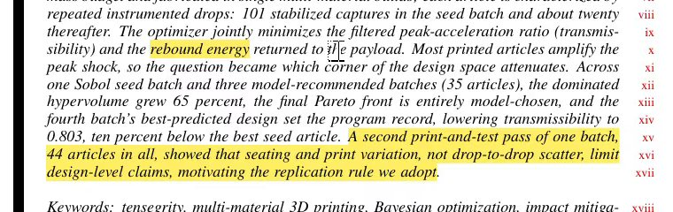

**01:52 (2 s after)**

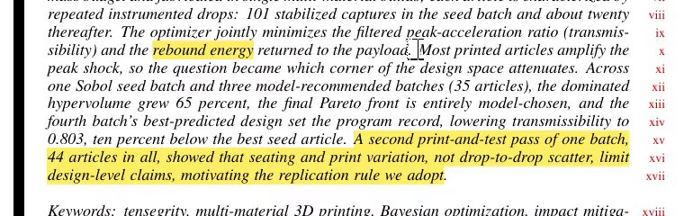

**Full screen at 01:50.** Red boxes: his yellow highlights. Orange circle: the mouse pointer. Blue box: the region cropped above.

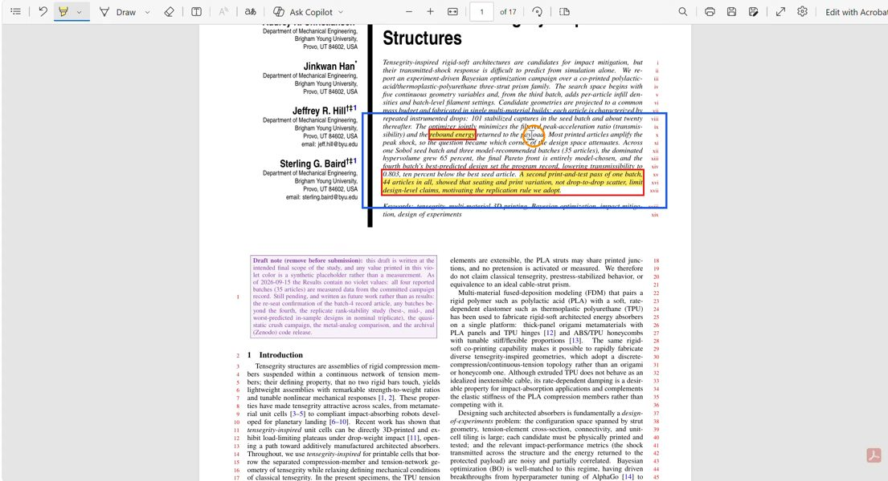

---

### 5. 01:59 to 02:24 | Ask Dr. Baird to review how the Bayesian optimization is worded

**Review request (@sgbaird).** Dr. Baird to read Section 2.3 (and, by extension, the BO method in Section 3.4) for wording.

> Let's make a note that it would be helpful probably to just have Sterling do a brief review of the Bayesian optimization, the way that's worded in here. Just to double check. It seems like it's good to me, but it'd probably be good to pass it by him, as he's more of an expert in that area.

**On screen** ([jump to 01:59 in the video](https://youtu.be/LgUbi-ZpGi0?t=119)): He highlights the heading "2.3 Bayesian Optimization for Architected-Material Design." (page 3, line 198).

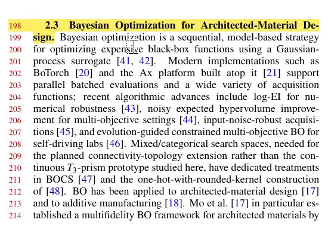

**Where in the source:** `manuscript-body.tex:498` to `529` (Section 2.3). The BO method itself is Section 3.4, `:1045` to `1181`, and the surrogate audits are `:1660` to `1764`.

**What I would change:** No edit until Dr. Baird has read it. Two items that belong in the same pass: the objective naming of item 1 (the BO minimized a mass-weighted score) and the "SAASBO/qNEHVI" entry in Table 1.

Burst frames and full screen

Mouse pointer detected at (772, 800) in the 2210 x 1200 frame.

**02:03 (2 s before)**

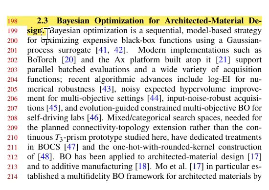

**02:07 (2 s after)**

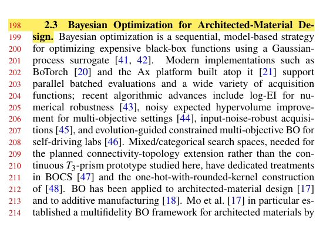

**Full screen at 02:05.** Red boxes: his yellow highlights. Orange circle: the mouse pointer. Blue box: the region cropped above.

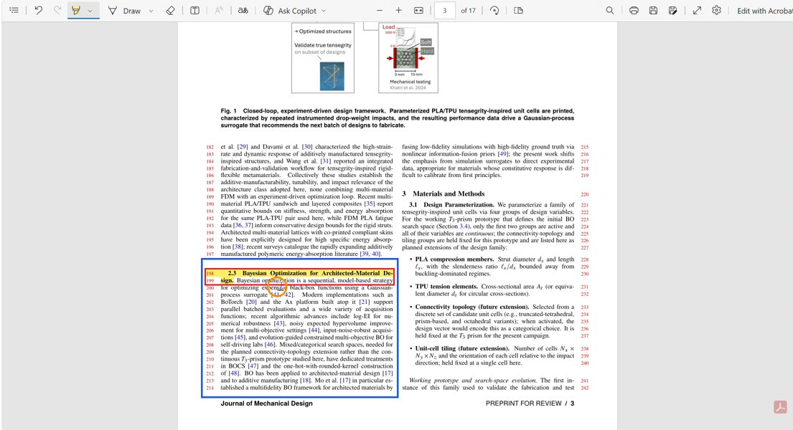

---

### 6. 02:26 to 03:17 | Replace the Fig. 2(b) photo with one on a light backdrop

**Change requested, plus a task for Claude.** Replace the wooden-background photo with a light-backdrop photo like the 6lhxfy one on issue #98, ideally of an untaped, raw article. Claude to try making one and flag it for checking.

> So I really like this figure here, but I don't like the background. I think we should replace this photo, perhaps with one like this. Let's take it on a light backdrop. So let's do that. Claude, if you can't do that really well, maybe try your hand at making one, and then also put a note for us to check that. If not, we can do it ourselves. I'm thinking the only thing is we'll probably want to take a picture of one that doesn't have this tape on it, such as the raw tensegrity structure, but I think a photo like this would look a lot better than having this with background in the back. Doesn't look too bad, but still.

**On screen** ([jump to 02:26 in the video](https://youtu.be/LgUbi-ZpGi0?t=146)): Fig. 2 on page 5 at 02:30, then (02:45) the issue #98 photo of 6lhxfy on a white backdrop, which he offers as the model. The second frame below is that photo.

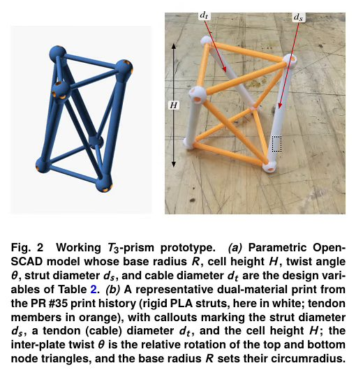

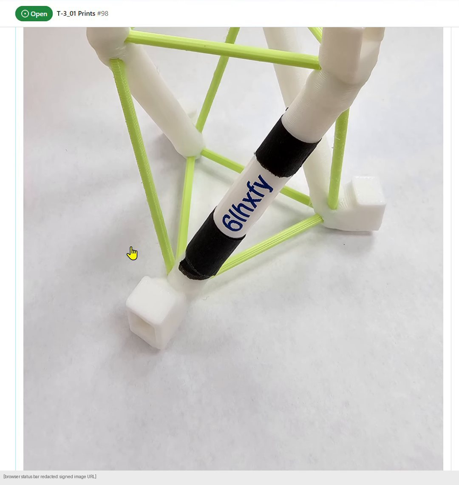

**Where in the source:** `manuscript-body.tex:699` to `737`; the photo is `figures/photos/printed-specimen.jpg` with TikZ callouts for $d_s$, $d_t$ and $H$.

**What I would change:** Done as a candidate, see [Inquiry G](#g-fig-2b-candidate-photos-for-you-to-check). **Please check it.** My recommendation is a reshoot as you describe (untaped, light sweep), with Candidate B below (the current photo with the wood removed) as a stopgap because it still matches panel (a), and Candidate A (a real light-backdrop photo of corny4) only if panel (a) and the caption are updated to the newer joint geometry. Separately, the current panel has a bug: **the $d_t$ arrow ends on the back PLA strut, not on a tendon**.

Burst frames and full screen

Mouse pointer detected at (978, 753) in the 2210 x 1200 frame.

**02:28 (2 s before)**

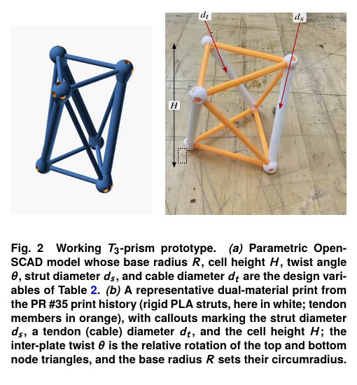

**02:32 (2 s after)**

**Full screen at 02:30.** Red boxes: his yellow highlights. Orange circle: the mouse pointer. Blue box: the region cropped above.

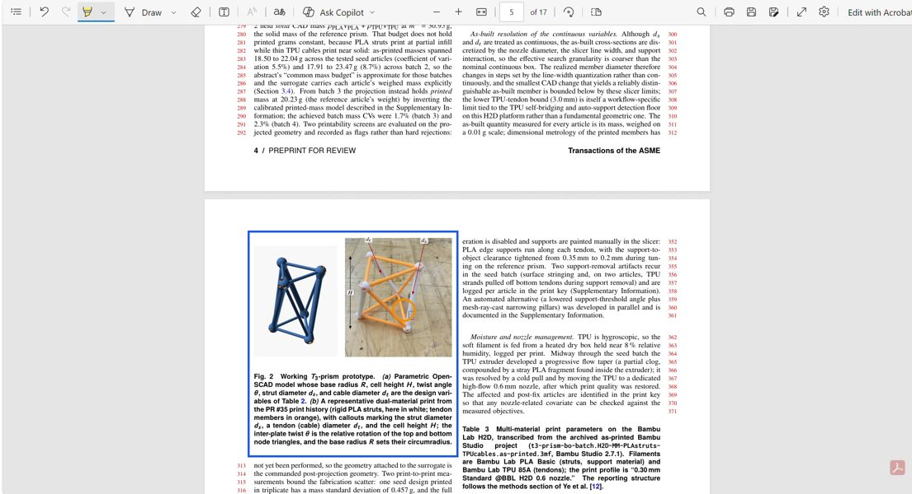

---

### 7. 03:19 to 04:09 | Plot transmissibility against printed mass for every structure

**Inquiry (done).** Make a graph with printed mass on the x-axis (lightest article at the left edge) and transmissibility on the y-axis, one point per structure, plus performance.

> This is less a criticism and more of a note that I want pulled up. I would like to see a graph charting the performance and transmissibility for each structure over its printed mass variance, from this up. So, for example, the lowest starting printing mass we could just put as zero, or have that be 18.5 at the very left. Whatever the lowest one is, just be the starting one. And then we can track transmissibility as the y value on that. I'd just like to see how that compares. So let's have Claude string that up and take a look at that.

**On screen** ([jump to 03:19 in the video](https://youtu.be/LgUbi-ZpGi0?t=199)): He highlights "while thin TPU [cables print near solid: as-printed masses spanned] 18.50 to 22.04 [g]" (lines 282 and 283).

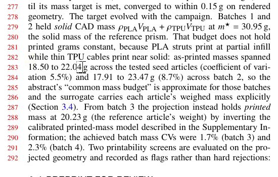

**Where in the source:** `manuscript-body.tex:610` to `616`.

**What I would change:** See [Inquiry A](#a-transmissibility-against-printed-mass). Short answer: across all 44 articles printed mass explains about 1% of the variance in transmissibility (r = +0.12, r² = 0.01). Nothing to change in the manuscript unless you want the figure in the SI; if kept, the text's "r = 0.07 across the 26 articles of batches 1 to 3" (`:1150`) should be updated to the 44-article value.

Burst frames and full screen

Mouse pointer detected at (665, 883) in the 2210 x 1200 frame.

**03:44 (2 s before)**

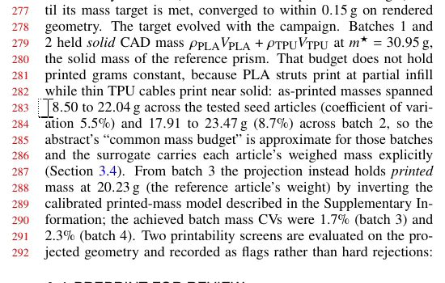

**03:48 (2 s after)**

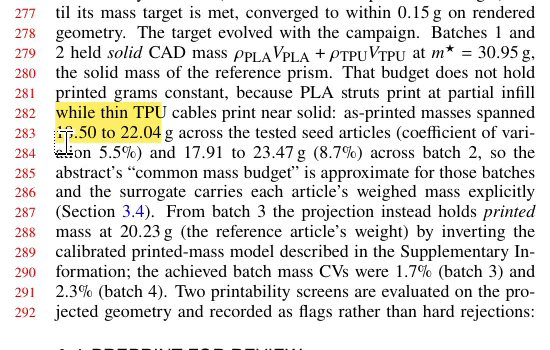

**Full screen at 03:46.** Red boxes: his yellow highlights. Orange circle: the mouse pointer. Blue box: the region cropped above.

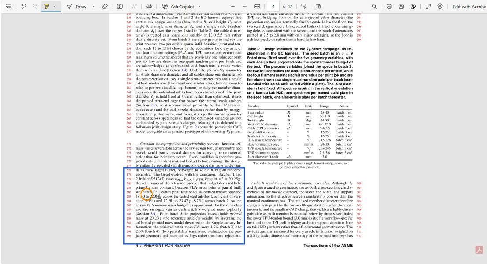

---

### 8. 04:13 to 04:57 | "Inverting the calibrated printed-mass model" needs a plain explanation

**Clarification (answered).** Pull up a reference to what inverting the printed-mass model means.

> Clarification here. This line right here. So let's just read it from the beginning: "From batch three, the projection instead holds printed mass at 20.23 grams (the reference article's weight) by inverting the calibrated printed-mass model described in the Supplementary Information." I guess I need to read over the Supplementary Information to find out what it means to invert the calibrated printed-mass model. Claude, when this video is uploaded, pull up a reference to whatever this is.

**On screen** ([jump to 04:13 in the video](https://youtu.be/LgUbi-ZpGi0?t=253)): He highlights lines 288 and 289: "mass at 20.23 g (the reference article's weight) by inverting the calibrated printed-mass model described in the Supplementary In[formation]".

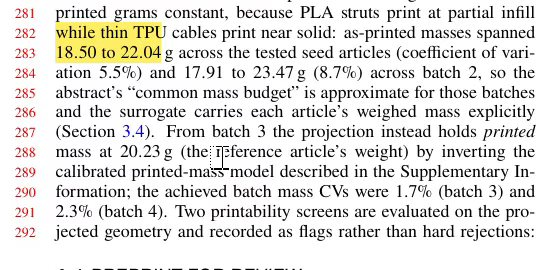

**Where in the source:** `manuscript-body.tex:619` to `622`; SI Section "Printed-Mass Model" (`supplementary.tex:399` to `430`).

**What I would change:** See [Inquiry B](#b-what-inverting-the-printed-mass-model-means). I would replace the phrase with what it does: "From batch 3 the projection instead holds printed mass at 20.23 g (the reference article's weight): a calibrated model predicts each design's printed mass from its geometry, and the design is scaled until that prediction equals the target (Supplementary Information)."

Burst frames and full screen

Mouse pointer detected at (782, 997) in the 2210 x 1200 frame.

**04:41 (2 s before)**

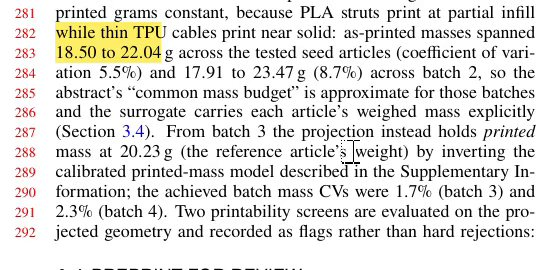

**04:45 (2 s after)**

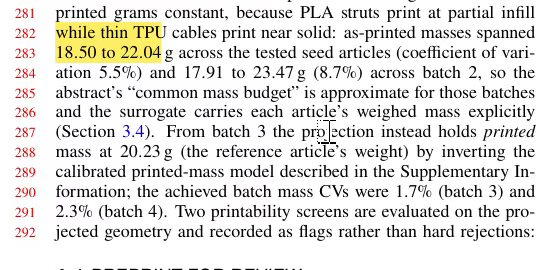

**Full screen at 04:43.** Red boxes: his yellow highlights. Orange circle: the mouse pointer. Blue box: the region cropped above.

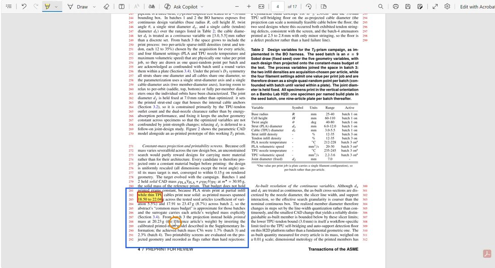

---

### 9. 04:57 to 05:13 | "CVs" was read as control volumes

**Change required.** Spell out coefficient of variation where the abbreviation is used.

> [Supplementary In]formation; the achieved batch mass CVs. I'm assuming this is control volumes. I know that's a pretty standard abbreviation.

**On screen** ([jump to 04:57 in the video](https://youtu.be/LgUbi-ZpGi0?t=297)): Pointer on "CVs" (line 290).

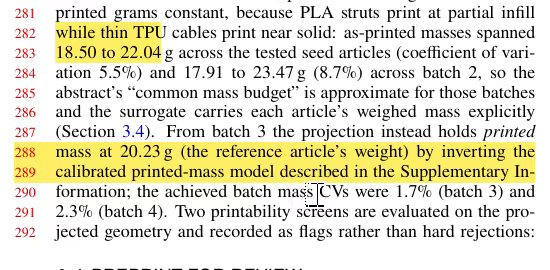

**Where in the source:** `manuscript-body.tex:622`. "Coefficient of variation" is spelled out at `:615` but the abbreviation is never introduced. "CV" then appears on 9 lines (622, 911, 986, 1350, 1463, 1496, 1527, 1591, 1837) while "LOOCV" and "LOGO-CV" use the same letters for cross-validation.

**What I would change:** Introduce it once at `:615` as "coefficient of variation (CV, standard deviation divided by mean)", or avoid the abbreviation for mass spread entirely, since the paper also uses CV for cross-validation. Grep and fix all nine uses together, per the repository rule on repeated phrasing.

Burst frames and full screen

Mouse pointer detected at (874, 1031) in the 2210 x 1200 frame.

**05:03 (2 s before)**

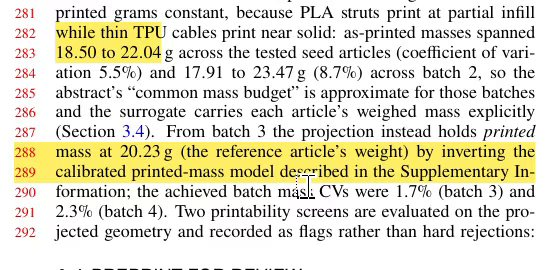

**05:07 (2 s after)**

**Full screen at 05:05.** Red boxes: his yellow highlights. Orange circle: the mouse pointer. Blue box: the region cropped above.

---

### 10. 05:14 to 05:40 | What 1.7% and 2.3% mean, and whether the batches were over or under

**Clarification (answered).** Explain whether 1.7% means "within 1.7% of the target", and whether the printed masses were over or under.

> Of 1.7% and 2.3%? Can we get some clarification on: does that mean they were within 1.7% of this mass here? Like, the printed batches were within 1.7%? Also, was that positive or negative? Like, were they over or under? Just curious on that.

**On screen** ([jump to 05:14 in the video](https://youtu.be/LgUbi-ZpGi0?t=314)): Pointer at the end of "1.7% (batch 3) and 2.3% (batch 4)" (lines 290 and 291).

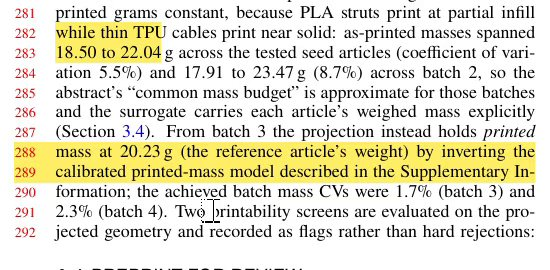

**Where in the source:** `manuscript-body.tex:622` and `623`; SI `supplementary.tex:418` to `424` (which already gives the offsets).

**What I would change:** See [Inquiry C](#c-what-the-batch-mass-cvs-are-and-the-sign). The percentages are spreads, not offsets: 1.7% is the standard deviation of the nine batch-3 masses divided by their mean. The masses came in **under** the target: batch 3 averaged 19.59 g (0.64 g, 3.2% under 20.23 g, all nine below), the batch-3 reprint 19.86 g (0.37 g under, eight of nine below), and batch 4 19.99 g (0.24 g under, seven of nine below). I would add one clause: "printed masses averaged 0.2 to 0.6 g (1 to 3%) below the 20.23 g target, with a within-batch coefficient of variation of 1.7 to 2.3%".

Burst frames and full screen

Mouse pointer detected at (768, 1023) in the 2210 x 1200 frame.

**05:23 (2 s before)**

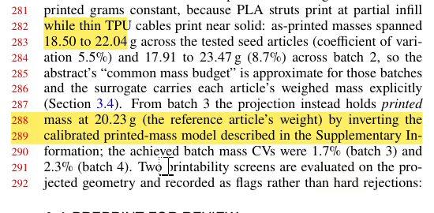

**05:27 (2 s after)**

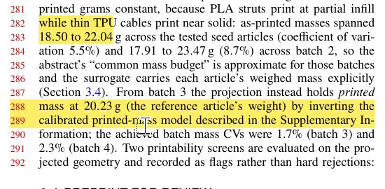

**Full screen at 05:25.** Red boxes: his yellow highlights. Orange circle: the mouse pointer. Blue box: the region cropped above.

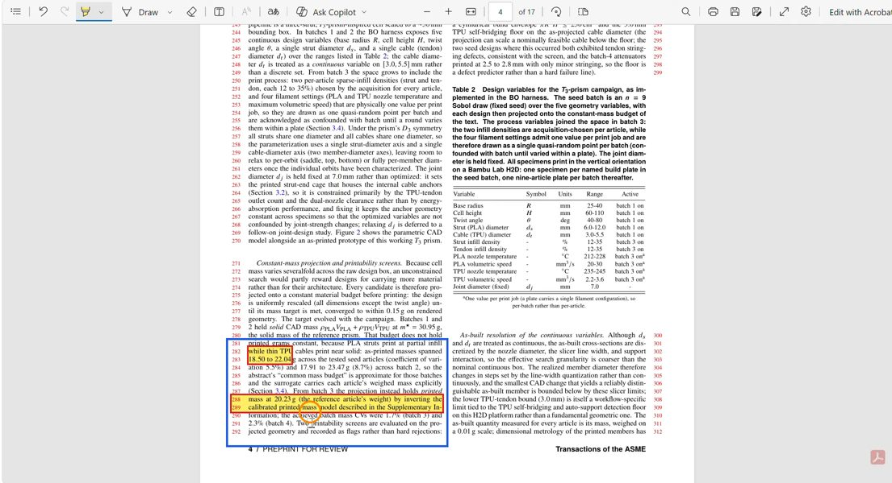

---

### 11. 05:41 to 06:18 | The printability-screens sentence is too dense; where did the screens come from?

**Clarification + origin inquiry (answered).** Rewrite the passage so a reader can follow it, and trace where the screens were implemented.

> On this next part here, the two printability screens, from right here to right here. This is pretty dense and interesting, especially considering I'm not sure I'm even sure what this is talking about. Printability screens: it's going over checking whether or not it can be printed, which I don't remember implementing. Let's look at where that originated from.

**On screen** ([jump to 05:41 in the video](https://youtu.be/LgUbi-ZpGi0?t=341)): He highlights from "Two printability screens" (line 291) through "...rather than a hard failure line)." (line 299).

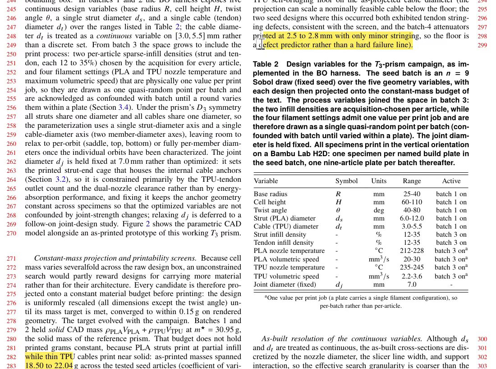

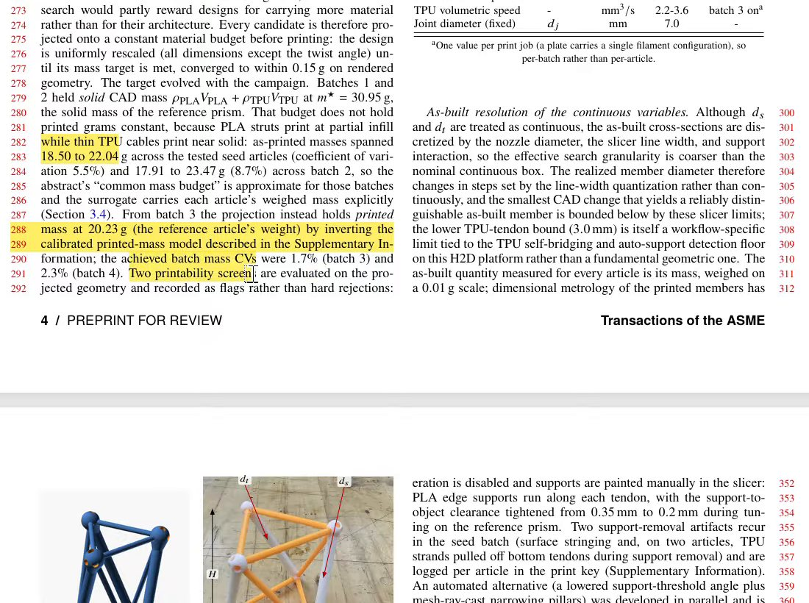

**Where in the source:** `manuscript-body.tex:623` to `632`.

**What I would change:** See [Inquiry D](#d-printability-screens-plain-language-report-origin-and-number-check). Neither screen was ever used to reject or change a design; both are flags written into the design tables. The 250 cm³ cap is a placeholder from the simulation work (PR #33) that Dr. Baird asked to carry into the seed batch on PR #35; the 3.0 mm floor came from an Edison analysis of a PETG test print. I would replace the passage with the rewrite in Inquiry D, which also fixes three claims the print log does not support.

Burst frames and full screen

Mouse pointer detected at (1147, 472) in the 2210 x 1200 frame.

**05:53 (2 s before)**

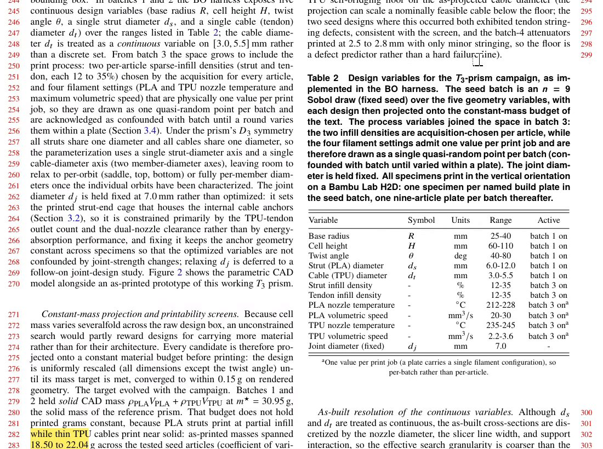

**05:57 (2 s after)**

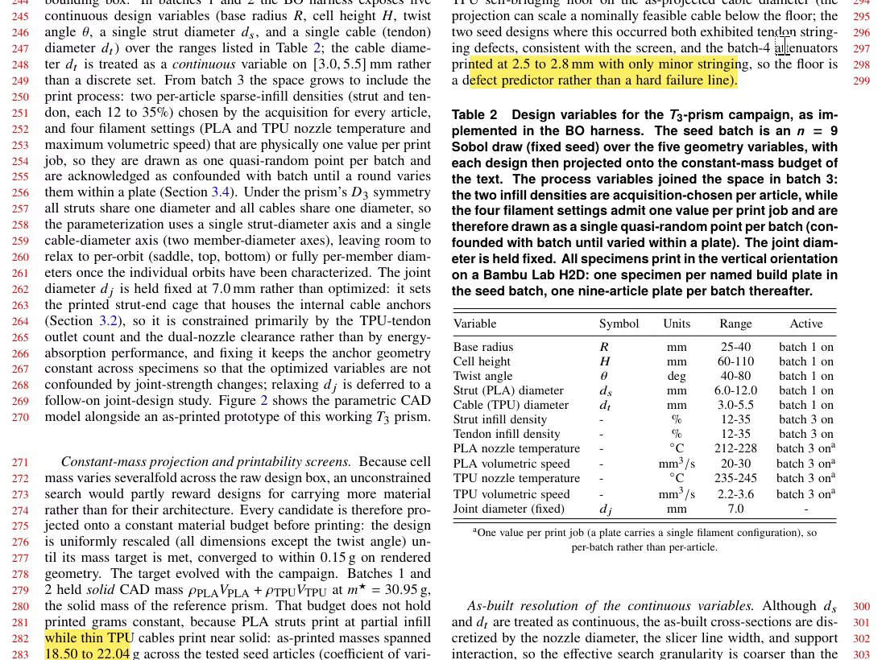

**Full screen at 05:55.** Red boxes: his yellow highlights. Orange circle: the mouse pointer. Blue box: the region cropped above.

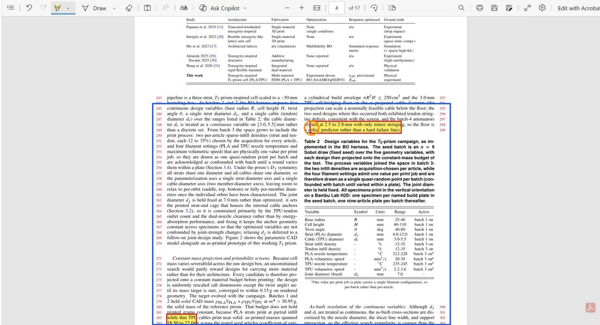

---

### 12. 06:20 to 06:33 | Double-check the numbers in the volume constraint

**Verify (done).** Double-check "a cylindrical build envelope πR²H ≤ 250 cm³" (and the 3.0 mm value).

> This looks like the volume constraints, which we talked about adding in. I would like to know... I would like these numbers double checked right here, specifically.

**On screen** ([jump to 06:20 in the video](https://youtu.be/LgUbi-ZpGi0?t=380)): Zoomed in; he highlights "πR²H ≤ 250 cm³" (line 293).

**Where in the source:** `manuscript-body.tex:625` and `626`.

**What I would change:** The formula and the thresholds match the code, and every recomputed envelope matches the design tables. Three things are wrong or misleading in the sentence: it is **not a build envelope** (it has nothing to do with the H2D build volume); $R$ and $H$ are measured to joint centres, so πR²H undercounts the real part (corny9: 283 cm³ by the formula, about 360 cm³ including the joint shells); and seven printed articles exceeded 250 cm³ (seed designs 02, 05, 08 with three prints of 08, plus corny8 and corny9), which the text does not say. Per-article table in [Inquiry D](#d-printability-screens-plain-language-report-origin-and-number-check).

Burst frames and full screen

Mouse pointer detected at (1877, 441) in the 2210 x 1200 frame.

**06:31 (2 s before)**

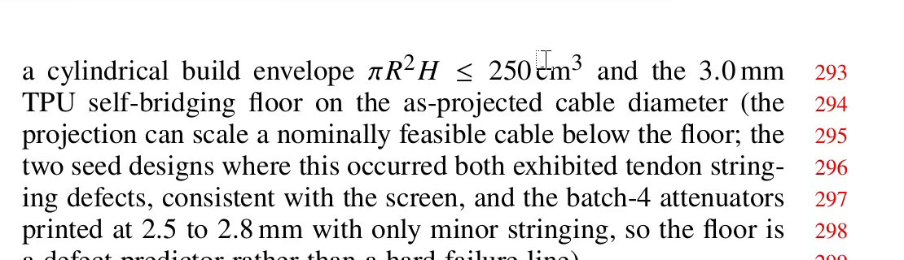

**06:35 (2 s after)**

**Full screen at 06:33.** Red boxes: his yellow highlights. Orange circle: the mouse pointer. Blue box: the region cropped above.

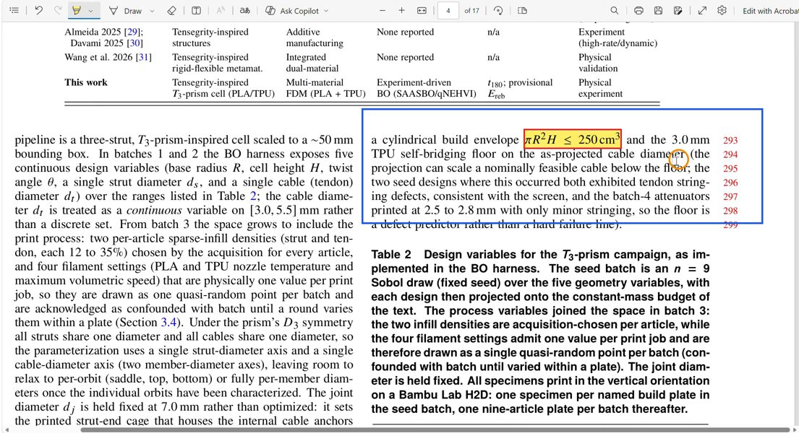

---

### 13. 06:34 to 07:17 | "TPU self-bridging floor on the as-projected cable diameter" is unclear

**Clarification (answered).** Explain what "self-bridging floor", "as-projected", and "scale a nominally feasible cable below the floor" mean.

> I'm really not sure what this whole part is talking about: "TPU self-bridging floor on the as-projected cable diameter. The projection can scale a nominally feasible cable below the floor; the two seed designs where this occurred both exhibited tendon stringing defects." So, one: I'm really not sure what this part here, from "the 3 mm TPU self-bridging floor" to "below the floor", means.

**On screen** ([jump to 06:34 in the video](https://youtu.be/LgUbi-ZpGi0?t=394)): He highlights "TPU self-bridging floor on the as-projected cable diameter (the projection can scale a nominally feasible cable below the floor;" (lines 294 and 295).

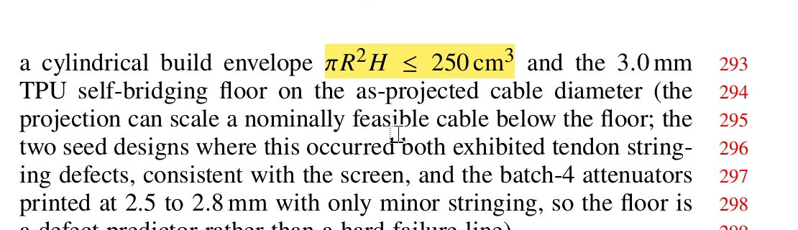

**Where in the source:** `manuscript-body.tex:626` to `629`.

**What I would change:** Plain version: the cable-diameter variable never goes below 3.0 mm, but the constant-mass rescaling shrinks heavy designs, so a cable chosen at 3.0 mm can print thinner. Nine articles printed at 2.51 to 2.78 mm; they were flagged and printed anyway. The 3.0 mm number is a rule of thumb for printing an unsupported cable across open air ("self-bridging"), taken from an Edison analysis of a PETG print, never measured for TPU, and the tendon supports are painted by hand anyway. Full explanation and suggested wording in [Inquiry D](#d-printability-screens-plain-language-report-origin-and-number-check).

Burst frames and full screen

Mouse pointer detected at (1542, 494) in the 2210 x 1200 frame.

**06:48 (2 s before)**

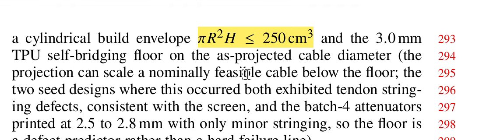

**06:52 (2 s after)**

**Full screen at 06:50.** Red boxes: his yellow highlights. Orange circle: the mouse pointer. Blue box: the region cropped above.

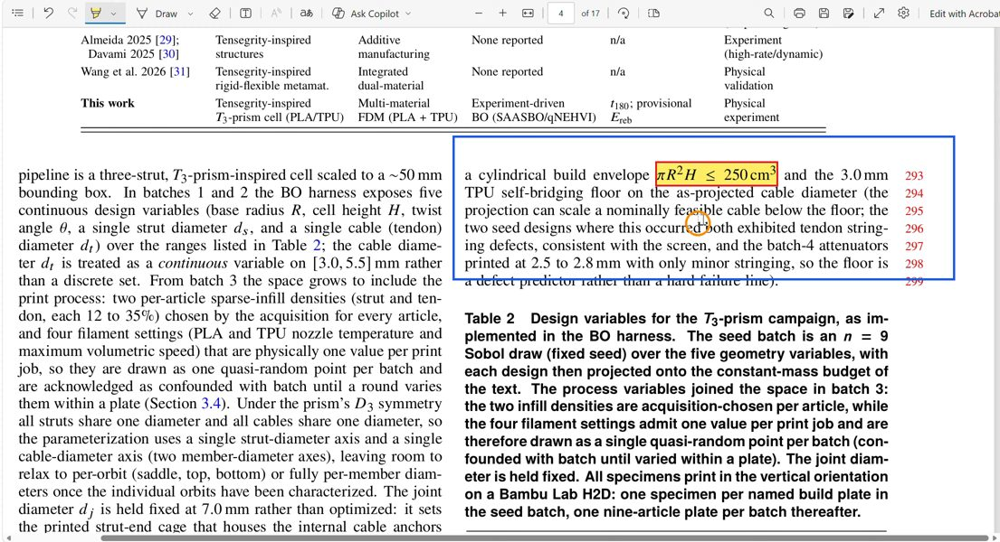

---

### 14. 07:17 to 08:08 | Stringing defects: say what ours actually are

**Change requested.** Clarify that the logged tendon defects are TPU strands that detached from the tendon (did not fuse), not spaghetti failures.

> Two: the talk of stringing defects will probably... Actually, never mind on that. Stringing defects is pretty well known. Our specific ones, the ones that I'm thinking of anyway, aren't necessarily spaghetti failures so much as they are a string that detaches from the tendon, that just didn't connect properly. Let's make sure that's clarified.

**On screen** ([jump to 07:17 in the video](https://youtu.be/LgUbi-ZpGi0?t=437)): Pointer on "the two seed designs where this occurred both exhibited tendon stringing defects" (lines 295 to 297).

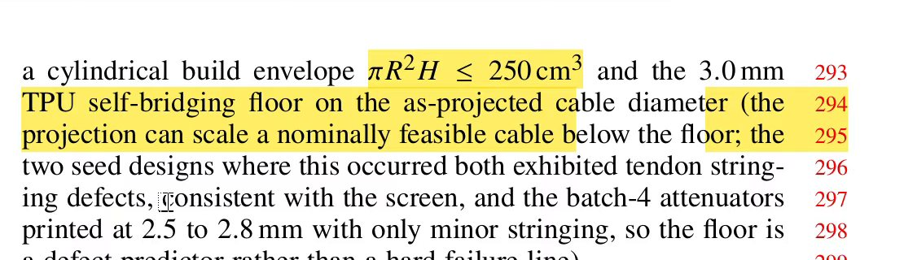

**Where in the source:** `manuscript-body.tex:628` and `629`; the same defect vocabulary is used in the Multi-Material Fabrication subsection (`:739` onward, "surface stringing" at PDF line 356) and in the SI print key.

**What I would change:** The print log agrees with him. The five logged strand defects (ebdna8, 6nheas, r2d2c1, r2d2c4, r2d2c8) are TPU strands that separated from the tendon, two of them during support removal; three are labeled "spaghetti string" in the log itself, which is probably where the wording came from. I would describe them as "a TPU strand that did not fuse to the tendon and separated from it" wherever "stringing" is used for this defect. Also, the sentence's claim is only half right: of the two seed designs with sub-floor cables, 1zm8rv logged stringing, but 6lhxfy logged a strut misprint and a slight tendon indent.

Burst frames and full screen

Mouse pointer detected at (1316, 535) in the 2210 x 1200 frame.

**07:38 (2 s before)**

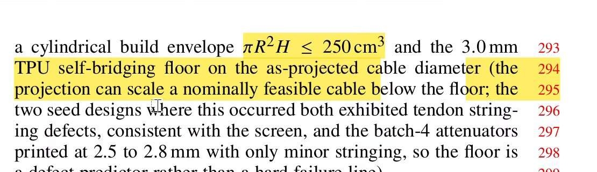

**07:42 (2 s after)**

**Full screen at 07:40.** Red boxes: his yellow highlights. Orange circle: the mouse pointer. Blue box: the region cropped above.

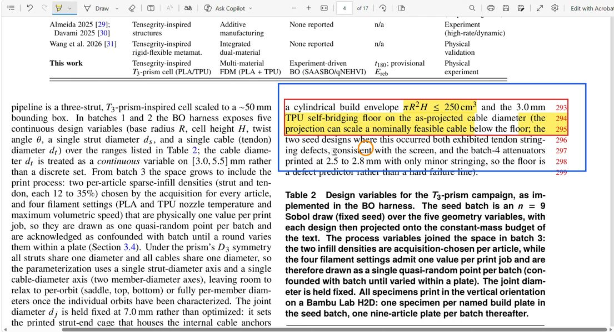

---

### 15. 08:08 to 08:22 | Plain-language report on the highlighted passage, with related posts

**Inquiry (done).** A layman's-terms report on the highlighted area (lines 293 to 295), with links to related issue and PR posts.

> And, Claude, give me a report in as layman's terms as you can muster about what this is trying to say in here. Specifically the highlighted area. And pull up any necessary, any related posts about it, in the report that I'm going to have you generate.

**On screen** ([jump to 08:08 in the video](https://youtu.be/LgUbi-ZpGi0?t=488)): Lines 293 to 295 highlighted (the 250 cm³ envelope and the self-bridging clause).

**Where in the source:** `manuscript-body.tex:625` to `629`.

**What I would change:** The report is [Inquiry D](#d-printability-screens-plain-language-report-origin-and-number-check), with the full version, per-article table and links in [`printability-screens-report.md`](printability-screens-report.md).

Burst frames and full screen

Mouse pointer detected at (1344, 753) in the 2210 x 1200 frame.

**08:08 (2 s before)**

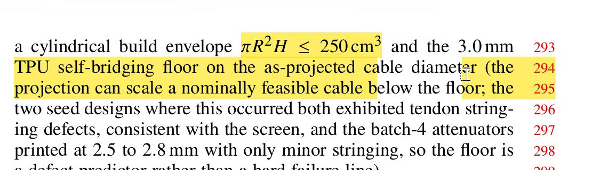

**08:12 (2 s after)**

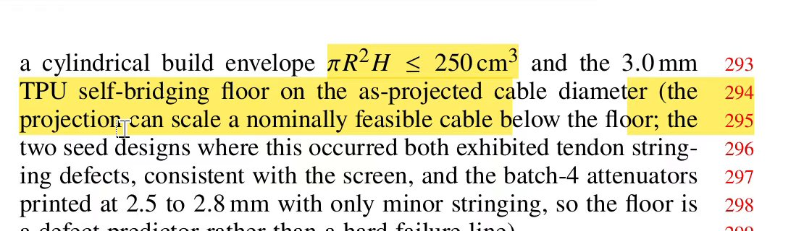

**Full screen at 08:10.** Red boxes: his yellow highlights. Orange circle: the mouse pointer. Blue box: the region cropped above.

---

### 16. 08:23 to 08:40 | Check whether Justin can ping Claude

**Inquiry (answered).** Find out whether Justin has access to trigger Claude, and report.

> This is completely unrelated, but another note that I'd like summarized. I think we need to check if Justin has access to pinging Claude, so make a note for us to check that. I don't know if you have the ability to check that, Claude, but a report on that would be great.

**On screen** ([jump to 08:23 in the video](https://youtu.be/LgUbi-ZpGi0?t=503)): Page 4, unchanged (the remark is unrelated to the text on screen).

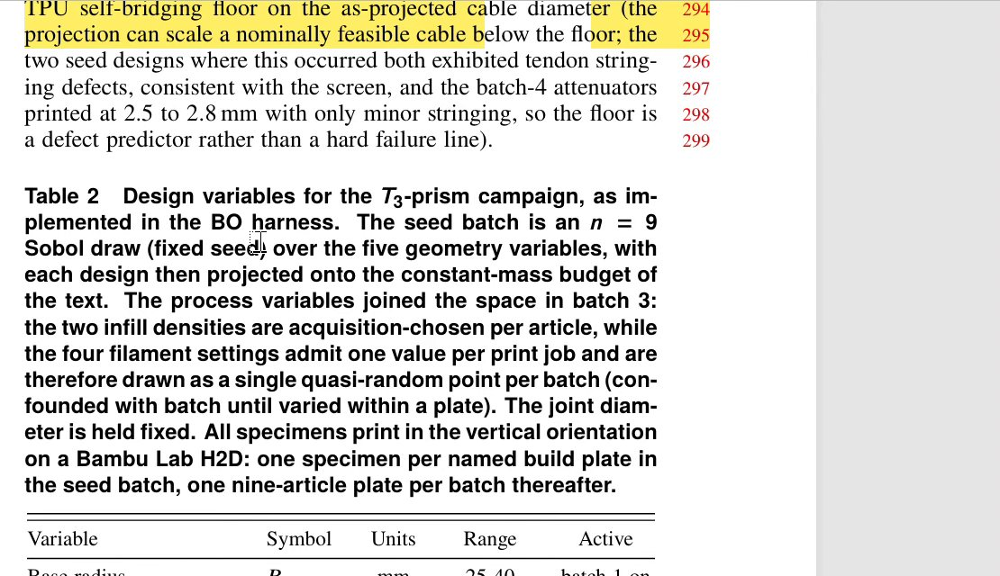

**Where in the source:** Not applicable.

**What I would change:** See [Inquiry E](#e-can-justin-ping-claude). **He cannot, and it has already failed once.** @JustinBal-Vulp has read access only; his `@claude` comment on issue #110 (2026-09-28 20:45 UTC) started a run that stopped with "User does not have write access on this repository". **Fix for @sgbaird:** add JustinBal-Vulp as a collaborator with the Write role.

Burst frames and full screen

The mouse pointer was stationary here, so frame differencing found no pointer.

**08:30 (2 s before)**

**08:34 (2 s after)**

**Full screen at 08:32.** Red boxes: his yellow highlights. Orange circle: the mouse pointer. Blue box: the region cropped above.

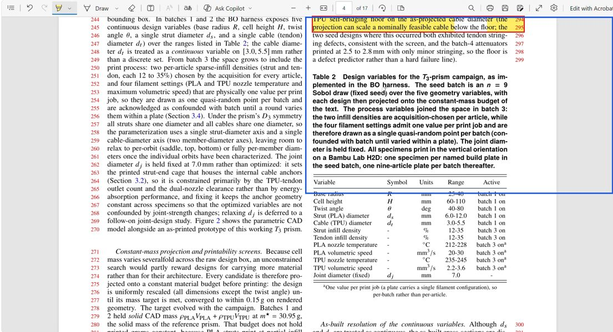

---

### 17. 08:41 to 09:09 | Point "vertical orientation" at a figure that shows it

**Change requested.** Where Table 2 says the specimens print in the vertical orientation, add a figure reference (for example "see Fig. 3") so "vertical" is explicit.

> Right here, where it mentions that they're printed vertically, "vertical orientation". Though it's inferable, let's put in maybe "see Figure 3" or something here. Just something that shows what we mean by vertical, because, yeah, it's more explicit.

**On screen** ([jump to 08:41 in the video](https://youtu.be/LgUbi-ZpGi0?t=521)): Pointer on "vertical orientation" in the Table 2 caption, then he scrolls to Fig. 3 (the fabrication workflow) at 09:05, whose slicing panel shows the prism standing on its base triangle.

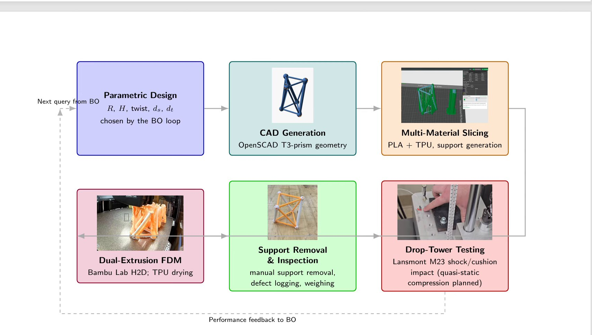

**Where in the source:** `manuscript-body.tex:645` (Table 2 caption); Fig. 3 is `fig:fab-workflow` (`:851` to `858`).

**What I would change:** Change "All specimens print in the vertical orientation" to "All specimens print upright, prism axis normal to the build plate with the base triangle on the bed (Fig. 3, slicing panel)". Worth checking that the FDM panel photo of Fig. 3 also shows an upright print; if it does not, point only to the slicing panel.

Burst frames and full screen

Mouse pointer detected at (1689, 542) in the 2210 x 1200 frame.

**08:46 (2 s before)**

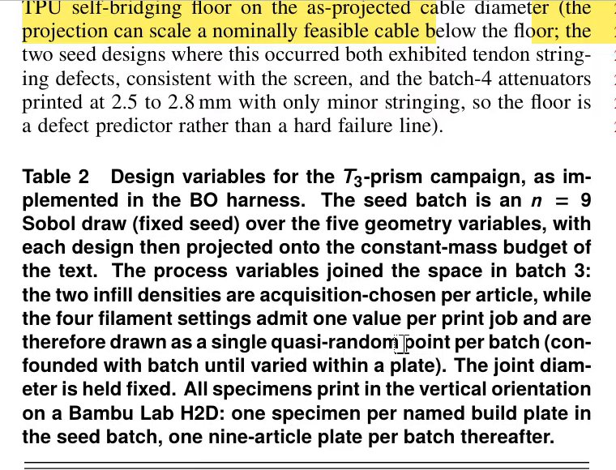

**08:50 (2 s after)**

**Full screen at 08:48.** Red boxes: his yellow highlights. Orange circle: the mouse pointer. Blue box: the region cropped above.

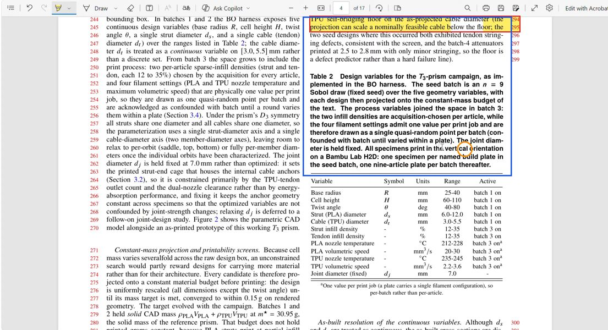

---

### 18. 09:11 to 09:27 | Table 2: put Units after Range

**Change requested.** Reorder the Table 2 columns so the unit follows the number.

> Just in terms of readability: maybe it's standard to have Symbol, Units, Range. Normally, when you're reading a number, you read the units after the number. So why don't we put units after range.

**On screen** ([jump to 09:11 in the video](https://youtu.be/LgUbi-ZpGi0?t=551)): Pointer in the Range column of Table 2.

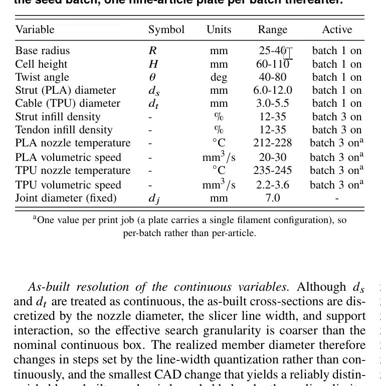

**Where in the source:** `manuscript-body.tex:652` (`Variable & Symbol & Units & Range & Active`) and the twelve rows below it.

**What I would change:** Reorder to `Variable & Symbol & Range & Units & Active` and swap the two cells in each row. No other table in the manuscript or SI uses a Units column, so this is the only place.

Burst frames and full screen

Mouse pointer detected at (1656, 408) in the 2210 x 1200 frame.

**09:18 (2 s before)**

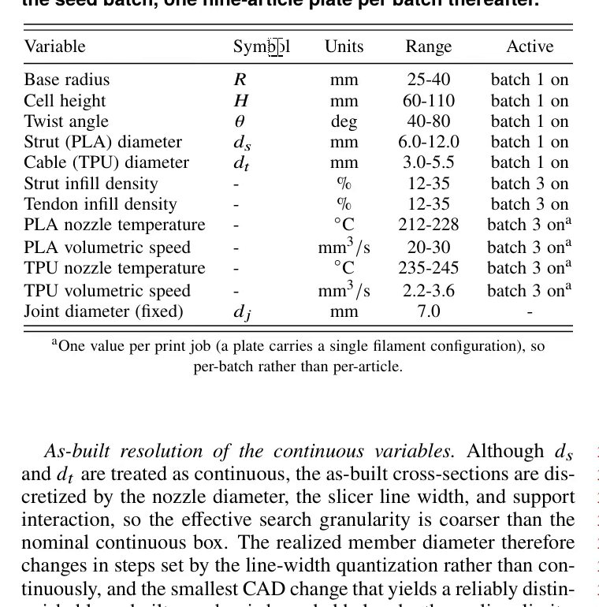

**09:22 (2 s after)**

**Full screen at 09:20.** Red boxes: his yellow highlights. Orange circle: the mouse pointer. Blue box: the region cropped above.

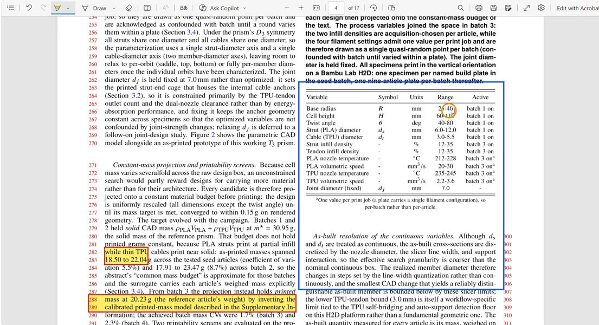

---

### 19. 09:29 to 09:42 | Session paused at line 300

**Context.** No edit. Coverage note: the next session starts at line 300 ("As-built resolution of the continuous variables").

> We're going to pause this session right here, at line 300, and we'll resume it later. I'm just going to upload this as a partial run-through that I'll continue on later today.

**On screen** ([jump to 09:29 in the video](https://youtu.be/LgUbi-ZpGi0?t=569)): Page 4, right column, line 300 at the top of the "As-built resolution" paragraph.

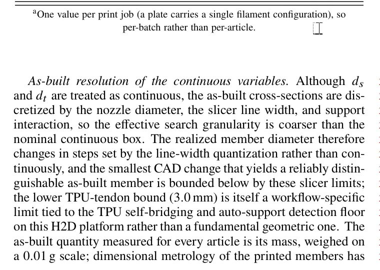

**Where in the source:** `manuscript-body.tex:676` onward.

**What I would change:** Not applicable.

Burst frames and full screen

The mouse pointer was stationary here, so frame differencing found no pointer.

**09:36 (2 s before)**

**09:40 (2 s after)**

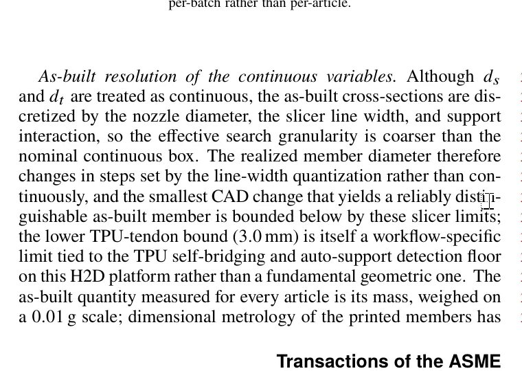

**Full screen at 09:38.** Red boxes: his yellow highlights. Orange circle: the mouse pointer. Blue box: the region cropped above.

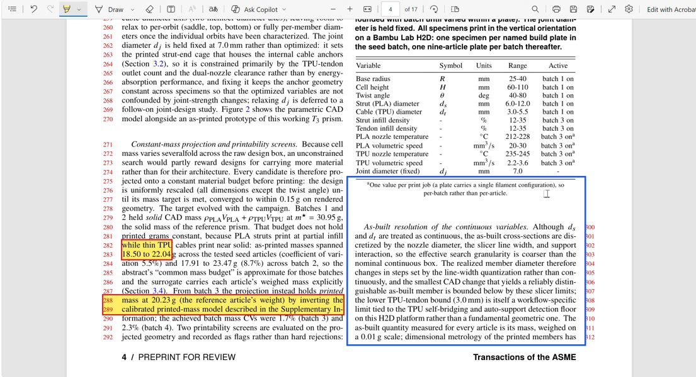

---

## Inquiry reports

### A. Transmissibility against printed mass

Item [7](#7-0319-to-0409--plot-transmissibility-against-printed-mass-for-every-structure). One point
per drop-tested article (44), weighed printed mass on the x-axis with the lightest article
(r2d2c9, 17.91 g) at the left edge, transmissibility on the left panel and, as the "performance"
he mentions, the velocity loss index on the right (higher is better; see [F](#f-what-the-velocity-loss-index-is-in-this-pipeline)).
Color marks the mass-control regime and marker shape the physical batch. Script, per-article CSV
and statistics: [`analysis/`](analysis/).

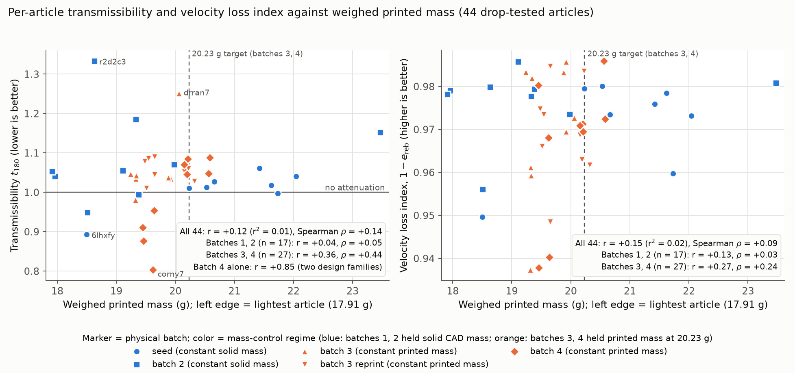

| Set | n | r (Pearson) | r² | Spearman ρ | p (Pearson) |
|---|--:|--:|--:|--:|--:|
| All 44 articles | 44 | +0.12 | 0.01 | +0.14 | 0.44 |
| Batches 1 and 2 (constant solid CAD mass) | 17 | +0.04 | 0.00 | +0.05 | 0.87 |
| Batches 3 and 4 (constant printed mass) | 27 | +0.36 | 0.13 | +0.44 | 0.07 |
| Seed batch alone | 8 | +0.82 | 0.67 | +0.50 | 0.013 |
| Batch 4 alone | 9 | +0.85 | 0.73 | +0.85 | 0.003 |

What it shows:

- **Across the campaign, printed mass barely predicts transmissibility** (r² = 0.01). The mass
  spread that worried the seed-batch analysis (r = +0.82 over eight articles) did not carry over
  once 36 more articles were added.
- **The two strong within-batch relations are not mass effects.** Batch 4 printed as two design
  families: corny1 to corny5 (tall, low twist, 20.15 to 20.58 g) and corny6 to corny9 (wide, high
  twist, 19.45 to 19.64 g), and all four attenuators are in the second family. Mass separates the
  families, so it correlates with transmissibility inside the batch, but geometry is doing the
  work. The seed batch's +0.82 is the same kind of confound over eight Sobol designs.
- **The velocity loss index shows no mass trend either** (r = +0.15).
- The spread in mass is itself the story of the projection change: 17.91 to 23.47 g in batches 1
  and 2, 19.24 to 20.58 g in batches 3 and 4.

### B. What "inverting the printed-mass model" means

Item [8](#8-0413-to-0457--inverting-the-calibrated-printed-mass-model-needs-a-plain-explanation).

**The model, forward.** Given a design and a uniform scale factor $s$, the calibrated model
predicts what the printed article will weigh on the scale. Member volumes grow as $s^3$; PLA
struts count as walls plus sparse infill (a thin strut is proportionally more wall, so it prints
denser); TPU counts as nearly solid, through one fitted factor. It was fitted to the 12 articles
weighed at the time (seed batch, duplicates and reference), with a residual of 0.38 g, about the same as the 0.46 g print-to-print scatter of
the triplicate-printed seed design 08.

**Inverted.** The projection runs it backwards: fix the target (20.23 g, the reference article
bpx68c's weight) and solve for the $s$ at which the predicted printed mass equals it. The code does
this by bisection, since mass rises monotonically with $s$. The design is then printed at that
scale.

References:

- SI Section "Printed-Mass Model", [`supplementary.tex:399` to `430`](../../manuscript/supplementary.tex).
- Code on the campaign branch: [`printed_mass_g`](https://github.com/vertical-cloud-lab/tensegrity-optimization/blob/cf667d8/bo/t3_prism_mass_model.py#L249-L257)
  (forward) and [`solve_scale_for_printed_mass`](https://github.com/vertical-cloud-lab/tensegrity-optimization/blob/cf667d8/bo/t3_prism_mass_model.py#L265-L297)
  (the inversion); the module docstring at the top of the same file explains the calibration.
- Introduced in `2f1ca2e` (2026-08-21, "Constant printed mass: calibrated mass model ...") on
  PR #102.

### C. What the batch mass CVs are, and the sign

Items [9](#9-0457-to-0513--cvs-was-read-as-control-volumes) and
[10](#10-0514-to-0540--what-17-and-23-mean-and-whether-the-batches-were-over-or-under). CV is the
coefficient of variation: the standard deviation of a batch's weighed masses divided by their mean.
It measures how tightly the nine articles cluster, not how close they are to the target. Weighed
masses include the ID label.

| Batch | Target | Mean (g) | SD (g) | CV | Mean minus 20.23 g | Below target | Mean minus model prediction |
|---|---|--:|--:|--:|--:|--:|--:|
| Seed (8 tested) | solid CAD mass | 20.84 | 1.14 | 5.5% | +0.61 g | 1 of 8 | n/a |
| Batch 2 | solid CAD mass | 19.36 | 1.68 | 8.7% | -0.87 g | 8 of 9 | +0.32 g |
| Batch 3 | 20.23 g printed | 19.59 | 0.34 | 1.7% | -0.64 g (-3.2%) | 9 of 9 | -0.52 g |
| Batch 3 reprint | 20.23 g printed | 19.86 | 0.35 | 1.8% | -0.37 g (-1.8%) | 8 of 9 | -0.25 g |
| Batch 4 | 20.23 g printed | 19.99 | 0.45 | 2.3% | -0.24 g (-1.2%) | 7 of 9 | -0.26 g |

So the answer to "within 1.7% of this mass?" is no: the 1.7% and 2.3% are spreads, and the
batches ran **under** the target, by 0.64 g in batch 3 and 0.24 g in batch 4. The last column is
the per-session flow offset the SI already reports (`supplementary.tex:421` to `423`); the
manuscript body does not mention the sign at all.

### D. Printability screens: plain-language report, origin, and number check

Items [11](#11-0541-to-0618--the-printability-screens-sentence-is-too-dense-where-did-the-screens-come-from)
to [15](#15-0808-to-0822--plain-language-report-on-the-highlighted-passage-with-related-posts).
The full report, with the per-article table for all 48 printed articles and every link, is
[`printability-screens-report.md`](printability-screens-report.md). The short version:

**In plain terms.** Before printing, each design is scaled as a whole (twist unchanged) until it
hits the mass target; that is the "projection", and "as-projected" means a dimension after that
resize, which is what gets printed. Two yes/no checks then run, and each answer is stored as a
flag, a column in the design table. Nothing was ever deleted, resized or held back because of
them.

1. **Volume.** Is πR²H at most 250 cm³? $R$ and $H$ are measured to the joint centres, so this
   undercounts the real bounding cylinder. It is not the printer's build volume. It is a
   placeholder "packing budget" from the simulation study.
2. **Cable.** Is the printed TPU cable at least 3.0 mm thick? That minimum is the "floor".
   "Self-bridging" means printing a cable across open air with nothing under it; thinner cables
   were expected to sag. The cable variable starts at 3.0 mm, but the resize shrinks heavy
   designs, so a cable chosen at 3.0 mm can print at 2.5 mm.

**Where they came from.**

| Date | What happened | Link |
|---|---|---|
| 2026-05-08 | Edison `25c1c897` diagnoses a spaghetti failure in a **PETG** test print (2.4 mm top cables spanning 43.3 mm) and lists "3.0 mm or 4.0 mm" cables as one of four fixes. It does not discuss TPU. | [analysis](https://github.com/vertical-cloud-lab/tensegrity-optimization/blob/21fd799/edison-trajectories/2026-05-08-t3-prism-bambu-import-25c1c897.md#L105-L118) |
| 2026-05-12 to 05-20 | The slicer auto-supports the top cables only at 1.3x scale (Marcus's PR #35 comment). 3.0 mm becomes the cable variable's lower bound. | [comment](https://github.com/vertical-cloud-lab/tensegrity-optimization/pull/35#issuecomment-4426810002), [`7d98451`](https://github.com/vertical-cloud-lab/tensegrity-optimization/blob/7d98451/bo/t3_prism_sobol_batch.py#L42-L48) |
| 2026-06-21 to 06-27 | Dr. Baird asks for fair comparison "in terms of mass, volume, and contact area" on PR #33. The lander volume budget stays "TBD"; the simulation code picks 250 cm³ so it would "bind on a meaningful fraction" of simulated shapes. | [PR #33](https://github.com/vertical-cloud-lab/tensegrity-optimization/pull/33#issuecomment-4760939061), [`04baa03`](https://github.com/vertical-cloud-lab/tensegrity-optimization/blob/04baa03/simulations/sim_bo_hybrid_campaign.py#L145-L152) |
| 2026-07-30 | Dr. Baird asks that the seed batch meet "the max volume constraint". Both numbers are copied into the batch generator as flags only; three seed designs exceeded 250 cm³ and were printed anyway. | [PR #35](https://github.com/vertical-cloud-lab/tensegrity-optimization/pull/35#issuecomment-5132975378), [`cf39fe0`](https://github.com/vertical-cloud-lab/tensegrity-optimization/blob/cf39fe0/bo/t3_prism_sobol_batch.py#L76-L81) |
| 2026-08-21 on | The campaign code keeps both as flags; neither enters the acquisition function. | [mass model](https://github.com/vertical-cloud-lab/tensegrity-optimization/blob/cf667d8/bo/t3_prism_mass_model.py#L329-L334), [PR #102](https://github.com/vertical-cloud-lab/tensegrity-optimization/pull/102#issuecomment-5364709143) |

So the "volume constraints we talked about adding in" is the 2026-07-30 request, and it was
implemented as a warning column rather than a constraint.

**The numbers, checked** (item [12](#12-0620-to-0633--double-check-the-numbers-in-the-volume-constraint)):

- Formula and thresholds: as stated, and the recomputed πR²H matches every value in the design
  tables. "Build envelope" is the wrong name.
- **Flags only: correct.** Seven of 48 printed articles exceeded 250 cm³ (seed designs 02, 05 and
  08, the last printed three times, plus corny8 and corny9) and nine printed with cables under
  3.0 mm. All were printed, and every flagged design except Spec 06 (1zm8rv) has a drop-tested article.
- **"The two seed designs where this occurred both exhibited tendon stringing defects": half
  right.** 1zm8rv logged "stringing along diagonal tendons". 6lhxfy logged "slight misprint near
  top of one PLA strut; slight indent on one top TPU tendon". The sentence also leaves out batch 2,
  whose three sub-floor articles (2.62 to 2.70 mm) logged no defects.
- **"The batch-4 attenuators printed at 2.5 to 2.8 mm with only minor stringing": diameters
  right, stringing not in the log.** corny6 to corny9 are the batch-4 articles below unity and the
  only ones below the floor (2.51 to 2.78 mm). Their print-key defect fields read "none". The
  phrase "only minor stringing" traces to a Claude comment on PR #102, not to the print log.
- **"The floor is a defect predictor": not supported.** Stringing or detached-strand defects were
  logged on 1 of 9 sub-floor articles and on 7 of 39 others.

**Suggested rewrite of lines 291 to 299** (from the report; accurate to the data):

> Each projected design was also checked against two printability limits, recorded as warnings
> and never used to reject or modify a design. The first compares πR²H with 250 cm³, where R is
> the radius of the circle through the joint centres and H the joint-to-joint height. This is a
> placeholder packing budget from an earlier simulation study, not a printer limit; seven printed
> articles (five designs) exceeded it. The second is a 3.0 mm minimum on the printed TPU cable
> diameter, adopted after early PETG test prints whose thin, unsupported top cables failed. The
> projection rescales the whole cell, so a design at the 3.0 mm bound of the cable variable can
> print thinner: nine articles printed at 2.51 to 2.78 mm, including all four batch-4 articles
> with t180 below 1. With hand-painted tendon supports all nine printed: one logged stringing, one
> a slight tendon indent, and seven no defects. The most common tendon defect, a TPU strand that
> did not fuse to the tendon and separated from it, was logged on five articles with cables of
> 3.28 to 4.23 mm. The 3.0 mm value is therefore a conservative rule for this workflow, not a
> demonstrated defect threshold.

This is longer than the original. If that is too much for the Methods, the second half (from
"The projection rescales") can move to the SI with a one-line pointer.

**Related posts:**

- [PR #35, 2026-07-30](https://github.com/vertical-cloud-lab/tensegrity-optimization/pull/35#issuecomment-5132975378): the request for the maximum volume constraint on the seed batch.
- [PR #35, 2026-07-30 reply](https://github.com/vertical-cloud-lab/tensegrity-optimization/pull/35#issuecomment-5132983514): three seed designs over 250 cm³, printed anyway.
- [PR #35, 2026-08-21](https://github.com/vertical-cloud-lab/tensegrity-optimization/pull/35#issuecomment-5373292206): extra care asked when painting supports on the three sub-floor batch-2 articles.
- [Issue #85, 2026-07-17](https://github.com/vertical-cloud-lab/tensegrity-optimization/issues/85#issuecomment-5008302271): first use of the name "TPU self-bridging floor".
- [PR #33, 2026-08-24](https://github.com/vertical-cloud-lab/tensegrity-optimization/pull/33#issuecomment-5398395837): in the simulation study both checks were hard constraints.
- [PR #102, 2026-09-15](https://github.com/vertical-cloud-lab/tensegrity-optimization/pull/102#issuecomment-5673199005): "the floor is evidently soft here", after the corny prints.
- The detached-strand defect log entries, quoted in the report: [ebdna8](https://github.com/vertical-cloud-lab/tensegrity-optimization/issues/98#issuecomment-5285048840), [6nheas](https://github.com/vertical-cloud-lab/tensegrity-optimization/issues/98#issuecomment-5348663481), [r2d2c1](https://github.com/vertical-cloud-lab/tensegrity-optimization/issues/98#issuecomment-5401135583), [r2d2c4](https://github.com/vertical-cloud-lab/tensegrity-optimization/issues/98#issuecomment-5401312748), [r2d2c8](https://github.com/vertical-cloud-lab/tensegrity-optimization/issues/98#issuecomment-5401479186).

### E. Can Justin ping Claude?

Item [16](#16-0823-to-0840--check-whether-justin-can-ping-claude). **No.**

- Justin's account is **@JustinBal-Vulp** (assignee of issue #110). The collaborator API reports
  his permission on this repository as **read**. The collaborators with write access or higher
  are sgbaird (three accounts), Jeffrayhill1, me-madsen, achris0520 and ctrhjk.
- The Claude workflow (`.github/workflows/claude.yml` on `main`) uses
  `anthropics/claude-code-action@v1` without an `allowed_non_write_users` setting, so the action
  only runs for users with write access.
- It has already failed once. His comment on issue #110 on 2026-09-28 at 20:45 UTC ("Give me the
  drop data for corny7 as a csv file ...") started run `36481445252`, which stopped with
  **"User does not have write access on this repository"** after three attempts. The run that
  answered it a minute later (`36481576494`, branch `claude/issue-110-20260928-2047`) was
  triggered by @me-madsen, not by Justin.
- **Fix (@sgbaird, admin only):** Settings, Collaborators, add JustinBal-Vulp with the **Write**
  role. Listing him in `allowed_non_write_users` in `claude.yml` would also work but lets a
  read-only account drive a session that holds the repository's secrets, so the Write role is
  the cleaner route. I could not check for a pending invitation (that API needs admin rights).

### F. What the velocity loss index is in this pipeline

Items [1](#1-0000-to-0028--call-the-rebound-quantity-the-velocity-loss-index-everywhere) and
[4](#4-0122-to-0157--abstract-name-the-second-objective-the-velocity-loss-index). Checked against
the five committed drop-result files:

- The pipeline's rebound fraction is $e_{\mathrm{reb}} = g t_{\mathrm{second}}/(2 \Delta v)$,
  reproduced from the per-article means to within 5e-5. $g t_{\mathrm{second}}/2$ is the speed at
  which the top vertex leaves the base after impact, if the hop is ballistic, and $\Delta v$ is the
  base plate's velocity change. **So $e_{\mathrm{reb}}$ is already a velocity ratio.**
- The campaign objective is $E_{\mathrm{reb}} = e_{\mathrm{reb}} m g h$ with $h$ = 1.524 m
  (checked for all 44 articles), in millijoules: a velocity ratio times the article's potential
  energy. That is why the manuscript calls it a "mass-weighted rebound score" and not a measured
  rebound energy (returned kinetic energy would scale with the square of the ratio).
- The natural velocity loss index is therefore **VLI = 1 minus $e_{\mathrm{reb}}$**, the fraction
  of the impact velocity change the structure does not give back at the top vertex. Across the 44
  articles it runs from 0.937 to 0.986.
- **Do not reuse the VLI numbers from the 2026-09-22 comment on this PR** (0.76 to 0.89, LOGO
  MAPE 3.5%). They were computed as 1 minus the square root of $e_{\mathrm{reb}}$, which treats
  the velocity ratio as an energy ratio. The rank correlations quoted there are unaffected
  (both forms are monotone in $e_{\mathrm{reb}}$), but the values and the MAPE are not.
- Direction: VLI is higher-is-better, the opposite of transmissibility, which matters for the
  abstract wording (item 4).
- Ranking: sorting articles by $E_{\mathrm{reb}}$ and by VLI agree closely where printed mass was
  held constant (Spearman 0.995 over batches 3 and 4) and less closely in batches 1 and 2 (0.855).

### G. Fig. 2(b) candidate photos for you to check

Item [6](#6-0226-to-0317--replace-the-fig-2b-photo-with-one-on-a-light-backdrop). All 175 images
attached to issues #98, #85, #86, #108 and PRs #35, #102 were downloaded and looked at. The only
untaped articles on a light seamless backdrop are the corny1 to corny9 photos (issue #98,
2026-09-11, @ctrhjk); the 6lhxfy photo you showed is taped. Files and notes:
[`fig2b-candidates/`](fig2b-candidates/) (see its [`notes.md`](fig2b-candidates/notes.md)).

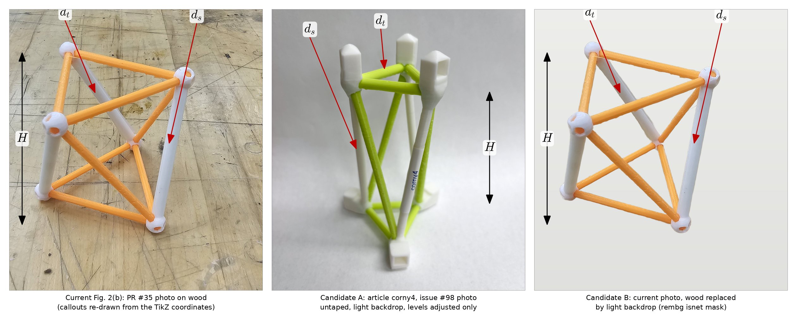

- **Candidate A (corny4, real photo, light backdrop, levels only).** Untaped and not composited.
  It is a newer article than panel (a): square strut-end cages and green TPU, where the CAD render
  has spherical nodes and the caption says orange, so panel (a) and the caption would change with
  it. A small "corny4" label is visible, its print record notes pores on the diagonal tendons, and
  in my view the $H$ arrow as drawn does not span the node planes and needs re-anchoring.
- **Candidate B (the current photo, wood removed with rembg).** The cut-out is clean with no lost
  tendons, and it still matches panel (a). It looks pasted in (no contact shadow, slightly bluish
  PLA), and a replaced background must be disclosed in the caption. Usable as a stopgap.
- **Bug in the current panel:** the $d_t$ arrow tip lands on the back PLA strut, not on a tendon.
  Any version should move it onto an orange (or green) tendon.
- **Recommendation:** reshoot as you proposed: an untaped article of the geometry in panel (a) on a
  white or light gray paper sweep, diffuse light, camera 15 to 20 degrees above the top plane,
  f/8 to f/11 so front and back nodes are sharp, and one frame with a ruler. Use B until then.

## Appendix A: corrected transcript

`faster-whisper` `medium.en` (greedy decoding, primed with project vocabulary) is in
[`transcript-whisper-medium-en.json`](transcript-whisper-medium-en.json); a second pass over the
unclear windows (beam search, no vocabulary prompt) is in
[`transcript-second-pass-beam5.json`](transcript-second-pass-beam5.json). The table below is the
first pass with the corrections in [Appendix B](#appendix-b-transcription-corrections) applied.
Square brackets mark words inserted for readability; quotation marks mark text he reads aloud
from the draft.

| Time | Corrected transcript |
|---|---|
| `00:00` | All right, this is the second batch of video edits for the manuscript. Before getting into that, as a note to Claude: let's replace any mention in here (I think Sterling mentioned it before) of rebound energy. Let's replace that with velocity loss index. |
| `00:29` | That is probably the best term we'll have to use for that going forward. I believe that I last left off somewhere partway through this. We're going to give it a quick glance over the very beginning and then pick up where I was before. I'll note really quick, this remains to be seen, as we still have yet to finish our validation testing. |
| `01:01` | I believe this is talking about 2dran, which I guess I'll find out about later. But we're still waiting to validate it with a more perfect replication of printing a 3dran. That'll probably be a more perfect print that we can run. |
| `01:22` | Noting here is one of the cases of rebound energy. There's probably a lot in here. Just replace that with the velocity loss index. We'll need to explain it at some point. It probably doesn't need to be [here]; it can probably just be mentioned here as a velocity loss index. |
| `01:38` | So it could say "the filtered peak-acceleration ratio (transmissibility) and a velocity loss index." We could mention that it's of the top vertex; we could explore different ways to say it, but something along those lines right there. |
| `01:59` | Let's make a note that it would be helpful probably to just have Sterling do a brief review of the Bayesian optimization, the way that's worded in here. Just to double check that that's... It seems like it's good to me, but it'd probably be good to pass it by him, as he's more of an expert in that area. |
| `02:26` | So I really like this figure here, but I don't like the background. I think we should replace this photo, perhaps with one like this. Let's take it on a light backdrop. So let's do that. |
| `02:45` | Claude, if you can't do that really well, maybe try your hand at making one, and then also put a note for us to check that. If not, we can do it ourselves. |
| `03:01` | I'm thinking the only thing is we'll probably want to take a picture of one that doesn't have this tape on it, such as the raw tensegrity structure, but I think a photo like this would look a lot better than having this with background in the back. Doesn't look too bad, but still. |
| `03:19` | This is less a criticism and more of a note that I want pulled up. I would like to see a graph charting the performance and transmissibility for each structure over its printed mass variance, from this up. |
| `03:46` | So, for example, the lowest starting printing mass we could just put as zero, or have that be 18.5 at the very left. Whatever the lowest one is, just be the starting one. |
| `03:59` | And then we can track transmissibility as the y value on that. I'd just like to see how that compares. So let's have Claude string that up and take a look at that. |
| `04:13` | Clarification here. This line right here. So let's just read it from the beginning: "From batch three, the projection instead holds printed mass at 20.23 grams (the reference article's weight) by inverting the calibrated printed-mass model described in the Supplementary Information." |
| `04:35` | I guess I need to read over the Supplementary Information to find out what it means to invert the calibrated printed-mass model. Claude, when this video is uploaded, pull up a reference to whatever this is. |
| `04:57` | "[Supplementary In]formation; the achieved batch mass CVs". I'm assuming this is control volumes. I know that's a pretty standard abbreviation. |
| `05:14` | "Of 1.7% and 2.3%"? Can we get some clarification on: does that mean they were within 1.7% of this mass here? Like, the printed batches were within 1.7%? Also, was that positive or negative? Like, were they over or under? Just curious on that. |
| `05:41` | On this next part here, the two printability screens, from right here, "two printability screens", to right here. This is pretty dense and interesting, especially considering I'm not sure I'm even sure what this is talking about. |
| `06:07` | "Printability screens": it's going over checking whether or not it can be printed, which I don't remember implementing. Let's look at where that originated from. |
| `06:20` | This looks like the volume constraints, which we talked about adding in. I would like to know... I would like these numbers double checked right here, specifically. |
| `06:34` | I'm really not sure what this whole part is talking about: "TPU self-bridging floor on the as-projected cable diameter. The projection can scale a nominally feasible cable below the floor." |
| `06:59` | "The two seed designs where this occurred both exhibited tendon stringing defects." So, one: I'm really not sure what this part here, from "the 3 mm TPU self-bridging floor" to "below the floor", means. |
| `07:17` | Two: the talk of stringing defects will probably... |
| `07:31` | Actually, never mind on that. Stringing defects is pretty well known. Our specific ones, the ones that I'm thinking of anyway, aren't necessarily spaghetti failures so much as they are a string that detaches from the tendon, that just didn't connect properly. |
| `07:54` | Let's make sure that's clarified. And, Claude, give me a report in as layman's terms as you can muster about what this is trying to say in here. |
| `08:09` | Specifically the highlighted area. And pull up any necessary, any related posts about it, in the report that I'm going to have you generate. |
| `08:23` | This is completely unrelated, but another note that I'd like summarized. I think we need to check if Justin has access to pinging Claude, so make a note for us to check that. I don't know if you have the ability to check that, Claude, but a report on that would be great. |
| `08:41` | Right here, where it mentions that they're printed vertically, "vertical orientation". Though it's inferable, let's put in maybe "see Figure 3" or something here. |
| `08:58` | Just something that shows what we mean by vertical, because, yeah, it's more explicit. |
| `09:11` | Just in terms of readability: maybe it's standard to have Symbol, Units, Range. Normally, when you're reading a number, you read the units after the number. So why don't we put units after range. |
| `09:29` | We're going to pause this session right here, at line 300, and we'll resume it later. I'm just going to upload this as a partial run-through that I'll continue on later today. |

## Appendix B: transcription corrections

| Time | Auto-transcription heard | Corrected to |
|---|---|---|
| `00:00` | let us replace any note in here | let's replace any mention in here |
| `00:49` | we still yet to finish | we still have yet to finish |
| `01:38` | we could explain it in different ways to say it, but something else is sad right there | we could explore different ways to say it, but something along those lines right there |
| `02:02` | the Bayesian optimization, whether that's awarded in here | the Bayesian optimization, the way that's worded in here |
| `02:45` | If Claude, if you can't do that | Claude, if you can't do that |
| `04:13` | The reference article is weight by inverting | (the reference article's weight) by inverting |
| `04:57` | Second, information, the achieved batch mass CVs | [Supplementary In]formation; the achieved batch mass CVs |
| `05:14` | Or 1.7% and 2.3%? | "Of 1.7% and 2.3%"? |
| `05:41` | the two printed ability masses ... two printed ability screens | the two printability screens ... "two printability screens" |
| `06:59` | The two C designs | "The two seed designs" |
| `07:17` | 2. The talking of stringing defects | Two: the talk of stringing defects |
| `08:41` | where it matches that they're printed vertically ... let's put in maybe C figure 3 | where it mentions that they're printed vertically ... let's put in maybe "see Figure 3" |
| `09:11` | to have symbol units range | to have Symbol, Units, Range |

Judgment calls worth flagging:

- `01:38` Both passes hear "something else [is] said right there". I read it as "something along
  those lines", closing his offer of wording; the meaning of the item does not depend on it.
- `02:02` The second pass hears "the beige optimization, whether that's awarded in here"; "the
  way that's worded in here" is the only reading that fits the highlighted Section 2.3 heading.
- `01:01` "2dran" and "3dran" are the print-batch IDs (the second and third prints of the batch-3
  designs); the vocabulary prompt carried "2dran", and "3dran" matches the print project committed
  on 2026-09-28.
- `08:23` "Justin" is @JustinBal-Vulp, the assignee of issue #110.

## How this was produced

The download ran on the lab Raspberry Pi rather than the CI runner, because YouTube blocks
datacenter IP ranges; everything after the download ran on the runner.

1. **Download (Pi).** `yt-dlp` 2026.08.19 was fetched as a standalone zipapp into a scratch
   directory, so nothing was installed on a device that carries a live camera workload. Video
   (format 271, VP9 2210 x 1200) and audio (format 251, Opus; format 140 returned HTTP 403) were
   pulled separately at 2 MB/s under `nice` and `ionice`, with the info JSON and the comment
   section (empty; no captions existed yet). The camera service was checked before and after
   (same `rpicam-vid` and `ffmpeg` processes, uninterrupted), and the scratch directory was removed.
2. **Transfer.** `rsync --bwlimit=1200`; SHA-256 hashes matched on both ends.
3. **Transcription.** `faster-whisper` `medium.en`, int8 on CPU, greedy decoding with a
   vocabulary prompt; then a beam-search pass without the prompt over nine unclear windows.
4. **Highlight detection.** One frame per second, Edge's highlighter yellow (about RGB 249, 243,
   110) segmented by color; a new highlight is a yellow region that appears while the page is not
   scrolling. The detected events on the PDF pages line up with the remarks.
5. **Pointer detection.** Frames 0.2 s to 1.5 s apart differenced inside the viewport; a small
   compact difference blob is the pointer.
6. **Capture.** Crops at t minus 2 s, t and t plus 2 s per item plus an annotated full frame. Every
   crop was inspected to confirm what was highlighted or pointed at, and matched to the LaTeX
   source. One frame (item 6, 02:45) had a signed image URL in the browser status bar; that strip
   is redacted.
7. **Inquiries.** The mass plot and the CV table come from
   [`analysis/mass_vs_transmissibility.py`](analysis/mass_vs_transmissibility.py) on the committed
   `manuscript/data/` snapshots. The printability report and the Fig. 2(b) search were run by two
   sub-agents and their key claims were re-checked against the print keys before inclusion. The
   Justin check used the collaborator API, the workflow file on `main`, and the logs of the two
   issue #110 runs.

## Scope note

This is a record of one reviewer's second pass over pages 1 and 3 to 4 (to line 300). It
deliberately applies none of the changes. The next session starts at line 300, "As-built
resolution of the continuous variables".
