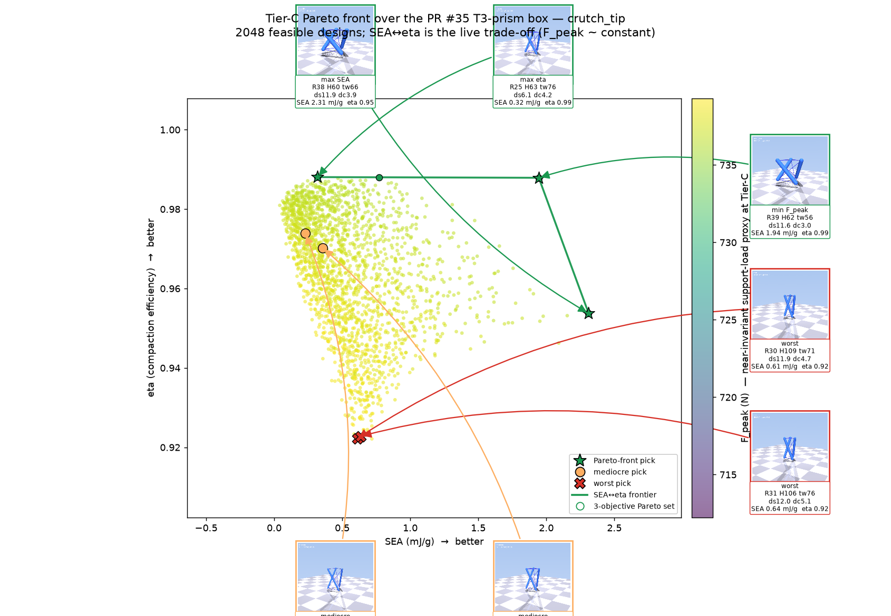
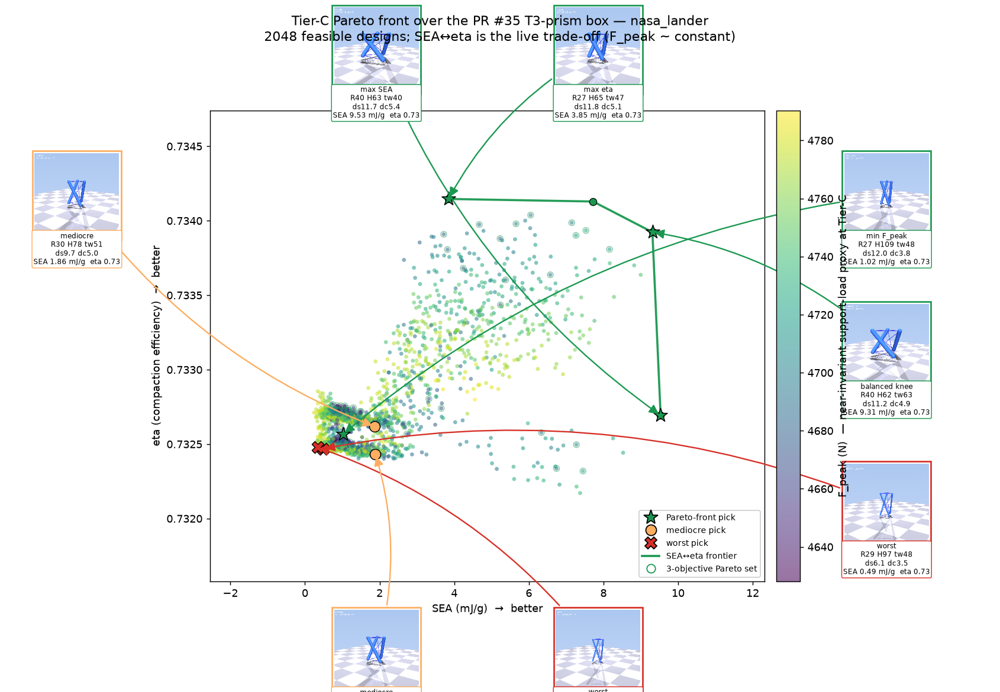

# Tier-C Pareto-front render campaign (PR #35 T3-prism box)

Addresses PR comment **4760877672**:

> each simulation is so cheap that I'm not sure it's even worth doing a
> cost-aware, multi-fidelity approach. Nevertheless, go ahead and run whatever
> you'd like in a full scenario. Do your best to find the actual Pareto front
> within the problem space you've been given. I want to see renders of these
> Pareto-front best ones as well as some renders of the worst performing ones
> and a few mediocre ones. Maybe call outs with images to an actual Pareto
> front graph.

Because one Tier-C MuJoCo regime evaluation is ~0.15 s, we skip the cost-aware /
multi-fidelity machinery entirely and **densely map the true Pareto front** with
a large Sobol set, then render representative cells onto the Pareto graph as
callout thumbnails.

`simulations/pareto_render_campaign.py`:

1. Draws **2048 Sobol designs per regime** over the exact PR #35 box
   (`R_mm∈[25,40]`, `H_mm∈[60,110]`, `twist_deg∈[40,80]`, `strut_d_mm∈[6,12]`,
   `cable_d_mm∈[3.0,5.5]`) via `scipy.stats.qmc.Sobol`.
2. Scores each on the three objectives with `bo_evaluator.evaluate_design`
   (CFC-180 filtered Tier-C MuJoCo): minimize `F_peak_N`, maximize
   `SEA_J_per_g`, maximize `eta`.
3. Takes the 3-objective non-dominated set as the empirical Pareto front.
4. Selects representative designs — Pareto winners (max-SEA, max-eta, balanced
   knee, min-F_peak), 2 **worst** dominated designs, and 2 **mediocre** mid-rank
   designs — and renders each as a 3-D MuJoCo still (geometry + strain-coloured
   tendons).
5. Drops the stills onto a `SEA↔eta` Pareto scatter (colour = `F_peak`) as
   **callout thumbnails with leader lines**, and animates the headline best +
   worst as full drop GIF/MP4s.

## Results

| regime | feasible | F_peak span | SEA range (mJ/g) | eta range |
|---|---:|---:|---:|---:|
| crutch | 2048/2048 | 712–739 N (**3.7 %**) | 0.04 – 2.31 | 0.922 – 0.988 |
| lander | 2048/2048 | 4628–4790 N (**3.4 %**) | 0.24 – 9.53 | 0.732 – 0.734 |





The whole PR #35 box is geometrically printable (every Sobol point passes the
class-1 / printability check), so the Pareto front is driven purely by physics,
not by the feasibility mask.

### What the front says

- **`F_peak` is near-invariant** (~3–4 % span both regimes) and tracks the
  static support load, exactly as the earlier Edison reviews (`ff8faab3`,
  `491f90ae`) and `sobol_t3_diagnostics.md` established. It is shown as the
  marker **colour**, not an axis, so it is not over-weighted.
- The **live trade-off is `SEA` vs `eta`**, which is why the annotated figure
  draws the clean 2-D `SEA↔eta` frontier (the genuine upper-right staircase)
  rather than connecting the 3-objective set (whose near-degenerate `eta`
  would otherwise zig-zag).
- **Crutch** has a real concave `SEA↔eta` frontier: max-`eta` cells are *thin,
  tall* (`strut_d≈6 mm`), max-`SEA` cells are *fat, short* (`strut_d≈12 mm`,
  `H≈60 mm`), and the **min-`F_peak` knee** (`R39 H62 ds11.6 dc3.0`) sits at the
  top of the front with `SEA 1.94 mJ/g` **and** `eta 0.99` — a genuinely
  attractive balanced design.
- **Lander** `eta` is pinned at ~0.733 (it always bottoms out the same way at
  9.8 m/s), so its trade-off is effectively `SEA`-only: the front collapses to
  *short, fat-strut, large-radius* cells (`H≈63 mm`, `strut_d≈11.7 mm`,
  `R≈40 mm`, `SEA≈9.5 mJ/g`).
- The **worst** cells in both regimes are the *tall, slender* end of the box
  (`H≈100–110 mm`, often `strut_d≈6 mm`): they cradle the least energy.

### Honest caveats (carried over)

- `SEA` here is a **peak elastic strain-energy proxy** (orders of magnitude
  below the incoming KE), not measured dissipation — it ranks designs, it does
  not predict absolute absorbed joules.
- `twist_deg` carries ≈0 Tier-C signal because `run_regimes` builds the prism at
  the fixed equilibrium twist; `evaluate_design` overrides only
  radius/height/strut-radius/cable-stiffness/pretension (the twist-plumbing
  audit in `sobol_t3_diagnostics.md`). The twist axis surfaces only at
  Tier-B/A.
- This is a **single-fidelity Tier-C** map, deliberately: per the comment, the
  sims are cheap enough that a dense Sobol search maps the *actual* front more
  faithfully than a cost-aware loop would. Tier-B/A promotion of the picks
  remains the recommended next bench/sim step.

## Files (under `outputs/`)

- `pareto_<regime>.csv` — every evaluated design + objectives + `feasible` /
  `pareto` flags (2048 rows each).
- `pareto_<regime>_annotated.png` — Pareto scatter with render callouts.
- `pareto_<regime>_render_<tag>.png` — per-pick 3-D stills (`best_sea`,
  `best_eta`, `best_fpeak`, `knee`, `worst0/1`, `mid0/1`).
- `pareto_<regime>_{best,worst}_drop.{gif,mp4}` — headline drop animations.
- `pareto_summary.md` — pick table per regime.

## Reproduce

```bash
MUJOCO_GL=osmesa python simulations/pareto_render_campaign.py --n 2048
# or a single regime / smaller set:
MUJOCO_GL=osmesa python simulations/pareto_render_campaign.py --n 512 --regimes crutch
```
