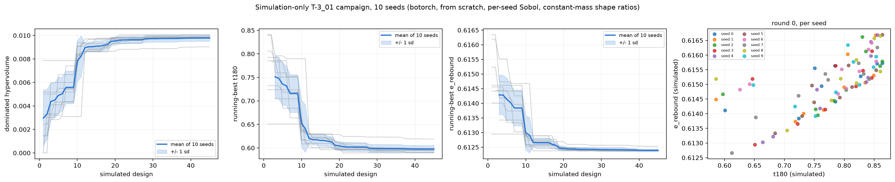
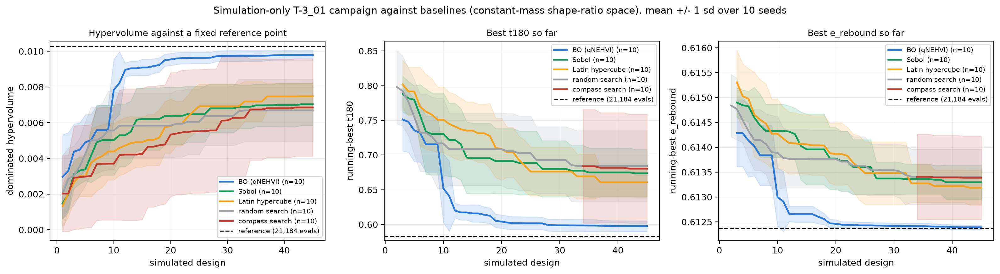
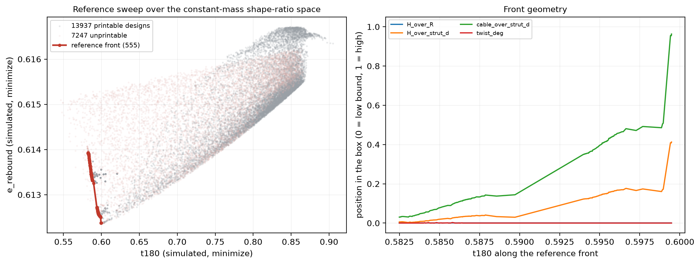

# The T-3_01 campaign in simulation: matching PR #102, and what correlates

PR #102 runs a two-objective SAASBO campaign whose objective function is a
print plus a 101-drop session on the Lansmont M23. This note is the
simulation-side counterpart: the same search space, the same two objectives,
the same batch size and generation strategy, with `drop_tower_sim` in place
of the drop tower, plus the thing that decides whether any of it is useful --
a correlation study of every simulated observable in this directory against
the eight articles that were actually tested.

Files:

| file | what it does |
|---|---|
| [`print_infill.py`](print_infill.py) | sub-100 % PLA infill: printed mass, effective strut density and modulus, the PR #35 constant-mass projection |
| [`drop_tower_sim.py`](drop_tower_sim.py) | MuJoCo analogue of the 60 in / PU-mat drop; returns `t180` and `e_reb_mJ` |
| [`pr102_correlation.py`](pr102_correlation.py) | scores the tested articles with every candidate observable and rank-correlates against the measured objectives |
| [`pr102_sim_campaign.py`](pr102_sim_campaign.py) | the closed-loop simulation-only campaign, one run per seed (`--space ratios` is the current constant-mass parameterization, section 6) |
| [`pr102_baselines.py`](pr102_baselines.py) | random/Sobol/LHS/compass baselines and the dense reference sweep, in either space |
| [`workflows-staged/sim-bo-pr102-matrix.yml`](workflows-staged/sim-bo-pr102-matrix.yml) | parallel seed matrix for Actions (staged; move it into `.github/workflows/`) |
| `data/pr102/*.csv` | snapshots of PR #102's batch table, print key and campaign summary |

## 1. Sub-100 % PLA infill

The articles are not solid. PR #86 section 7 regressed the weighed articles
on their per-material solid masses and found the PLA prints at about 57 % of
solid density and the TPU at about 99 %. `print_infill.fit_solidity()`
re-derives that from the committed CSVs and gets 0.556 / 0.995 (n = 9,
R^2 = 0.66), so the constants in the module are the published 0.565 / 0.986
and the refit agrees.

Two consequences are wired into the simulator:

* **Strut density.** `effective_pla_density_kgm3()` = 700.6 kg/m^3 instead of
  1240. Every strut capsule in `drop_tower_sim` is built at that density, so
  the article's inertia -- the thing that sets a base-excited structure's
  transmissibility -- matches the scale.
* **Effective modulus.** `effective_pla_modulus_MPa()` applies the
  Gibson-Ashby scaling `E_eff/E_s = phi^n`. The bracket is 1980 MPa (n = 1,
  stretch-dominated) to 1117 MPa (n = 2, bending-dominated), 1486 MPa at the
  n = 1.5 default. Tier C treats struts as rigid so only the mass channel
  bites here; the modulus is for the tiers that let the strut deform.

A second correction was needed before the masses came out right. The
idealized volume model used elsewhere in this directory (three capsules plus
nine cylinders at the vertical-cable length) is not the printed CAD, which
also carries PLA joints, housings and the modeled-in scaffold. Regressing
the batch table's reference-STL per-material masses on the model volumes
gives one factor per material, 1.68 for PLA and 0.68 for TPU, with 9 % and
6 % scatter across the nine designs. With both corrections in place the
predicted as-printed masses land within 0.7 g mean absolute error of the
scale readings across the batch (18.8 to 22.6 g predicted, 18.5 to 22.3 g
measured), and the constant-mass projection reproduces the batch table's own
`scale` column to about 2 %.

That projection matters on its own: the campaign's search space is the
*base* Sobol coordinates, and what gets printed is the uniform rescale of
them that hits a mass target. Across the batch the scale runs 0.74 to 1.08,
so simulating the base coordinates would simulate an article up to a quarter
of a size away from the one on the bench. `evaluate_pr102` projects first.

### Which mass the projection holds constant, and why the first answer was wrong

The first version of this study projected onto PR #35's Route-A manifold:
uniformly rescale until the *solid* CAD mass equals 30.95 g. That is what
round 1 was actually built to, and it is not constant printed mass. All nine
articles sit at 30.95 g solid and weigh 18.50 to 22.29 g on the scale,
because PLA prints sparse while thin TPU prints near solid and the PLA/TPU
split moves with the shape.

For the second objective that is fatal rather than untidy. `e_reb_mJ` is an
*absolute* energy, `e_rebound * m * g * h`, deliberately so: a lighter
article returning the same velocity fraction returns less energy to the
payload. Multiply a near-constant fraction by a mass that is free to swing
and you get the mass. Measured on the 68,944-design reference sweep that ran
with the old projection: printed mass spanned 32 %, simulated `e_rebound`
spanned 0.34 %, and rho(`e_reb_mJ`, `mass_g`) came out at **0.99993**. The
objective *was* the mass, and the campaign's apparent convergence on it
(complete by design 5, before the surrogate existed) was the optimizer
finding the lightest corner of a box.

PR #102 closed the same hole on the bench side in commit `2f1ca2e`: project
onto constant *printed* mass instead, and carry `mass_printed_g` as a sixth
BO parameter confined to a narrow slab, target +/- 0.457 g, the sample sd of
the spec-08 triplicate. Competing shapes are then compared at the same mass,
and the part of the objective spread that is mass is attributed to the mass
parameter rather than to the shape.

[`pr102_mass_model.py`](pr102_mass_model.py) is that projection, ported and
re-calibrated here from the CSVs already committed under `data/pr102/` so
the constants are traceable rather than copied. The model is a two-stage
fit: analytic body volumes to rendered solid grams, then rendered solid
grams to weighed printed grams through a wall-plus-infill law whose PLA
solid fraction depends on the *printed* strut diameter, with the six
absolute-size sensor housings carried as a non-scaling offset. It is worth
porting rather than reusing the two flat solidity factors above, which are
the same flat fit PR #102 reports as its own contrast case:

| fit | residual sd over the 12 weighed articles |
|---|--:|
| wall + infill, strut-diameter dependent | **0.378 g** |
| two flat densities (0.565 PLA / 0.996 TPU) | 0.927 g |
| print-to-print scatter, spec-08 triplicate | 0.457 g |

So the ported model is as accurate as the process is repeatable and the flat
one is twice as coarse. Independent check: re-projected onto 20.23 g the S0
reference article comes out at scale 1.1335 against the 1.1538 it was
printed at, 1.8 % off.

What the correction does to the objective, on a 256-point Sobol set over the
box:

| | constant solid mass (old) | constant printed mass (new) |
|---|--:|--:|
| `e_reb_mJ` relative span | 0.316 | 0.047 |
| `mass_g` relative span | 0.316 | 0.045 |
| `e_rebound` relative span | 0.003 | 0.005 |
| rho(`e_reb_mJ`, `mass_g`) | 0.9999 | 0.997 |
| rho(`e_reb_mJ`, `e_rebound`) | 0.505 | 0.026 |

The leak is now bounded to the declared print scatter. It also makes a
second problem unmissable: **with mass controlled, this simulation has only
one live objective.** rho(`e_reb_mJ`, `e_rebound`) = 0.026 says the
simulated restitution does not respond to the design at all, which follows
directly from the mat calibration decision in section 2 (calibrated to the
measured input pulse, not to the measured restitution, so simulated
`e_rebound` sits near 0.61 against a measured 0.02 to 0.05). The bench's own
`e_rebound` spans 2.5x across the articles, so the *measured* objective is
real; the simulated stand-in for it is not. Read anything the simulation
says about `e_reb_mJ` as mass bookkeeping, and read `t180` as the only
objective the model is optimizing.

`--manifold solid` still reproduces the old behaviour, kept so the round-1
articles can be scored on the manifold they were actually printed on and so
the earlier numbers in this file stay reproducible.

## 2. The drop-tower analogue

Channel roles are from PR #67's input-output series: CH5 is a single-axis
sensor on the bottom acrylic plate (input), the tri-axis is hot-glued to the
top vertex (output), and `t180` is the ratio of their CFC-180 peaks. The
model is a carriage on a vertical slide joint (the tower's rails) carrying
the CH5 site, an explicit one-sided Hunt-Crossley PU mat, and the article
with its three bottom vertices ball-anchored to the carriage, nine TPU
tendons at the `printable_design` axial stiffness, and a 5 g accelerometer
mass on the measured top vertex.

`e_rebound` in the campaign summary is a restitution *velocity* ratio, not
an energy fraction: `t_second = 2 * e_rebound * v_in / g` reproduces every
specimen's second-impact time to three digits. The simulation therefore
reads it off the carriage's post-contact velocity, and `e_reb_mJ` is formed
exactly as PR #102 forms it, `e_rebound * m_printed * g * 1.524 m`.

**What the mat is calibrated on, and what it is not.** `--calibrate` fits
the two mat parameters to the measured input pulse: peak 208.4 G against a
measured 208.2 G, width 4.08 ms against the 4.08 ms implied by the measured
peak and delta-v. It is deliberately *not* fitted to the measured
restitution. A mat lossy enough to return only 2 % of the impact velocity in
this model peaks near 300 G, well above what the tower measures, because the
energy the rig actually loses leaves through paths the model does not carry
(guide rails, anvil and frame, the mount). Simulated `e_rebound` therefore
comes out around 0.6 against a measured 0.02 to 0.05, and is treated as a
rank proxy, not a prediction.

Section 1 sharpens that: once mass is held constant it is not even a rank
proxy, because simulated `e_rebound` varies by 0.5 % over the whole box and
does not order the designs at all (rho against `e_reb_mJ` = 0.026). Fixing
the mass normalization did not create that; it removed the mass that was
hiding it.

The same honesty applies to `t180` itself: the simulated S0 article reads
0.707 against a measured 1.011. Rigid struts have no bending modes, so the
model has no mechanism for the *amplification* every tested article except
`6lhxfy` shows. It can only attenuate. Absolute agreement was never
available at this tier; rank agreement is the question, and section 3
answers it.

## 3. Which simulated observable tracks the measured objectives

`pr102_correlation.py` scores the seven articles that have both a design
mapping and a weighed mass (`amdjwm` maps to no known print, so PR #102
skips it and so do we) with every candidate observable this thread has
produced, then rank-correlates against the two measured objectives.

At n = 7, Spearman needs |rho| >= 0.79 for p = 0.05 two-sided, and about 30
observables are screened, so read the table with the multiplicity in mind:
the leader clears Bonferroni, the rest of the top block does not.

**Measured `t180`.** `rel_span` is the observable's range over its mean
across the seven articles, and it is not decoration: it separates a real
design effect from a rank that rides on numerical structure. Each article is
simulated at the mass its own print weighed, by solving the
constant-printed-mass projection for that mass, rather than at a batch
target: these are specific prints and their masses are known, so using
anything else would put a known quantity into the residual.

| simulated observable | Spearman rho | p | rel_span |
|---|--:|--:|--:|
| `lander_SEA_J_per_cm3` | **-0.93** | 0.003 | 2.31 |
| `sim_in_180_g` | -0.89 | 0.007 | **0.0009** |
| `crutch_SEA_J_per_cm3` | -0.89 | 0.007 | 1.86 |
| `lander_SEA_J_per_g` | -0.89 | 0.007 | 2.85 |
| `crutch_SEA_J_per_g` | -0.86 | 0.014 | 2.00 |
| `H_mm` (a design coordinate, for scale) | +0.79 | 0.036 | 0.47 |
| `footprint_mm2` | -0.75 | 0.052 | 0.81 |
| `lander_eta` (compaction efficiency, lander regime) | -0.71 | 0.071 | **0.0012** |
| `sim_t180` (the drop-tower analogue itself) | +0.50 | 0.25 | 0.25 |

**Measured `e_reb_mJ`:** the best is `lander_eta` at +0.82 (p = 0.023) on a
0.12 percent span, then `R_mm` (+0.71, p = 0.071) and `sim_solid_e_reb_mJ`
(+0.68, p = 0.094). Nothing clears Bonferroni over ~30 screened observables.

Four readings, in order of how much they should change what we do:

1. **The purpose-built analogue is still not the best predictor; the
   incidental Tier-C observables are.** `sim_t180` lands at rho = +0.50
   (p = 0.25) while the Tier-C observables built for the crutch and lander
   regimes -- a completely different question -- rank the bench articles at
   -0.86 to -0.93. The sign is the physical part: articles whose stored
   elastic energy per unit volume is higher are the articles that measured
   *lower* transmissibility. **The one worth attaching to the campaign GP is
   `SEA_J_per_cm3`** (rho = -0.93 lander, -0.89 crutch), which moves 231
   percent across the seven articles and is the only leader with both a
   significant rank and a real span.
2. **The caution attached to `lander_eta` last time was right, and it did not
   survive.** It led the `t180` table at rho = -0.96 on a 0.13 percent span,
   flagged then as "a ranking of numerical structure until a perturbation
   study says otherwise". Re-projecting every article onto its own weighed
   mass is that perturbation, and `lander_eta` fell to -0.71 (p = 0.07) and
   changed which objective it leads. A rank that reorders when the article
   is rescaled by a few percent was never carrying design information.
3. **`sim_in_180_g` is the same failure mode, newly visible, and it is the
   null control.** The input peak is the rig, not the design; a calibrated
   mat should deliver the same input to every article, and it does, to
   within 0.09 percent. On the old constant-solid-mass projection every
   article had the same simulated input peak and it read rho = 0.00. Now
   that each article carries its own weighed mass, the carriage-plus-article
   system differs slightly between them and that 0.09 percent of numerical
   wobble sorts the articles at rho = -0.89, p = 0.007. It is not a
   predictor of anything. Treat any leader whose `rel_span` is a fraction of
   a percent as noise with a good p-value, whatever the column says.
4. **The rebound objective has no usable simulated predictor.** Section 1
   makes the reason structural rather than statistical: with mass held
   constant the simulated `e_rebound` does not respond to the design at all,
   so there is nothing for a correlation to find. `e_reb_mJ` should be
   modeled from bench data alone until a tier that carries the rig's loss
   paths exists.

The infill correction now enters through the mass the article is simulated
at rather than through a density. `sim_solid_t180` (the same geometry given
the mass it would have printed solid, about 1.7x heavier) correlates at
rho = +0.50 for `t180`, indistinguishable from the printed-mass model at this
n. Where it matters unambiguously is the mass channel that `e_reb_mJ` is
built from, where solid density puts every article out by that same 1.7x
before any physics happens.

## 4. The closed-loop simulation-only campaign

`pr102_sim_campaign.py` mirrors PR #102's structure: the same five-parameter
box, the same two minimized objectives, the same 9-per-plate batch size, the
same `mass_g` tracking metric and the same SAASBO generation step by
default. What it adds is that the loop can continue past one round and can
be repeated, which is the only reason to run it in simulation at all.

### What a repeat has to be

A repeat is only a repeat if the whole campaign is redrawn. The first
version of this script attached the nine physically printed articles as
round 0 of every seed, so every repeat began from an identical initial
design and the seed reached nothing but the surrogate's own randomness. The
seeds then agreed to under 2 %, which measured the determinism of the
plumbing rather than the reproducibility of the optimizer.

`--init sobol`, now the default, starts each repeat from scratch: round 0 is
the campaign's own nine-point Sobol draw, scrambled with that repeat's seed
(passed to Ax's Sobol generator explicitly as well as through
`AxClient(random_seed=...)`, so the draw is pinned to the seed rather than
to process state). `--init printed` keeps the PR #102-exact behaviour for
when the question is specifically what the measured batch implies.

One thing had to move with it. The hypervolume reference point used to be
derived from the seed's own round 0, which is harmless when every seed
shares round 0 and wrong as soon as they do not: a repeat that happened to
draw a bad initial batch would be handed a generous reference point and
score a larger hypervolume for it. It is now computed once from the nine
printed articles scored in simulation, inflated 5 %, so it is the same
number for every seed and every initialization.

The third panel of the aggregate figure plots each repeat's round 0 in
objective space. Under `--init sobol` those are ten different clouds; under
`--init printed` they collapse onto one set of nine markers. That panel is
there so the failure mode above is visible rather than inferred.

### Ten repeats on the constant-printed-mass manifold

Ten repeats (`--model botorch`, `--init sobol`, `--jobs 4`, five batches
of 9 = 45 simulated designs each) were re-run after the section 1 mass fix,
on the six-parameter space that mirrors PR #102 (`--space slab6`: the five
base axes plus `mass_printed_g` in its narrow slab). All ten land on the
identical box vertex: `R` 40 mm, `H` 60 mm, `twist` 40 deg, `strut_d`
6.0 mm, `cable_d` 3.0 mm, mass at the slab's light edge, `t180` = 0.5686
every time, final hypervolume 10.058 +/- 0.0002 (a 0.002 % spread against
1.5 % on the pre-fix manifold). Round 0 still starts the seeds 5.59 to
6.81 apart, so the loop is converging rather than degenerate at the start.

That collapse is the honest consequence of the fix, not a better result.
With mass held constant the problem is effectively single-objective in
`t180` plus "sit at the light edge of the slab", and the optimum is a
corner. `strut_d`, the one loose axis before the fix, is now pinned at its
minimum, because with mass fixed the strut diameter sets the overall scale.

Two things to notice before reading that as a recommendation. It agrees with
the measured campaign on thin cables -- `6lhxfy`, the one article that
genuinely attenuated on the bench, is the thin-cable corner -- and disagrees
on twist, where `6lhxfy` sits at the box maximum. And unlike the
regime sims, this model *does* consume the twist axis (the geometry is built
at the supplied twist), so a twist result here is a physical claim rather
than the un-consumed plumbing `sobol_t3_diagnostics.md` documents for
`run_regimes`. Given that the model cannot amplify at all (section 2), the
disagreement is more likely the model's than the bench's.

The slab space itself did not survive review (2026-08-22): carrying mass as
a sixth parameter is right for PR #102, where the print scale is a genuinely
free axis with measured scatter, and wrong for a deterministic simulation,
where mass is a function of shape and the slab is exploitable as a gradient
(all ten repeats duly sat on its light edge). Section 6 is the campaign
re-run on the re-parameterization that removes the mass axis entirely, and
is the version to read for current numbers; `--space slab6` keeps this one
reproducible.

One SAASBO seed was also run to check that path (the default, matching
PR #102): one round of 3 designs took 570 s on a contended runner core
against 0.3 s per simulation. That is why the repeats above use the cheap
qNEHVI surrogate, and why the staged workflow parallelizes over seeds
rather than running them in series. Even with the cheap model the fit is
the wall-clock: a fourth batch of 9 costs minutes while the 36 simulations
behind it cost about 11 s in total.

Parallelism is local as well as in Actions. `--jobs N` runs N repeats as
separate processes, one campaign each, with the numeric libraries pinned to
one thread per worker (the acquisition optimization is the cost and it does
not thread well, so the parallelism belongs at the seed level). Ten repeats
on this four-core runner is three waves.

Files. Per-seed convergence and objective-space plots are
`outputs/pr102_sim_bo_botorch_sobol_seed*.png`, the cross-seed figure with
the +/- 1 sd band and the round-0 panel is
`outputs/pr102_sim_bo_botorch_sobol_aggregate.png`, and the per-seed trial
tables are the matching CSVs. The earlier shared-round-0 run is kept
alongside under `..._printed_...` for the comparison.

## 5. Baselines, and how far the box actually goes

A hypervolume trace that climbs proves nothing on its own: the question is
whether it climbs faster than something with no model in it, and whether it
finishes anywhere near what the box contains. `pr102_baselines.py` supplies
both.

**Manifold note.** Everything in this section was run before the section 1
mass fix, on the constant-*solid*-mass projection, where `e_reb_mJ` was
rank-identical to printed mass. The optimizer comparison it makes (BO
against space-filling and pattern search, same budget, same seeds) is still
informative about search efficiency on a smooth deterministic surface, but
the front geometry and the absolute numbers describe the superseded
objective. Section 6 repeats the whole construction (reference sweep,
baselines, comparison) on the corrected, re-parameterized campaign; the
files here are kept unsuffixed (`pr102_reference_*.csv`,
`pr102_baseline_<strategy>_seed<k>.csv`) and the corrected ones carry a
`_ratios` suffix.

### The reference optimum

65,536 scrambled Sobol designs (about 1,800x the campaign's budget, 1,120 s
over four processes at 17 ms each) followed by a Nelder-Mead polish of the
best point under each of 21 weightings, 3,408 further evaluations. The
non-dominated set of all 68,944 is the best estimate of the true front
available at this fidelity: 247 points, hypervolume 18.024 against the same
fixed reference point the campaign uses, best `t180` 0.4848, best
`e_reb_mJ` 169.00.

This is a dense sample, not a proof of global optimality. What makes it
usable as a ceiling is that the polish moves it essentially nowhere: the
front sits on box bounds, so a local optimizer started from the sweep's best
points converges onto the same corners rather than finding anything the
sweep missed.

The front is sharply L-shaped, and its geometry is the actionable read.
`cable_d_mm` is pinned at its low bound (3.0 mm) along the entire front, and
`twist_deg` at its low bound for most of it. The trade-off is carried by
`strut_d_mm` and `H_mm`: the minimum-`t180` end is a short, wide, thin-strut
cell (`R` 40, `H` 60, `strut_d` about 6.4 mm) and the minimum-`e_reb_mJ` end
is a tall, narrow, fat-strut one (`R` 25, `H` 110, `strut_d` 12). Two of the
five axes are therefore doing nothing but sitting on a wall, which is worth
knowing before the next plate is printed: the box should probably be
extended below `cable_d_mm` 3.0 mm and below `twist_deg` 40 deg rather than
re-searched as it stands.

### The baselines

Four, each at the campaign's own 36-design budget and over the same ten
seeds:

| baseline | what it is |
|---|---|
| `random` | uniform i.i.d. draws; the floor |
| `sobol` | scrambled Sobol over the whole budget, i.e. the campaign's round 0 extended to fill it, so the gap to the campaign is exactly what the surrogate contributes |
| `lhs` | scrambled Latin hypercube, the other standard space-filling design |
| `heuristic` | compass (pattern) search with a halving step on a normalized weighted sum, budget split over three weightings (0.15 / 0.5 / 0.85) so it produces a spread of trade-offs rather than one point; the seed sets the start and the axis order |

| method | final HV (mean +/- sd) | fraction of reference | best `t180` | best `e_reb_mJ` | p vs BO |
|---|--:|--:|--:|--:|--:|
| BO (qNEHVI) | 17.50 +/- 0.25 | **97.1 %** | 0.4972 | 169.81 | - |
| compass search | 14.49 +/- 1.78 | 80.4 % | 0.5408 | 172.59 | 9.1e-5 |
| Sobol | 11.82 +/- 1.11 | 65.6 % | 0.5790 | 172.17 | 9.1e-5 |
| Latin hypercube | 11.66 +/- 1.54 | 64.7 % | 0.5864 | 172.00 | 9.1e-5 |
| random search | 10.86 +/- 1.09 | 60.3 % | 0.5972 | 172.30 | 9.1e-5 |

`p` is a one-sided Mann-Whitney U on the ten final hypervolumes; 9.1e-5 is
the smallest value that test can return at n = 10 against n = 10, so every
baseline is *completely* separated from the BO, with no overlap between the
two sets of ten.

Three things the comparison settles:

1. **The surrogate is what is doing the work, not the space-filling design.**
   The BO's first nine designs *are* a Sobol batch (Ax's own generator, a
   different scramble from the `sobol` baseline's, hence the small offset at
   design 9: 9.25 against 9.81, with the baseline slightly ahead). The moment
   the model takes over the traces separate and never re-cross: one
   model-driven batch takes the BO from 51 % of the reference ceiling to
   83 %, and it is at 96 % by design 18 and 97 % by design 27. Sobol run out
   to the full 36 designs finishes at 66 %. Space filling is not the
   ingredient.
2. **Sobol and LHS are indistinguishable from each other, and barely beat
   random.** 65.6 % against 64.7 % against 60.3 %, with sd of 1.1 to 1.5. At
   36 points in 5 dimensions, quasi-random stratification buys very little.
3. **The heuristic is the strongest baseline and still loses by a wide
   margin**, and it has the largest seed-to-seed spread of any method
   (sd 1.78, and 4.04 mJ on best `e_reb_mJ`). That is the expected signature
   of a local method on a front whose extremes are box corners: whether a run
   ends up near one depends on where it started.

The BO's spread is also the smallest of the five (sd 0.25 = 1.4 % of its
mean, against 9 to 12 % for the baselines). Across ten independent repeats it
is both better and more repeatable, which is the property that matters when
each real evaluation is a print plus a drop session.

Pooled over ten seeds, the BO's points lie along the front; every baseline's
points are a cloud in the interior. Note the BO does *not* reach the extreme
low-`e_reb_mJ` tail of the front, which lives at `R` 25 / `H` 110 /
`strut_d` 12: qNEHVI spends its budget on the knee, which is where
hypervolume is, and the tail is worth about 1 mJ.

### Caveat on all of the above

This compares optimizers on a **simulated** objective, so what it measures is
search efficiency on this response surface, not accuracy against the bench.
Section 3's caveats still apply to the objective itself. The transfer that
does hold is the shape of the problem: 5 continuous axes, 2 objectives,
a smooth deterministic response, a front on the box boundary. On that shape,
36 model-driven evaluations reach 97 % of a 68,944-evaluation ceiling and 36
space-filling ones reach 66 %.

Files. `outputs/pr102_reference_cloud.csv.gz` (all 68,944 evaluations,
gzipped, read directly by pandas), `outputs/pr102_reference_front.csv` (the
247 non-dominated designs), `outputs/pr102_reference_summary.csv`,
`outputs/pr102_baseline_<strategy>_seed<k>.csv` (40 runs, every evaluation
with its parameters, objectives, printed mass, constant-mass scale and
feasibility flag), `outputs/pr102_baselines_summary.csv`, and the two
figures. Nothing needs re-running to redo a plot.

## 6. The campaign on the constant-mass shape-ratio manifold

The 2026-08-22 review of the slab runs recommended re-parameterizing
instead of carrying mass as a parameter: in a deterministic simulation mass
is a function of shape, so a mass axis is degenerate (every point shares
its projected article with a one-parameter family of others) and the slab
is exploitable as a gradient, which is exactly how all ten slab repeats
used it. `--space ratios`, now the default, implements that
recommendation.

The search space is the four dimensionless shape ratios, `H/R` in [1.5,
4.4], `H/strut_d` in [5, 18.3], `cable_d/strut_d` in [0.25, 0.917] and
`twist` in [40, 80] deg, the extremes the PR #35 box can express. The
single overall scale is solved in closed form by the section 1 mass model
so every evaluated article prints at exactly 20.23 g; mass never enters
the search space, and the second objective becomes the dimensionless
`e_rebound` (`e_reb_mJ` is the constant `m* g h` times it on this
manifold). What the base box can no longer police is printability, so it
enters honestly instead of implicitly: the projected article's cable
diameter (3.0 mm TPU bridging floor) and envelope (250 cm^3) are Ax
outcome constraints under constrained qNEHVI, and they bind, on about 40 %
of the ratio box (unprintable projections are excluded from every front,
hypervolume and running best below, but kept in the CSVs).

### Ten repeats, reference, baselines

The same construction as sections 4 and 5, re-run end to end on the new
manifold: ten from-scratch repeats (`--model botorch`, `--init sobol`,
five batches of 9 = 45 designs each), a reference sweep (16,384 scrambled
Sobol designs plus the 21-weighting Nelder-Mead polish, 21,184 evaluations,
about 470x the campaign budget), and the four baselines at the campaign's
budget over the same ten seeds.

The repeats start far apart (round-0 hypervolume spread 24.9 % of its
mean, best round-0 `t180` 0.651 to 0.790) and finish close (final
hypervolume 0.00978 +/- 0.00027, 2.9 % of the mean, best `t180` 0.589 to
0.599 for nine of ten seeds): convergent under resampling, without the
degenerate identical-vertex collapse of the slab space. One seed (6) stalls
at `t180` 0.619 with its twist at 63 deg, the price of a 45-design budget
on a constrained space, and it is visible rather than averaged away.

| method | final HV (mean +/- sd) | fraction of reference | best `t180` (mean) | p vs BO |
|---|--:|--:|--:|--:|
| BO (constrained qNEHVI) | 0.00978 +/- 0.00027 | **95.2 %** | 0.597 | - |
| Latin hypercube | 0.00748 +/- 0.00074 | 72.7 % | 0.661 | 9.1e-5 |
| Sobol | 0.00703 +/- 0.00119 | 68.4 % | 0.674 | 1.2e-4 |
| compass search | 0.00685 +/- 0.00273 | 66.6 % | 0.680 | 3.6e-3 |
| random search | 0.00669 +/- 0.00176 | 65.0 % | 0.684 | 9.1e-5 |

The BO's margin survives the re-parameterization, and one baseline moved in
an informative way: compass search, the strongest baseline on the
unconstrained slab (80 % of reference), drops to the bottom of the pack
here, because roughly a third of its probe moves land on unprintable
projections that a penalty can reject but not steer around. A model that
learns the constraint surfaces loses much less of its budget to them.

### Where the optimum moved, and what binds now

* **The envelope constraint replaces the box wall.** Nine of ten repeat
  winners and 98.7 % of the 555-point reference front press the 250 cm^3
  envelope cap (those winners at 245 to 249 cm^3), and the front's
  best-`t180` end sits on
  the cable print floor at exactly 3.00 mm as well. On the slab space the
  answer was "sit in the corner of the box"; here it is "print the widest,
  flattest cell the build volume and the bridging floor allow at 20.23 g",
  which is a statement about the printer and the physics rather than about
  where someone drew the search box.
* **`H/R` and `twist` still sit on their bounds** (1.5 and 40 deg across
  the front and nine of ten winners). Those walls came from the PR #35 box
  extremes, so the earlier conclusion survives re-parameterization: the
  next plate is worth more below `twist` 40 deg and below `H/R` 1.5, in
  other words flatter and wider than the current family allows.
* **The winning printed article** is R about 37.5 mm, H about 56 mm, strut
  6.3 to 10.6 mm, cable 3.4 to 4.6 mm, `t180` about 0.59 against the
  reference's 0.5825. The strut-diameter axis stays soft: `H/strut_d`
  from 5.2 to 8.9 all reach `t180` within 1 %, so the model is trading it
  against cable ratio along a shallow valley, consistent with the front
  geometry panel, where the trade-off is carried entirely by
  `cable_d/strut_d` and `H/strut_d`.
* **The two objectives are now largely concordant, not competing.** Over
  the 13,937 printable reference designs `e_rebound` spans 0.71 % and
  rank-correlates with `t180` at rho = +0.84, so the Pareto front is a
  sliver (its `t180` extent is 0.5825 to 0.5995) and the campaign is
  effectively single-objective in `t180`. That is the section 1 finding
  surviving one more reformulation, now with nothing left to hide behind:
  the simulated restitution has no design response at fixed mass, and a
  live second objective needs either a tier that carries the rig's loss
  paths or the bench itself.

Files. `outputs/pr102_sim_bo_botorch_ratios_sobol_seed<k>.{csv,png}`,
`..._aggregate.png`, `..._summary.csv`;
`outputs/pr102_reference_{cloud,front,summary}_ratios.*`;
`outputs/pr102_baseline_<strategy>_ratios_seed<k>.csv`;
`outputs/pr102_baselines_{comparison,objective_space,summary}_ratios.*`.
Every evaluation is on disk, printable or not, so any of this can be
re-plotted without re-running.

## 7. The second objective, swapped: peak tendon strain

Context (PR #33, 2026-08-24): with mass held constant the simulated
`e_rebound` spans under 1 % of its mean across the whole ratio manifold
(the calibrated mat owns the loss budget), and `zeta_analysis.md` closed
the door on the bench's proposed replacement `zeta_pct` at this tier. The
operator asked for a swap, so
[`pr102_objective_screen.py`](pr102_objective_screen.py) measured every
candidate the extended drop-tower analogue can produce, over 128 Sobol
designs on the constant-mass manifold (78 printable), on the two
properties an objective needs here: design response (relative span) and
independence from `t180`.

### The rubber-duck audit first, because it changed the physics

Before trusting the screen, the whole objective-definition chain (regime
objectives, the mass confound, the dead rebound axis, the zeta dead end,
this swap) was submitted to Edison ANALYSIS as a rubber-duck audit
([`edison-trajectories/objective-rubber-duck/`](../edison-trajectories/objective-rubber-duck/),
task `9c0ab4c7`). The audit confirmed the chain's structure (no sign
errors; the measured-restitution extraction verifies to 1.8e-5; the
sim-concordant-vs-bench-anticorrelated restitution puzzle is correctly
attributed to missing loss mechanisms, not to an extraction bug) and
caught one real modeling bug and two wording problems:

* **The tendon-semantics bug.** The spatial tendons wrote
  `range="0 rest"` with `springlength` unset. In MuJoCo semantics that is
  a solver-enforced length *limit* at the slack length plus a
  bidirectional spring resting at the qpos0 length, so the article's
  elasticity flowed partly through constraint impedance rather than the
  specified TPU stiffness, and the screened "strain" was a geometric
  over-length diagnostic. Fixed: the tendons are now dead-band springs
  (`springlength="0 rest"`), so tension is exactly
  `k_cable * extension` and the post-processed strain is the material
  tension strain of that spring. The mat recalibrates on the corrected
  model to an essentially identical fit (3.180e5 N/m, 5.398e4 N s/m; S0
  input pulse 208.2 G / 4.08 ms, both exact), because the input pulse is
  set by the mat and the total mass, not by the article's stiffness path.
* `e_reb_mJ` uses the restitution velocity ratio, not its square, so it
  overstates returned energy 20 to 50x at bench values. Kept verbatim for
  bench-pipeline parity (it is rank-preserving), now documented at the
  definition site.
* "Measured `zeta_pct` is independent of `t180`" is too strong at n = 7
  (bootstrap interval [-0.87, +0.96]); the defensible phrasing is "no
  association detected".

### The corrected screen

On the corrected physics (`outputs/pr102_objective_screen*.csv`, 78
printable designs, `t180` spanning 0.700 to 0.928):

| candidate | rel. span | Spearman rho vs t180 | reading |
|---|--:|--:|---|
| `e_rebound` | 1.0 % | +0.61 | dead, confirmed |
| `t1000`, `out_180_g` | 32 / 27 % | +0.99 / +1.00 | duplicates of `t180` |
| `in_180_g`, `pulse_ms` | 0.3 / 1.0 % | - | null controls working |
| **`peak_tendon_strain`** | **162 %** | **-0.82** | max TPU tension strain, 4.7 to 22.7 % |
| `peak_tendon_energy_mJ` | 271 % | -0.56 | tendon elastic energy, 15 to 160 mJ |
| `stroke_mm` | 272 % | +0.64 | top-vertex compression, 5 to 34 mm |

**`peak_tendon_strain` (minimized) is the new second objective**: a real
trade-off against `t180` (the compliant articles that shield the payload
strain their tendons hardest, the same sign as the bench's tentative
`t180`-vs-rebound anti-correlation), a direct physical reading (TPU
break/fatigue margin over 100+ drops), 14 of 78 screen designs
non-dominated, and it is driven by an axis `t180` barely uses
(`cable_over_strut_d`, rho = -0.72). Edison's position, adopted here: run
it as an *exploratory* second response while no measured TPU allowable
exists, print articles spanning the attenuation-strain front, and once
coupon/cyclic data pin an allowable, demote strain to a probabilistic
survival constraint and optimize `t180` alone. Its longer-term
recommendation (a solver-resolved energy ledger per drop, and per-tendon
force/strain-amplitude recording) is queued as follow-up work.

`--obj2 e_rebound` reproduces the earlier formulation; the new runs carry
the `ratios-strain` file tag so the e_rebound-era artifacts keep their
names. Note the corrected tendon physics shifts absolute values
everywhere (S0 `t180` is 0.768 against 0.785 before the fix), so
cross-era comparisons of raw numbers are not meaningful; every artifact
regenerated after the fix carries the new tag or a fresh timestamp.

### Ten repeats on the corrected physics, at full acquisition effort

Ten independent repeats (per-seed Sobol round 0, constrained qNEHVI, the
original 5 batches of 9 = 45 designs, acquisition at the Ax defaults of
20 restarts x 1024 raw samples), plus the four baselines at the same
budget and seeds (`outputs/pr102_sim_bo_botorch_ratios-strain_sobol_*`,
`outputs/pr102_baseline_*_ratios-strain_seed*.csv`). An earlier pass of
this campaign ran at a reduced 8x128 acquisition effort with only 3
model rounds to fit a session window; those artifacts are preserved
under `outputs/acq8x128-archive/` and the per-seed comparison against
them is `outputs/pr102_acq_effort_paired_comparison.csv`. A model round
of 9 costs 260 to 760 s at the defaults on this runner against ~85 s
reduced, so the full ten-repeat campaign is ~96 min of 4-core compute.

| method | final HV (mean +- sd) | best `t180` (mean) | best strain (mean) |
|---|--:|--:|--:|
| BO (constrained qNEHVI) | 0.0277 +- 0.0037 | 0.755 | **0.0398** |
| Sobol | **0.0295 +- 0.0026** | 0.713 | 0.0541 |
| random search | 0.0295 +- 0.0027 | 0.715 | 0.0556 |
| Latin hypercube | 0.0284 +- 0.0021 | 0.719 | 0.0523 |
| compass search | 0.0258 +- 0.0054 | 0.743 | 0.0464 |

Two findings, and the first one removes a confound:

**The reduced acquisition effort was not the reason the BO failed to
separate.** The full-effort and reduced-effort repeats share identical
round-0 draws (the initial Sobol batch is pinned to the seed), so the
model rounds compare pairwise. At the matched 36-design budget the
paired difference in final hypervolume is -1.1 % of the mean (full
effort *lower*), 5 wins in 10, Wilcoxon p = 0.92: the 8x128 override
was costing essentially nothing on this 4-parameter, two-constraint
problem. The extra ninth-design batch (36 -> 45) buys the BO
0.0266 -> 0.0277, but buys the samplers a comparable amount, and the
ordering does not change.

**So the non-separation is a property of the objective pair, not of the
optimizer's settings.** At 45 designs and full effort the one-sided
Mann-Whitney p vs BO is 0.86/0.89/0.76 for Sobol/random/LHS, i.e. the
samplers' hypervolume is if anything higher. Same reading as before,
now unconfounded: with the two objectives anti-correlated at
rho = -0.82, most of the printable cloud lies near the front, so
space-filled points buy hypervolume almost for free, where the old
concordant pair left the front a corner that only a model could walk
to. And the BO's distinctive behaviour also replicates: it resolves the
strain corner (best strain 0.0398 +- 0.0028 across seeds, five of ten
on the identical 0.03829 design, against sampler means of 0.052 to
0.056) at the cost of breadth on the `t180` end (0.755 mean vs the
samplers' 0.713 to 0.719). On this problem the optimizer is a
corner-resolver and constraint-learner, not a front-coverer, and no
amount of acquisition effort changes that. One follow-up stays queued:
the corrected-physics reference sweep (the e_rebound-era
21,184-evaluation ceiling does not apply to the new pair, so
`hv_frac_of_reference` is deliberately blank in the summary).

## 8. Caveats

* Seven articles. Every correlation in section 3 is a small-n rank
  statistic screened across about 30 candidates; treat the leader as a
  hypothesis to test on the next batch, not as an established transfer
  function.
* `lander_eta`'s 0.13 percent span has not been perturbation-tested (vary
  the timestep, the prestrain, the payload mass, and see whether the ranking
  survives). That test is the first thing to run before anyone leans on it.
* The simulated `t180` cannot exceed 1 by much: rigid struts cannot
  resonate, so the amplifying articles have no mechanism in this model.
  Tier B (Newton) or Tier A (PolyFEM) is where that would come from.
* Simulated `e_rebound` is a rank proxy at roughly 20x the measured value,
  for the reason given in section 2.
* The infill solidity is one effective scalar per material, absorbing wall
  count, infill density and pattern. The exact per-profile answer would come
  from the BambuStudio CLI's sliced per-filament grams, as PR #86 section 7
  notes.
* `amdjwm` is excluded (no design mapping). If it is identified, both the
  correlation study and PR #102's ingest gain a point, and it is the
  second-best measured article, so it matters.
