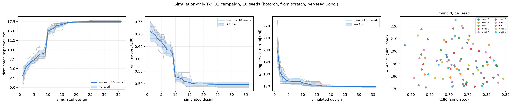
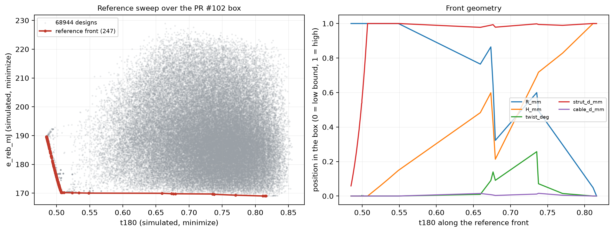
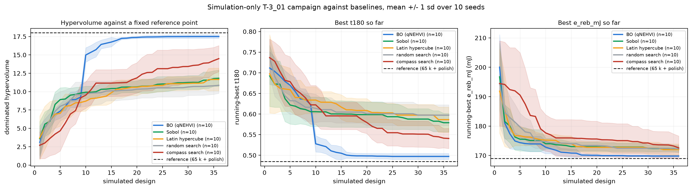
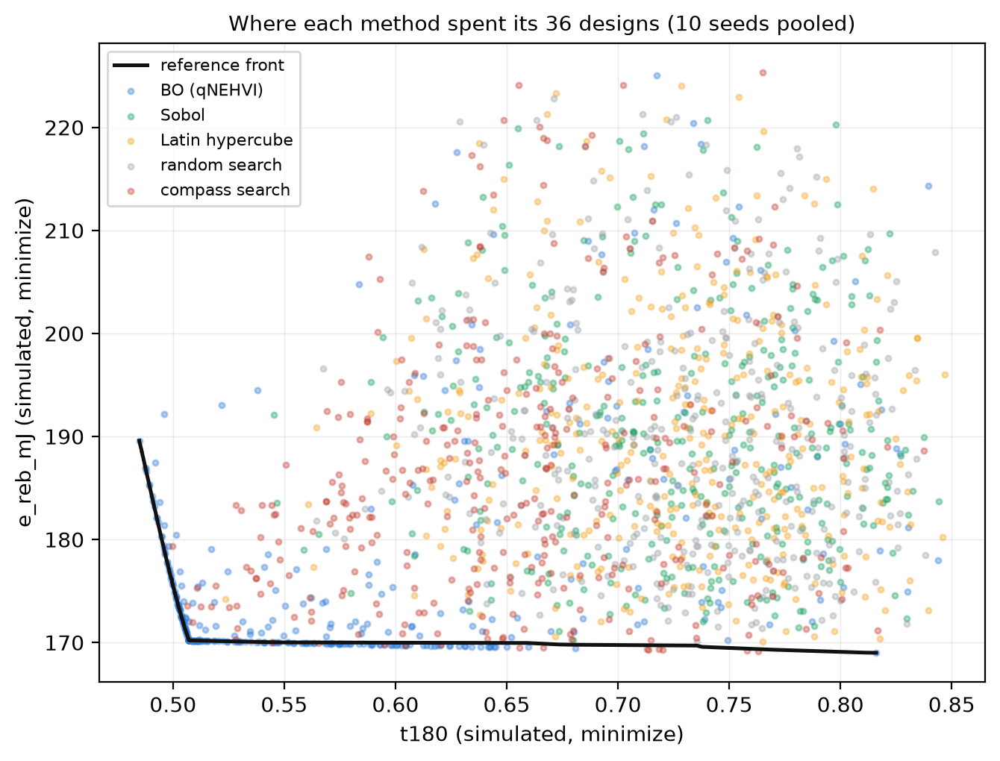

# The T-3_01 campaign in simulation: matching PR #102, and what correlates

PR #102 runs a two-objective SAASBO campaign whose objective function is a
print plus a 101-drop session on the Lansmont M23. This note is the
simulation-side counterpart: the same search space, the same two objectives,
the same batch size and generation strategy, with `drop_tower_sim` in place
of the drop tower, plus the thing that decides whether any of it is useful --
a correlation study of every simulated observable in this directory against
the eight articles that were actually tested.

Files:

| file | what it does |
|---|---|
| [`print_infill.py`](print_infill.py) | sub-100 % PLA infill: printed mass, effective strut density and modulus, the PR #35 constant-mass projection |
| [`drop_tower_sim.py`](drop_tower_sim.py) | MuJoCo analogue of the 60 in / PU-mat drop; returns `t180` and `e_reb_mJ` |
| [`pr102_correlation.py`](pr102_correlation.py) | scores the tested articles with every candidate observable and rank-correlates against the measured objectives |
| [`pr102_sim_campaign.py`](pr102_sim_campaign.py) | the closed-loop simulation-only campaign, one run per seed |
| [`workflows-staged/sim-bo-pr102-matrix.yml`](workflows-staged/sim-bo-pr102-matrix.yml) | parallel seed matrix for Actions (staged; move it into `.github/workflows/`) |
| `data/pr102/*.csv` | snapshots of PR #102's batch table, print key and campaign summary |

## 1. Sub-100 % PLA infill

The articles are not solid. PR #86 section 7 regressed the weighed articles
on their per-material solid masses and found the PLA prints at about 57 % of
solid density and the TPU at about 99 %. `print_infill.fit_solidity()`
re-derives that from the committed CSVs and gets 0.556 / 0.995 (n = 9,
R^2 = 0.66), so the constants in the module are the published 0.565 / 0.986
and the refit agrees.

Two consequences are wired into the simulator:

* **Strut density.** `effective_pla_density_kgm3()` = 700.6 kg/m^3 instead of
  1240. Every strut capsule in `drop_tower_sim` is built at that density, so
  the article's inertia -- the thing that sets a base-excited structure's
  transmissibility -- matches the scale.
* **Effective modulus.** `effective_pla_modulus_MPa()` applies the
  Gibson-Ashby scaling `E_eff/E_s = phi^n`. The bracket is 1980 MPa (n = 1,
  stretch-dominated) to 1117 MPa (n = 2, bending-dominated), 1486 MPa at the
  n = 1.5 default. Tier C treats struts as rigid so only the mass channel
  bites here; the modulus is for the tiers that let the strut deform.

A second correction was needed before the masses came out right. The
idealized volume model used elsewhere in this directory (three capsules plus
nine cylinders at the vertical-cable length) is not the printed CAD, which
also carries PLA joints, housings and the modeled-in scaffold. Regressing
the batch table's reference-STL per-material masses on the model volumes
gives one factor per material, 1.68 for PLA and 0.68 for TPU, with 9 % and
6 % scatter across the nine designs. With both corrections in place the
predicted as-printed masses land within 0.7 g mean absolute error of the
scale readings across the batch (18.8 to 22.6 g predicted, 18.5 to 22.3 g
measured), and the constant-mass projection reproduces the batch table's own
`scale` column to about 2 %.

That projection matters on its own: the campaign's search space is the
*base* Sobol coordinates, and PR #35 prints the uniform rescale of them that
hits a fixed solid-CAD mass. Across the batch the scale runs 0.74 to 1.08,
so simulating the base coordinates would simulate an article up to a quarter
of a size away from the one on the bench. `evaluate_pr102` projects first.

## 2. The drop-tower analogue

Channel roles are from PR #67's input-output series: CH5 is a single-axis
sensor on the bottom acrylic plate (input), the tri-axis is hot-glued to the
top vertex (output), and `t180` is the ratio of their CFC-180 peaks. The
model is a carriage on a vertical slide joint (the tower's rails) carrying
the CH5 site, an explicit one-sided Hunt-Crossley PU mat, and the article
with its three bottom vertices ball-anchored to the carriage, nine TPU
tendons at the `printable_design` axial stiffness, and a 5 g accelerometer
mass on the measured top vertex.

`e_rebound` in the campaign summary is a restitution *velocity* ratio, not
an energy fraction: `t_second = 2 * e_rebound * v_in / g` reproduces every
specimen's second-impact time to three digits. The simulation therefore
reads it off the carriage's post-contact velocity, and `e_reb_mJ` is formed
exactly as PR #102 forms it, `e_rebound * m_printed * g * 1.524 m`.

**What the mat is calibrated on, and what it is not.** `--calibrate` fits
the two mat parameters to the measured input pulse: peak 208.4 G against a
measured 208.2 G, width 4.08 ms against the 4.08 ms implied by the measured
peak and delta-v. It is deliberately *not* fitted to the measured
restitution. A mat lossy enough to return only 2 % of the impact velocity in
this model peaks near 300 G, well above what the tower measures, because the
energy the rig actually loses leaves through paths the model does not carry
(guide rails, anvil and frame, the mount). Simulated `e_rebound` therefore
comes out around 0.6 against a measured 0.02 to 0.05, and is treated as a
rank proxy, not a prediction.

The same honesty applies to `t180` itself: the simulated S0 article reads
0.707 against a measured 1.011. Rigid struts have no bending modes, so the
model has no mechanism for the *amplification* every tested article except
`6lhxfy` shows. It can only attenuate. Absolute agreement was never
available at this tier; rank agreement is the question, and section 3
answers it.

## 3. Which simulated observable tracks the measured objectives

`pr102_correlation.py` scores the seven articles that have both a design
mapping and a weighed mass (`amdjwm` maps to no known print, so PR #102
skips it and so do we) with every candidate observable this thread has
produced, then rank-correlates against the two measured objectives.

At n = 7, Spearman needs |rho| >= 0.79 for p = 0.05 two-sided, and about 30
observables are screened, so read the table with the multiplicity in mind:
the leader clears Bonferroni, the rest of the top block does not.

**Measured `t180`.** `rel_span` is the observable's range over its mean
across the seven articles, and it is not decoration: it separates a real
design effect from a rank that rides on numerical structure.

| simulated observable | Spearman rho | p | rel_span |
|---|--:|--:|--:|
| `lander_eta` (compaction efficiency, lander regime) | **-0.96** | 0.0005 | **0.0013** |
| `lander_SEA_J_per_cm3` | **-0.93** | 0.003 | 2.38 |
| `crutch_SEA_J_per_cm3` | -0.89 | 0.007 | 1.86 |
| `lander_SEA_J_per_g` | -0.89 | 0.007 | 2.93 |
| `crutch_SEA_J_per_g` | -0.86 | 0.014 | 1.99 |
| `H_mm` (a design coordinate, for scale) | +0.79 | 0.036 | 0.47 |
| `sim_t180` (the drop-tower analogue itself) | +0.46 | 0.29 | 0.33 |
| `sim_in_180_g` | 0.00 | 1.00 | 0.001 |

**Measured `e_reb_mJ`:** nothing clears p = 0.05. The best are `R_mm`
(+0.71, p = 0.07), `sim_e_rebound` (-0.64, p = 0.12) and `sim_t180` (-0.57,
p = 0.18).

Three readings, in order of how much they should change what we do:

1. **The purpose-built analogue is not the best predictor; the incidental
   Tier-C observables are.** `sim_t180` lands at rho = +0.46 (p = 0.29)
   while the Tier-C observables built for the crutch and lander regimes --
   a completely different question -- rank the bench articles at -0.86 to
   -0.96. The sign is the physical part: articles whose simulated pulse is
   flatter and whose stored elastic energy per unit volume is higher are the
   articles that measured *lower* transmissibility.
   **The one worth attaching to the campaign GP is `SEA_J_per_cm3`**
   (rho = -0.93 for the lander regime, -0.89 for the crutch), not
   `lander_eta` despite its higher rho: eta moves 0.13 percent across the
   seven articles (0.7326 to 0.7334) while the volumetric SEA moves 240
   percent. A perfect ranking over a 0.1 percent span is a ranking of
   numerical structure until a perturbation study says otherwise, and the
   earlier Edison reviews in this thread already flagged Tier-C `eta` as a
   pinned observable. Take `lander_eta` as a lead to test, and
   `SEA_J_per_cm3` as the prior to use.
2. **The rebound objective has no simulated predictor yet.** Every candidate
   fails at n = 7. Given that the mat calibration explicitly gave up on
   restitution, this is the expected result rather than a surprising one,
   and it means `e_reb_mJ` should be modeled from bench data alone until a
   tier that carries the rig's loss paths exists.
3. **`sim_in_180_g` is rho = 0.00 by construction and that is a good sign.**
   The input peak is the rig, not the design; a calibrated mat should give
   the same input to every article, and it does. It is the null control for
   the rest of the table.

The infill correction is visible but not decisive at this n: `sim_solid_t180`
(the same model run at solid PLA density) correlates identically at rho =
+0.46 for `t180` but moves from -0.57 to -0.43 for `e_reb_mJ`. Where it
matters unambiguously is the mass channel, which is what `e_reb_mJ` is built
from: solid density puts every article's mass out by a factor 1.7, so the
objective it feeds is wrong by that factor before any physics happens.

## 4. The closed-loop simulation-only campaign

`pr102_sim_campaign.py` mirrors PR #102's structure: the same five-parameter
box, the same two minimized objectives, the same 9-per-plate batch size, the
same `mass_g` tracking metric and the same SAASBO generation step by
default. What it adds is that the loop can continue past one round and can
be repeated, which is the only reason to run it in simulation at all.

### What a repeat has to be

A repeat is only a repeat if the whole campaign is redrawn. The first
version of this script attached the nine physically printed articles as
round 0 of every seed, so every repeat began from an identical initial
design and the seed reached nothing but the surrogate's own randomness. The
seeds then agreed to under 2 %, which measured the determinism of the
plumbing rather than the reproducibility of the optimizer.

`--init sobol`, now the default, starts each repeat from scratch: round 0 is
the campaign's own nine-point Sobol draw, scrambled with that repeat's seed
(passed to Ax's Sobol generator explicitly as well as through
`AxClient(random_seed=...)`, so the draw is pinned to the seed rather than
to process state). `--init printed` keeps the PR #102-exact behaviour for
when the question is specifically what the measured batch implies.

One thing had to move with it. The hypervolume reference point used to be
derived from the seed's own round 0, which is harmless when every seed
shares round 0 and wrong as soon as they do not: a repeat that happened to
draw a bad initial batch would be handed a generous reference point and
score a larger hypervolume for it. It is now computed once from the nine
printed articles scored in simulation, inflated 5 %, so it is the same
number for every seed and every initialization.

The third panel of the aggregate figure plots each repeat's round 0 in
objective space. Under `--init sobol` those are ten different clouds; under
`--init printed` they collapse onto one set of nine markers. That panel is
there so the failure mode above is visible rather than inferred.

### Ten repeats

Ten repeats were run in-session (`--model botorch`, `--init sobol`,
`--jobs 4`, four batches of 9 = 36 simulated designs each, so the same
per-seed budget as the earlier three-seed run):

| seed | final hypervolume | best `t180` | best `e_reb_mJ` |
|---|--:|--:|--:|
| 0 | 17.83 | 0.4848 | 170.20 |
| 1 | 17.36 | 0.4992 | 170.17 |
| 2 | 17.43 | 0.4996 | 169.89 |
| 3 | 17.39 | 0.5025 | 169.59 |
| 4 | 17.75 | 0.4880 | 170.20 |
| 5 | 17.57 | 0.4979 | 169.57 |
| 6 | 17.26 | 0.5015 | 170.18 |
| 7 | 17.31 | 0.5035 | 169.73 |
| 8 | 17.96 | 0.4877 | 169.00 |
| 9 | 17.18 | 0.5072 | 169.59 |

Ten independent draws start much further apart than they finish. After
round 0 alone the hypervolume spans 7.71 to 11.07, a spread of 13.8 % of
its mean, and the best `t180` in the initial batch spans 0.584 to 0.646.
Four batches later the hypervolume is 17.50 +/- 0.26, a spread of 1.51 %,
and the best `t180` spans 0.485 to 0.507. So the loop is convergent under
resampling of its own initial design, which is the claim the earlier
three-seed run could not make: those seeds shared round 0, so their
agreement was arithmetic rather than evidence. The three shared-round-0
seeds finished at 17.59 to 17.79 against the same reference point, inside
the spread of the ten independent ones and near its top, which is what a
hand-picked initial batch should do.

All ten walk to the same corner: `R` at its maximum 40 mm, `H` at its
minimum 60 mm, `twist` at its minimum 40 deg, `cable_d` at its minimum
3.0 mm. Short, wide, thin-cabled. `strut_d` is the one loose axis and it is
loose across the whole box (6.35 to 12.0 mm over the ten best-`t180`
designs, with no trend in the objective), so the model is genuinely
indifferent to it once the other four are cornered rather than merely
under-resolved on it.

Two things to notice before reading that as a recommendation. It agrees with
the measured campaign on thin cables -- `6lhxfy`, the one article that
genuinely attenuated on the bench, is the thin-cable corner -- and disagrees
on twist, where `6lhxfy` sits at the box maximum. And unlike the
regime sims, this model *does* consume the twist axis (the geometry is built
at the supplied twist), so a twist result here is a physical claim rather
than the un-consumed plumbing `sobol_t3_diagnostics.md` documents for
`run_regimes`. Given that the model cannot amplify at all (section 2), the
disagreement is more likely the model's than the bench's.

One SAASBO seed was also run to check that path (the default, matching
PR #102): one round of 3 designs took 570 s on a contended runner core
against 0.3 s per simulation. That is why the repeats above use the cheap
qNEHVI surrogate, and why the staged workflow parallelizes over seeds
rather than running them in series. Even with the cheap model the fit is
the wall-clock: a fourth batch of 9 costs minutes while the 36 simulations
behind it cost about 11 s in total.

Parallelism is local as well as in Actions. `--jobs N` runs N repeats as
separate processes, one campaign each, with the numeric libraries pinned to
one thread per worker (the acquisition optimization is the cost and it does
not thread well, so the parallelism belongs at the seed level). Ten repeats
on this four-core runner is three waves.

Files. Per-seed convergence and objective-space plots are
`outputs/pr102_sim_bo_botorch_sobol_seed*.png`, the cross-seed figure with
the +/- 1 sd band and the round-0 panel is
`outputs/pr102_sim_bo_botorch_sobol_aggregate.png`, and the per-seed trial
tables are the matching CSVs. The earlier shared-round-0 run is kept
alongside under `..._printed_...` for the comparison.

## 5. Baselines, and how far the box actually goes

A hypervolume trace that climbs proves nothing on its own: the question is
whether it climbs faster than something with no model in it, and whether it
finishes anywhere near what the box contains. `pr102_baselines.py` supplies
both.

### The reference optimum

65,536 scrambled Sobol designs (about 1,800x the campaign's budget, 1,120 s
over four processes at 17 ms each) followed by a Nelder-Mead polish of the
best point under each of 21 weightings, 3,408 further evaluations. The
non-dominated set of all 68,944 is the best estimate of the true front
available at this fidelity: 247 points, hypervolume 18.024 against the same
fixed reference point the campaign uses, best `t180` 0.4848, best
`e_reb_mJ` 169.00.

This is a dense sample, not a proof of global optimality. What makes it
usable as a ceiling is that the polish moves it essentially nowhere: the
front sits on box bounds, so a local optimizer started from the sweep's best
points converges onto the same corners rather than finding anything the
sweep missed.

The front is sharply L-shaped, and its geometry is the actionable read.
`cable_d_mm` is pinned at its low bound (3.0 mm) along the entire front, and
`twist_deg` at its low bound for most of it. The trade-off is carried by
`strut_d_mm` and `H_mm`: the minimum-`t180` end is a short, wide, thin-strut
cell (`R` 40, `H` 60, `strut_d` about 6.4 mm) and the minimum-`e_reb_mJ` end
is a tall, narrow, fat-strut one (`R` 25, `H` 110, `strut_d` 12). Two of the
five axes are therefore doing nothing but sitting on a wall, which is worth
knowing before the next plate is printed: the box should probably be
extended below `cable_d_mm` 3.0 mm and below `twist_deg` 40 deg rather than
re-searched as it stands.

### The baselines

Four, each at the campaign's own 36-design budget and over the same ten
seeds:

| baseline | what it is |
|---|---|
| `random` | uniform i.i.d. draws; the floor |
| `sobol` | scrambled Sobol over the whole budget, i.e. the campaign's round 0 extended to fill it, so the gap to the campaign is exactly what the surrogate contributes |
| `lhs` | scrambled Latin hypercube, the other standard space-filling design |
| `heuristic` | compass (pattern) search with a halving step on a normalized weighted sum, budget split over three weightings (0.15 / 0.5 / 0.85) so it produces a spread of trade-offs rather than one point; the seed sets the start and the axis order |

| method | final HV (mean +/- sd) | fraction of reference | best `t180` | best `e_reb_mJ` | p vs BO |
|---|--:|--:|--:|--:|--:|
| BO (qNEHVI) | 17.50 +/- 0.25 | **97.1 %** | 0.4972 | 169.81 | - |
| compass search | 14.49 +/- 1.78 | 80.4 % | 0.5408 | 172.59 | 9.1e-5 |
| Sobol | 11.82 +/- 1.11 | 65.6 % | 0.5790 | 172.17 | 9.1e-5 |
| Latin hypercube | 11.66 +/- 1.54 | 64.7 % | 0.5864 | 172.00 | 9.1e-5 |
| random search | 10.86 +/- 1.09 | 60.3 % | 0.5972 | 172.30 | 9.1e-5 |

`p` is a one-sided Mann-Whitney U on the ten final hypervolumes; 9.1e-5 is
the smallest value that test can return at n = 10 against n = 10, so every
baseline is *completely* separated from the BO, with no overlap between the
two sets of ten.

Three things the comparison settles:

1. **The surrogate is what is doing the work, not the space-filling design.**
   The BO's first nine designs *are* a Sobol batch (Ax's own generator, a
   different scramble from the `sobol` baseline's, hence the small offset at
   design 9: 9.25 against 9.81, with the baseline slightly ahead). The moment
   the model takes over the traces separate and never re-cross: one
   model-driven batch takes the BO from 51 % of the reference ceiling to
   83 %, and it is at 96 % by design 18 and 97 % by design 27. Sobol run out
   to the full 36 designs finishes at 66 %. Space filling is not the
   ingredient.
2. **Sobol and LHS are indistinguishable from each other, and barely beat
   random.** 65.6 % against 64.7 % against 60.3 %, with sd of 1.1 to 1.5. At
   36 points in 5 dimensions, quasi-random stratification buys very little.
3. **The heuristic is the strongest baseline and still loses by a wide
   margin**, and it has the largest seed-to-seed spread of any method
   (sd 1.78, and 4.04 mJ on best `e_reb_mJ`). That is the expected signature
   of a local method on a front whose extremes are box corners: whether a run
   ends up near one depends on where it started.

The BO's spread is also the smallest of the five (sd 0.25 = 1.4 % of its
mean, against 9 to 12 % for the baselines). Across ten independent repeats it
is both better and more repeatable, which is the property that matters when
each real evaluation is a print plus a drop session.

Pooled over ten seeds, the BO's points lie along the front; every baseline's
points are a cloud in the interior. Note the BO does *not* reach the extreme
low-`e_reb_mJ` tail of the front, which lives at `R` 25 / `H` 110 /
`strut_d` 12: qNEHVI spends its budget on the knee, which is where
hypervolume is, and the tail is worth about 1 mJ.

### Caveat on all of the above

This compares optimizers on a **simulated** objective, so what it measures is
search efficiency on this response surface, not accuracy against the bench.
Section 3's caveats still apply to the objective itself. The transfer that
does hold is the shape of the problem: 5 continuous axes, 2 objectives,
a smooth deterministic response, a front on the box boundary. On that shape,
36 model-driven evaluations reach 97 % of a 68,944-evaluation ceiling and 36
space-filling ones reach 66 %.

Files. `outputs/pr102_reference_cloud.csv.gz` (all 68,944 evaluations,
gzipped, read directly by pandas), `outputs/pr102_reference_front.csv` (the
247 non-dominated designs), `outputs/pr102_reference_summary.csv`,
`outputs/pr102_baseline_<strategy>_seed<k>.csv` (40 runs, every evaluation
with its parameters, objectives, printed mass, constant-mass scale and
feasibility flag), `outputs/pr102_baselines_summary.csv`, and the two
figures. Nothing needs re-running to redo a plot.

## 6. Caveats

* Seven articles. Every correlation in section 3 is a small-n rank
  statistic screened across about 30 candidates; treat the leader as a
  hypothesis to test on the next batch, not as an established transfer
  function.
* `lander_eta`'s 0.13 percent span has not been perturbation-tested (vary
  the timestep, the prestrain, the payload mass, and see whether the ranking
  survives). That test is the first thing to run before anyone leans on it.
* The simulated `t180` cannot exceed 1 by much: rigid struts cannot
  resonate, so the amplifying articles have no mechanism in this model.
  Tier B (Newton) or Tier A (PolyFEM) is where that would come from.
* Simulated `e_rebound` is a rank proxy at roughly 20x the measured value,
  for the reason given in section 2.
* The infill solidity is one effective scalar per material, absorbing wall
  count, infill density and pattern. The exact per-profile answer would come
  from the BambuStudio CLI's sliced per-filament grams, as PR #86 section 7
  notes.
* `amdjwm` is excluded (no design mapping). If it is identified, both the
  correlation study and PR #102's ingest gain a point, and it is the
  second-best measured article, so it matters.
