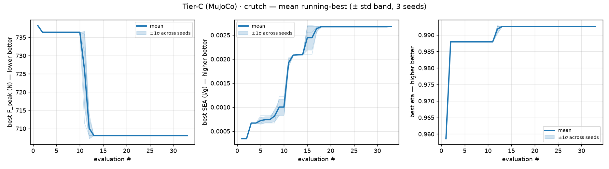
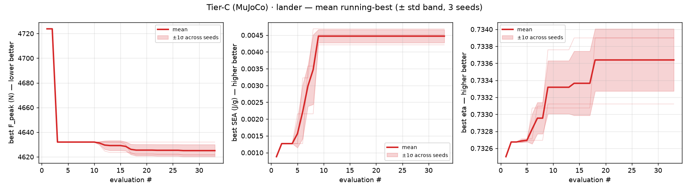
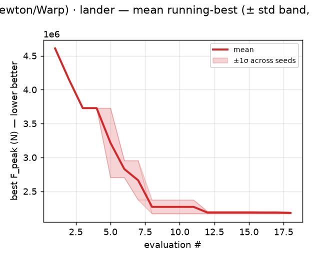
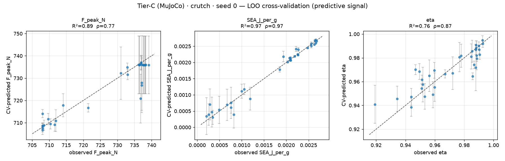

# Simulation-only Bayesian-optimization campaign (PR #35 T3-prism box)

This is the **closed-loop, simulation-only** analogue of PR #35's
`bo/t3_prism_sobol_batch.py`.  Per @sgbaird (PR comment 4759514616):

> run a Bayesian optimization campaign as you see fit using only simulations
> as the objective functions.  Mirror what's in #35, but using these kinds of
> simulations instead of real experiments.

Where PR #35 emits a **single Sobol batch** for a human-in-the-loop
print-and-bench-test round, `simulations/sim_bo_campaign.py` **closes the
loop**: Ax proposes a design, a simulation scores it, and the result is fed
straight back to the surrogate that drives the next proposal.  No printer, no
drop-tower — the objective function *is* the simulation.

The plotting was reworked per @sgbaird (PR comment 4759900555):

> the plotting of both crutch and lander on the same graphs is confusing
> because of the scale differences.  Separate these out.  Generate individual
> plots for each seed.  Also, add stdDev bands where applicable for the average
> behavior plots.  Repeat this for each of the tier methods … Also, create
> LOO-CV plots for each seed and model … I want to see if there is predictive
> signal it's learning from.

So now: **every figure is for one regime** (their objective scales differ by
~6×, which made the shared axes unreadable); each random **seed gets its own
plots**; the averaged-behaviour plot carries a **±1σ band across seeds**; the
loop is run on **each simulation tier**; and each seed/model gets an **Ax
leave-one-out cross-validation (LOO-CV)** plot.

## Setup

| Element | Value |
|---|---|
| Design box | identical to PR #35 (`R_mm`∈[25,40], `H_mm`∈[60,110], `twist_deg`∈[40,80], `strut_d_mm`∈[6,12], `cable_d_mm`∈[3.0,5.5]) |
| Frozen | `topology=t3_prism`, `tiling=1×1×1`, `tpu_shore=85A`, vertical build, PLA struts / TPU cables |
| Optimizer | Ax `AxClient`, default `Sobol → BOTORCH_MODULAR` strategy (qNEHVI for multi-objective tiers) |
| Seeds | the three already-printed PR #35 T3 cells (`bo_evaluator._t3_seed_designs()`), scored by simulation; then closed-loop trials |
| Repeats | 3 random seeds (Tier-C) / 2 (Tier-B) per regime → enables the std-dev band |

### Tier methods (the BO loop is repeated on each)

| Tier | Engine | Objectives | Notes |
|---|---|---|---|
| **C** | MuJoCo rigid-tendon regime sim (`bo_evaluator.evaluate_design`) | **minimize** `F_peak_N`, **maximize** `SEA_J_per_g`, **maximize** `eta` (qNEHVI) | CFC-180-filtered axial accel; ~0.2 s/eval |
| **B** | Newton/Warp XPBD drop (`newton_drop`) | **minimize** `F_peak_N` (single-objective) | Newton exposes only the payload-accel trace (no tendon strain energy), so it is single-objective; ~4 s/eval; the tendons sit in the dynamic load path |

Two **independent** campaigns are run per tier, one per loading regime, because
the loading scenario is fixed inside a campaign while the design varies.  (A
single **multi-task** GP that shares information across regimes is the next
step — see the *Multi-task treatment of the regimes* section of
`bo_integration.md`.)

Run:

```bash
python simulations/sim_bo_campaign.py --tiers C --seeds 0 1 2 --n-iter 30
python simulations/sim_bo_campaign.py --tiers B --seeds 0 1 --n-iter 15  # Newton
```

## What the campaign found

### Tier-C (MuJoCo, 3 objectives, 3 seeds × 33 evals/regime)

| Regime | feasible | `F_peak` span | `SEA` span | `eta` span | BO-converged max-SEA design |
|---|---:|---|---|---|---|
| crutch | 99/99 | 708–739 N (**4.4 %**) | 9.8e-5 – 2.7e-3 J/g (**27×**) | 0.919 – 0.993 | `R=40, H=60, twist=80, strut_d=12, cable_d≈4.2` → SEA 2.68e-3 |
| lander | 99/99 | 4622–4784 N (**3.5 %**) | 6.2e-4 – 4.7e-3 J/g (**7.5×**) | 0.732 – 0.734 | `R≈28, H≈62, twist≈58, strut_d≈11, cable_d≈5.0` → SEA 4.69e-3 |

`F_peak` is near-invariant (so the Pareto fronts are nearly vertical) and
`SEA` is the live discriminator — the optimizer drives the crutch to the
**short-and-fat / thick-strut corner** and the lander to a **low-height /
moderate-radius / thick-strut** cell.  Each regime's mean running-best `SEA`
**climbs then plateaus** (classic BO convergence), and the ±1σ band shows the
spread across the three seeds is small once the model takes over.





### Tier-B (Newton/Warp, single objective, 2 seeds × 18 evals/regime)

Newton's XPBD drop puts the TPU tendons in the dynamic load path, and — unlike
Tier-C — its peak transmitted force is **strongly design-dependent**:
`F_peak` spans **2.17 – 5.5 MN (a ~2.5× range)** across the box, so the
single-objective BO shows a genuine descent (running-best `F_peak` falls ~2.5×
then plateaus) rather than the near-flat Tier-C curve.  This is exactly the
kind of cross-tier contrast the multi-fidelity ladder is meant to expose: the
geometry that looks invariant to the cheap rigid-contact sim does move the
impact peak once the elastic tendons resolve it.



### LOO cross-validation — is the GP learning predictive signal?

`cross_validate` refits a BoTorch surrogate on each campaign's trial data and
predicts each held-out point.  Mean over seeds (R² / Spearman ρ of
CV-predicted vs observed):

| Tier · regime | `F_peak_N` | `SEA_J_per_g` | `eta` |
|---|---|---|---|
| C · crutch | 0.89 / 0.79 | **0.97 / 0.96** | 0.69 / 0.87 |
| C · lander | 0.91 / 0.95 | 0.57 / 0.73 | 0.80 / 0.61 |
| B · crutch | **0.99 / 0.91** | — | — |
| B · lander | **0.99 / 0.92** | — | — |

The GP has **strong, real predictive signal** on the discriminating outcomes
(Tier-C crutch `SEA` R²≈0.97; Tier-B `F_peak` R²≈0.99) — the optimizer is not
chasing noise.  Where the signal is weak it is because the *outcome itself* is
nearly constant across the box (Tier-C `eta` for the lander is pinned at
0.732–0.734, so its CV ρ is low even though the absolute error is tiny), not
because the model failed to fit.  Per-seed scatter plots
(`*_seed<k>_cv.png`) carry the y=x line and ±1σ predictive bars.



## Honest read (what this campaign *is* and *is not*)

This campaign inherits every Tier-C caveat the earlier Sobol sweep + Edison
review (`ff8faab3`) and `sobol_t3_diagnostics.py` already established — running
a real optimizer on the cheap simulator does not remove them:

- **Tier-C `F_peak` is near-invariant** (≈3–4 % across the whole box) and sits
  at the static support load, *not* a resolved impact peak (crutch median
  `F_peak`/(75 kg·g) ≈ 1.0).  Tier-B's Newton drop *does* resolve a
  design-dependent peak (2.5× span), which is why its single-objective loop
  actually converges on `F_peak`.
- **`SEA` is a peak *elastic* strain-energy proxy** (~10³–10⁴× below incoming
  KE), not dissipated work; it is a *relative* design ranking, not an absolute
  energy-absorption number.
- **`twist_deg` carries ≈0 signal** at both tiers here: neither the Tier-C
  regime override nor the Newton build consumes the twist axis (geometry is
  built at the fixed equilibrium twist), so the optimizer reads twist as a
  nuisance dimension.

So the value of this run is **methodological**, exactly as PR #35 is for the
hardware loop: it demonstrates the full Ax/qNEHVI closed loop driving *only* on
simulation, repeated across tiers and seeds, with separated per-regime
diagnostics, std-dev bands, and LOO-CV that confirm which axes the surrogate
can and cannot resolve.  The Edison-recommended next steps — promote the
SEA-maximizing corner designs to Tier-B/A and the bench, fit a co-kriging
discrepancy model, and run cost-aware constrained qNEHVI with regime+fidelity
as task labels — are tracked in `bo_integration.md`.

## Files

- `simulations/sim_bo_campaign.py` — the tier/seed-parameterized closed-loop driver
- `outputs/sim_bo_<tier>_<regime>.csv` — full trial tables (params + objectives + seed + stage + feasibility), e.g. `sim_bo_C_crutch.csv`, `sim_bo_B_lander.csv`
- `outputs/sim_bo_<tier>_<regime>_pareto.csv` — feasible Pareto subset (union across seeds)
- `outputs/sim_bo_<tier>_<regime>_seed<k>_convergence.png` — per-seed running-best
- `outputs/sim_bo_<tier>_<regime>_convergence.png` — mean running-best with ±1σ band across seeds
- `outputs/sim_bo_<tier>_<regime>_seed<k>_pareto.png` — per-seed Pareto fronts (multi-objective tiers)
- `outputs/sim_bo_<tier>_<regime>_seed<k>_cv.png` — per-seed LOO-CV observed-vs-predicted (predictive signal)
