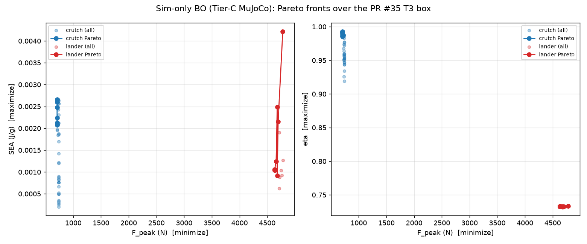
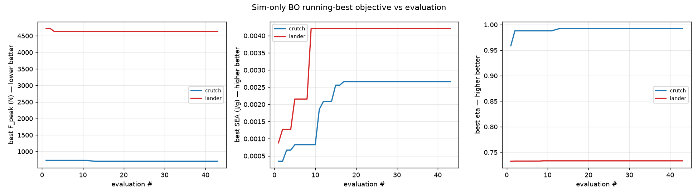

# Simulation-only Bayesian-optimization campaign (PR #35 T3-prism box)

This is the **closed-loop, simulation-only** analogue of PR #35's
`bo/t3_prism_sobol_batch.py`.  Per @sgbaird (PR comment 4759514616):

> run a Bayesian optimization campaign as you see fit using only simulations
> as the objective functions.  Mirror what's in #35, but using these kinds of
> simulations instead of real experiments.

Where PR #35 emits a **single Sobol batch** for a human-in-the-loop
print-and-bench-test round, `simulations/sim_bo_campaign.py` **closes the
loop**: Ax proposes a design, the Tier-C MuJoCo regime simulation
(`bo_evaluator.evaluate_design`) scores it, and the result is fed straight
back to a multi-objective **qNEHVI** surrogate that drives the next proposal.
No printer, no drop-tower — the objective function *is* the simulation.

## Setup

| Element | Value |
|---|---|
| Design box | identical to PR #35 (`R_mm`∈[25,40], `H_mm`∈[60,110], `twist_deg`∈[40,80], `strut_d_mm`∈[6,12], `cable_d_mm`∈[3.0,5.5]) |
| Frozen | `topology=t3_prism`, `tiling=1×1×1`, `tpu_shore=85A`, vertical build, PLA struts / TPU cables |
| Objectives | minimize `F_peak_N`, maximize `SEA_J_per_g`, maximize `eta` (the three `bo_evaluator` outcomes) |
| Optimizer | Ax `AxClient`, default `Sobol → BOTORCH_MODULAR` strategy (qNEHVI for the 3-objective front) |
| Seeds | the three already-printed PR #35 T3 cells (`bo_evaluator._t3_seed_designs()`), scored by simulation |
| Budget | 3 seeds + 40 closed-loop trials, **per regime** (crutch, lander) = 86 simulated evaluations |
| Fidelity | Tier-C MuJoCo, CFC-180-filtered axial accel (matches the drop-tower pipeline, PR #74) |

Two **independent** campaigns are run, one per loading regime, because the
loading scenario is fixed inside a campaign while the design varies.  (A
single **multi-task** GP that shares information across the two regimes is the
next step — see the *Multi-task treatment of the regimes* section of
`bo_integration.md`.)

Run:

```bash
python simulations/sim_bo_campaign.py                 # both regimes, defaults
python simulations/sim_bo_campaign.py --regime crutch --n-iter 60
```

## What the campaign found

| Regime | feasible trials | `F_peak` span | `SEA` span | `eta` span |
|---|---:|---|---|---|
| crutch | 43/43 | 708–739 N (**4.3 %**) | 2.1e-4 – 2.7e-3 J/g (**13×**) | 0.919 – 0.993 |
| lander | 43/43 | 4632–4784 N (**3.3 %**) | 6.2e-4 – 4.2e-3 J/g (**6.8×**) | 0.732 – 0.733 |

**Best designs the BO converged to** (max-SEA, the discriminating objective):

- **crutch:** `R=40, H=60, twist≈60, strut_d=12, cable_d≈4.1 mm` → SEA 2.66e-3 J/g, eta 0.986, F_peak 708 N. The optimizer drove to the **short-and-fat corner** (R↑ to 40, H↓ to 60) with the **thickest struts** — that combination maximizes the cell's elastic-energy proxy while keeping eta high.
- **lander:** `R≈36, H≈63, twist≈53, strut_d≈6.5, cable_d≈4.1 mm` → SEA 4.21e-3 J/g, eta 0.733, F_peak 4780 N. Lander `eta` is essentially pinned (0.732–0.733), so the front collapses to a near-1-D SEA search and 37/43 trials are mutually non-dominated.

`outputs/sim_bo_convergence.png` shows the classic BO signature: running-best
**SEA climbs and plateaus** (crutch reaches its optimum by ~eval 17, lander by
~eval 9) while `F_peak` and `eta` stay essentially flat — i.e. the optimizer
spends its budget where the signal is.





## Honest read (what this campaign *is* and *is not*)

This campaign inherits every Tier-C caveat the earlier Sobol sweep + Edison
review (`ff8faab3`) and `sobol_t3_diagnostics.py` already established — running
a real optimizer on the cheap simulator does not remove them:

- **`F_peak` is near-invariant** (≈3–4 % across the whole box) and sits at the
  static support load, *not* a resolved impact peak (crutch median
  `F_peak`/(75 kg·g) ≈ 1.0). So the Pareto fronts are nearly **vertical** —
  `F_peak` is not a useful discriminator at Tier-C, and the optimizer correctly
  treats `SEA`/`eta` as the live objectives.
- **`SEA` is a peak *elastic* strain-energy proxy** (~10³–10⁴× below incoming
  KE), not dissipated work; it is a *relative* design ranking, not an absolute
  energy-absorption number.
- **`twist_deg` carries ≈0 signal** at Tier-C: the regime override does not
  consume the twist axis (geometry is built at the fixed equilibrium twist), so
  the optimizer reads twist as a nuisance dimension — visible in the crutch
  Pareto set, where twist ranges 40–62° at essentially identical objectives.

So the value of this run is **methodological**, exactly as PR #35 is for the
hardware loop: it demonstrates the full Ax/qNEHVI closed loop driving *only*
on simulation, produces the seed CSVs that can be `attach_trial`-ed into a
hardware campaign as a cheap simulated prior, and confirms which axes the
cheap tier can and cannot resolve. The Edison-recommended next steps —
promote the SEA-maximizing corner designs to Tier-B/A and the bench, fit a
co-kriging discrepancy model, and run cost-aware constrained qNEHVI with
regime+fidelity as task labels — are tracked in `bo_integration.md`.

## Files

- `simulations/sim_bo_campaign.py` — the closed-loop driver
- `outputs/sim_bo_crutch.csv`, `outputs/sim_bo_lander.csv` — full trial tables (params + objectives + stage)
- `outputs/sim_bo_crutch_pareto.csv`, `outputs/sim_bo_lander_pareto.csv` — Pareto-optimal subsets
- `outputs/sim_bo_pareto.png` — F_peak↔SEA and F_peak↔eta Pareto scatter, both regimes
- `outputs/sim_bo_convergence.png` — running-best objective vs evaluation, both regimes
